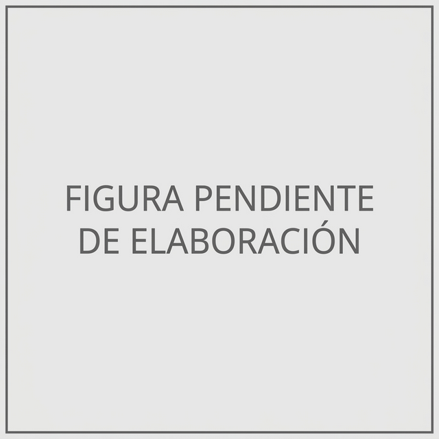
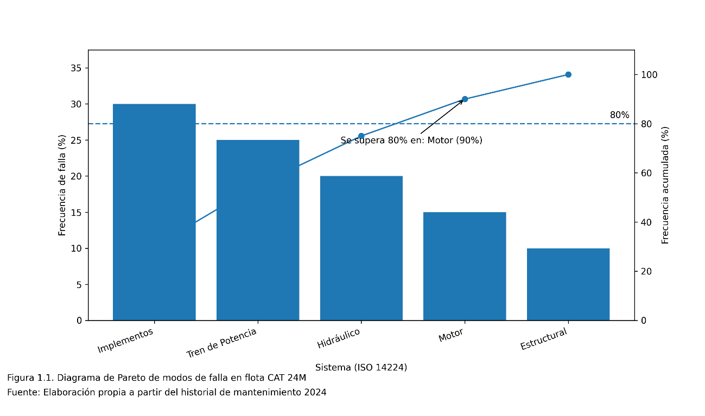
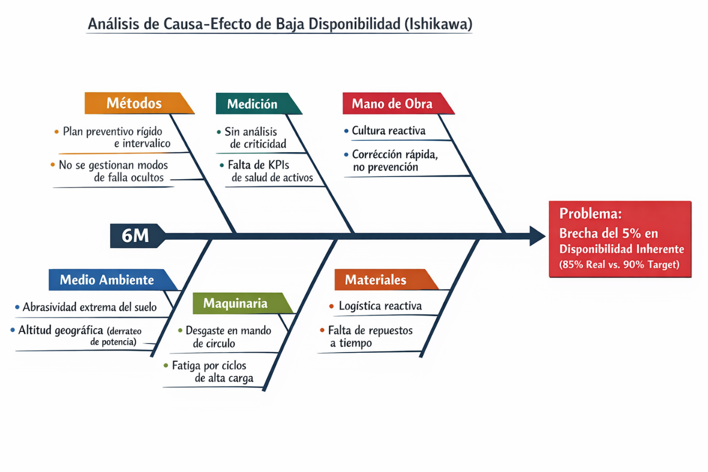
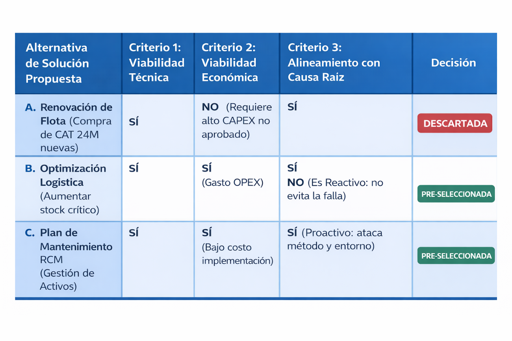
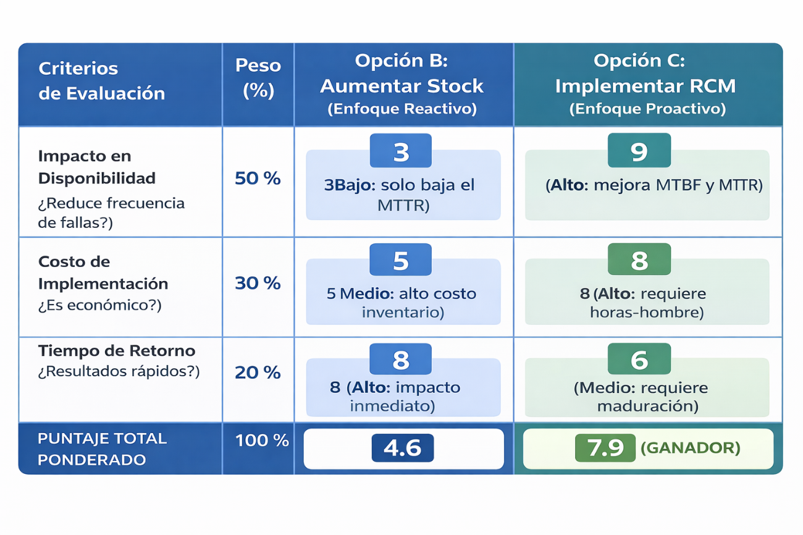
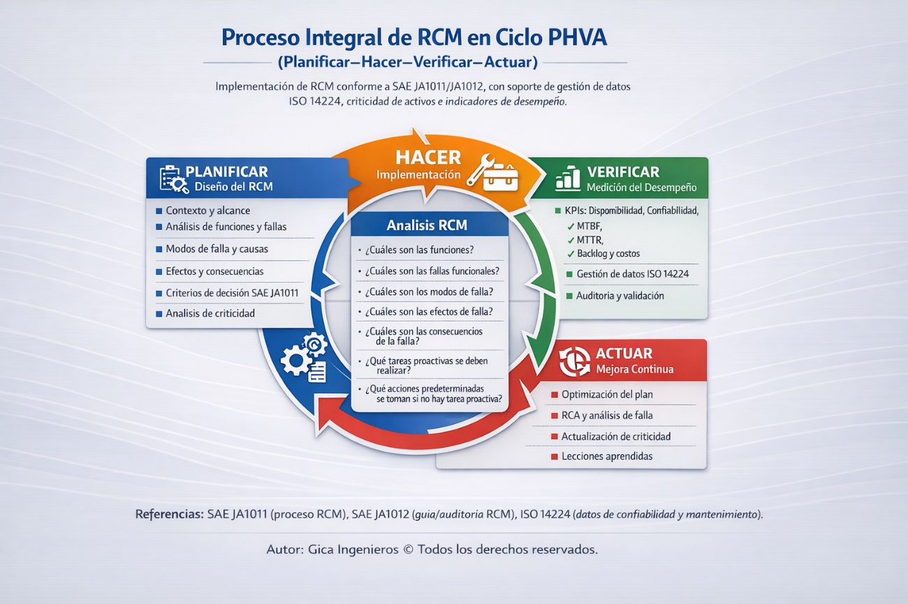
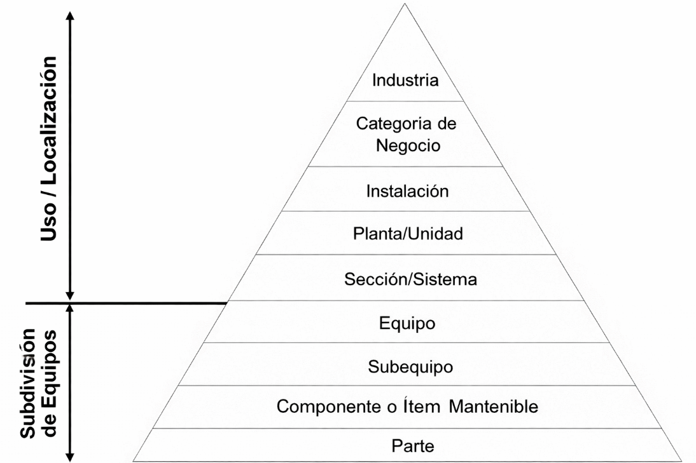
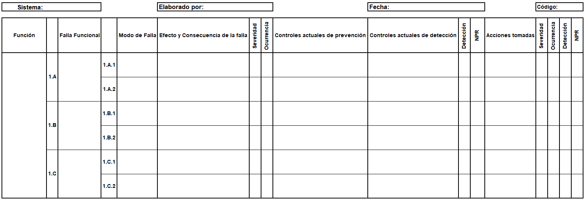
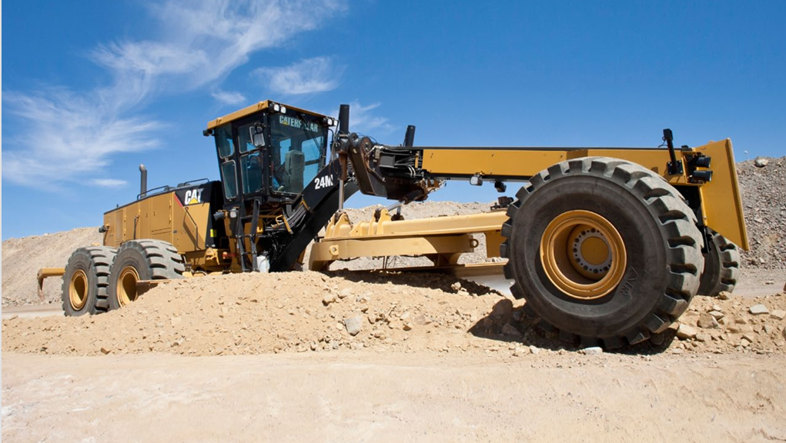
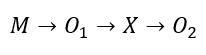

# Reporte extenso de comparación de contenido: GICA vs. ejemplo del ingeniero

> **Documento GICA:** `C:\Users\ingmi\Downloads\proj_977dcadd83.docx`  
> **Documento de referencia:** `C:\Users\ingmi\Downloads\ENTREGABLE 1_TESIS II_CAT 24M - VERSIÓN 07 - 06.02.26.docx`  
> **Fecha de conversión:** 2026-08-19

> **Alcance del reporte:** comparación íntegra desde **INTRODUCCIÓN** hasta **ANEXOS**. La portada, la información básica y los índices se conservan en las dos conversiones Markdown completas, pero no se repiten aquí porque corresponden a la revisión previa.

## Cómo leer este archivo

Cada unidad presenta primero el contenido generado por GICA y, a continuación, el contenido de la misma sección en el documento del ingeniero. No se resume ni se reescribe el contenido: se transcribe a Markdown para facilitar una revisión manual detallada. Las tablas se convierten a tablas Markdown y las figuras incrustadas se enlazan desde la carpeta `assets`.

La única consolidación estructural necesaria está en las bases teóricas: GICA reúne **Confiabilidad y mantenibilidad** en una sola sección, mientras que el ejemplo del ingeniero las presenta como dos secciones independientes. Ambas se incluyen completas en la misma unidad.

## Cobertura de la conversión completa

| Documento | Párrafos con texto | Encabezados | Tablas | Palabras aprox. | Imágenes únicas | Usos de imágenes |
| --- | ---: | ---: | ---: | ---: | ---: | ---: |
| GICA | 261 | 48 | 5 | 13595 | 2 | 10 |
| Ejemplo del ingeniero | 358 | 50 | 5 | 14864 | 11 | 57 |

## Criterio para contar citas

En cada sección se cuenta una mención por cada par autor-año. Una agrupación con dos autores y años distintos suma dos citas; las repeticiones también se contabilizan. No se cuentan años sueltos, periodos de estudio ni fechas. Las normas se muestran aparte como menciones normativas/técnicas, y la bibliografía se informa por número de entradas, no como citas del texto.

## Política obligatoria de fuentes

No se aceptan páginas web genéricas como fuentes académicas. Cada cita debe corresponder a un documento real y verificable: artículo científico, tesis, libro, capítulo de libro, norma técnica, guía o informe institucional oficial, o documentación técnica del fabricante. Un DOI o una URL se registra únicamente como medio de acceso al documento y no como tipo de fuente. También quedan excluidas las referencias simuladas o generadas sin verificación.

La política detallada se encuentra en [05_clasificacion_y_politica_de_fuentes.md](05_clasificacion_y_politica_de_fuentes.md).

## Conteo acumulado por capítulo y sección

El total acumulado incluye las subsecciones subordinadas; el conteo detallado posterior muestra las citas directas de cada unidad.

| Sección (incluye sus subsecciones) | GICA: citas | GICA: fuentes | Ejemplo: citas | Ejemplo: fuentes |
| --- | ---: | ---: | ---: | ---: |
| INTRODUCCIÓN | 2 | 2 | 3 | 3 |
| I. PLANTEAMIENTO DEL PROBLEMA | 6 | 6 | 5 | 5 |
| ↳ 1.1 Descripción de la realidad problemática | 6 | 6 | 5 | 5 |
| ↳ 1.2 Formulación del problema | 0 | 0 | 0 | 0 |
| ↳ 1.3 Objetivos | 0 | 0 | 0 | 0 |
| ↳ 1.4 Justificación | 0 | 0 | 0 | 0 |
| ↳ 1.5 Delimitaciones de la investigación | 0 | 0 | 0 | 0 |
| II. MARCO TEÓRICO | 38 | 27 | 39 | 25 |
| ↳ 2.1 Antecedentes | 10 | 10 | 10 | 10 |
| ↳ 2.2 Bases teóricas | 13 | 11 | 14 | 13 |
| ↳ 2.3 Marco conceptual | 0 | 0 | 2 | 2 |
| ↳ 2.4 Definición de términos básicos | 15 | 7 | 13 | 2 |
| III. HIPÓTESIS Y VARIABLES | 2 | 2 | 2 | 2 |
| ↳ 3.1 Hipótesis | 0 | 0 | 0 | 0 |
| ↳ 3.2 Operacionalización de variable | 2 | 2 | 2 | 2 |
| IV. METODOLOGÍA DEL PROYECTO | 1 | 1 | 3 | 3 |
| ↳ 4.1 Diseño metodológico | 0 | 0 | 2 | 2 |
| ↳ 4.2 Método de investigación | 1 | 1 | 1 | 1 |
| ↳ 4.3 Población y muestra | 0 | 0 | 0 | 0 |
| ↳ 4.4 Lugar de estudio | 0 | 0 | 0 | 0 |
| ↳ 4.5 Técnicas e instrumentos para la recolección de la información | 0 | 0 | 0 | 0 |
| ↳ 4.6 Análisis y procesamiento de datos | 0 | 0 | 0 | 0 |
| ↳ 4.7 Aspectos éticos en Investigación | 0 | 0 | 0 | 0 |
| V. CRONOGRAMA DE ACTIVIDADES | 0 | 0 | 0 | 0 |
| VI. PRESUPUESTO | 0 | 0 | 0 | 0 |
| VII. REFERENCIAS BIBLIOGRÁFICAS | N/A (16 referencias) | N/A | N/A (29 referencias) | N/A |
| ANEXOS | 0 | 0 | 0 | 0 |

## Resumen de citas por sección y subsección

| N.º | Sección o subsección | GICA: citas | GICA: fuentes | Ejemplo: citas | Ejemplo: fuentes |
| ---: | --- | ---: | ---: | ---: | ---: |
| 1 | INTRODUCCIÓN | 2 | 2 | 3 | 3 |
| 2 | I. PLANTEAMIENTO DEL PROBLEMA | 0 | 0 | 0 | 0 |
| 3 | 1.1 Descripción de la realidad problemática | 6 | 6 | 5 | 5 |
| 4 | 1.2 Formulación del problema | 0 | 0 | 0 | 0 |
| 5 | 1.3 Objetivos | 0 | 0 | 0 | 0 |
| 6 | 1.4 Justificación | 0 | 0 | 0 | 0 |
| 7 | 1.4.1 Justificación normativa | 0 | 0 | 0 | 0 |
| 8 | 1.4.2 Justificación teórica | 0 | 0 | 0 | 0 |
| 9 | 1.4.3 Justificación práctica | 0 | 0 | 0 | 0 |
| 10 | 1.4.4 Justificación metodológica | 0 | 0 | 0 | 0 |
| 11 | 1.4.5 Justificación económica | 0 | 0 | 0 | 0 |
| 12 | 1.4.6 Justificación social | 0 | 0 | 0 | 0 |
| 13 | 1.5 Delimitaciones de la investigación | 0 | 0 | 0 | 0 |
| 14 | 1.5.1 Delimitación teórica | 0 | 0 | 0 | 0 |
| 15 | 1.5.2 Delimitación temporal | 0 | 0 | 0 | 0 |
| 16 | 1.5.3 Delimitación espacial | 0 | 0 | 0 | 0 |
| 17 | II. MARCO TEÓRICO | 0 | 0 | 0 | 0 |
| 18 | 2.1 Antecedentes | 0 | 0 | 0 | 0 |
| 19 | 2.1.1 Antecedentes internacionales | 5 | 5 | 5 | 5 |
| 20 | 2.1.2 Antecedentes nacionales | 5 | 5 | 5 | 5 |
| 21 | 2.2 Bases teóricas | 0 | 0 | 0 | 0 |
| 22 | 2.2.1 Mantenimiento Centrado en la Confiabilidad (RCM) | 3 | 3 | 3 | 3 |
| 23 | 2.2.2 Proceso del RCM | 2 | 2 | 2 | 2 |
| 24 | 2.2.3 Taxonomía de fallos según ISO 14224 | 2 | 2 | 0 | 0 |
| 25 | 2.2.4 Análisis de Modos y Efectos de Fallos (AMEF) | 2 | 2 | 2 | 2 |
| 26 | 2.2.5 Disponibilidad inherente | 1 | 1 | 1 | 1 |
| 27 | 2.2.6 Confiabilidad y mantenibilidad | 2 | 2 | 5 | 5 |
| 28 | 2.2.7 Motoniveladoras CAT 24M | 1 | 1 | 1 | 1 |
| 29 | 2.3 Marco conceptual | 0 | 0 | 2 | 2 |
| 30 | 2.4 Definición de términos básicos | 15 | 7 | 13 | 2 |
| 31 | III. HIPÓTESIS Y VARIABLES | 0 | 0 | 0 | 0 |
| 32 | 3.1 Hipótesis | 0 | 0 | 0 | 0 |
| 33 | 3.2 Operacionalización de variable | 2 | 2 | 2 | 2 |
| 34 | IV. METODOLOGÍA DEL PROYECTO | 0 | 0 | 0 | 0 |
| 35 | 4.1 Diseño metodológico | 0 | 0 | 2 | 2 |
| 36 | 4.2 Método de investigación | 1 | 1 | 1 | 1 |
| 37 | 4.3 Población y muestra | 0 | 0 | 0 | 0 |
| 38 | 4.4 Lugar de estudio | 0 | 0 | 0 | 0 |
| 39 | 4.5 Técnicas e instrumentos para la recolección de la información | 0 | 0 | 0 | 0 |
| 40 | 4.6 Análisis y procesamiento de datos | 0 | 0 | 0 | 0 |
| 41 | 4.7 Aspectos éticos en Investigación | 0 | 0 | 0 | 0 |
| 42 | V. CRONOGRAMA DE ACTIVIDADES | 0 | 0 | 0 | 0 |
| 43 | VI. PRESUPUESTO | 0 | 0 | 0 | 0 |
| 44 | VII. REFERENCIAS BIBLIOGRÁFICAS | N/A (16 referencias) | N/A | N/A (29 referencias) | N/A |
| 45 | ANEXOS | 0 | 0 | 0 | 0 |

## Comparación sección por sección

## Unidad 01: INTRODUCCIÓN

### Contenido generado por GICA

**Encabezado en el documento:** INTRODUCCIÓN

**Citas académicas detectadas:** 2 menciones; 2 fuentes distintas; 2 sin coincidencia en la bibliografía del mismo documento.  
**Marcadores detectados:** `Moubray (2020)`; `Smith (2021)`  
**Sin correspondencia bibliográfica:** `Moubray (2020)`; `Smith (2021)`  
**Menciones normativas/técnicas (separadas del conteo académico):** 2 — `ISO 55000`; `ISO 14224`

La industria minera peruana, particularmente en la Sierra Central, enfrenta desafíos significativos en la gestión de activos críticos, donde la disponibilidad de equipos pesados como las motoniveladoras CAT 24M se convierte en un factor determinante para la continuidad operativa. En este contexto, las unidades mineras cupríferas requieren optimizar sus procesos de mantenimiento para garantizar la confiabilidad de sus flotas, ya que las interrupciones no programadas generan pérdidas económicas y riesgos operativos. La implementación de estrategias de mantenimiento centrado en confiabilidad (RCM) emerge como una solución técnica viable para abordar estas problemáticas, alineándose con las tendencias globales de gestión de activos basadas en estándares como la ISO 55000.

La flota de motoniveladoras CAT 24M, compuesta por cinco unidades, presenta una brecha crítica en su disponibilidad inherente, la cual se ve afectada por fallas recurrentes en componentes clave como el sistema hidráulico y el tren de potencia. Esta situación se agrava en condiciones operativas adversas, propias de la minería a cielo abierto, donde factores como la altitud, la abrasividad del terreno y las cargas cíclicas aceleran el desgaste de los equipos. Los registros históricos de mantenimiento correctivo evidencian tiempos de parada prolongados, lo que impacta directamente en la productividad de la unidad minera. La falta de un plan estructurado de mantenimiento preventivo, basado en análisis de criticidad y modos de falla, limita la capacidad de anticipar y mitigar riesgos, reduciendo así la confiabilidad operacional.

Estudios recientes en el ámbito minero han demostrado la efectividad del RCM para mejorar la disponibilidad de equipos móviles. Investigaciones como las de Moubray (2020) y Smith (2021) destacan cómo la aplicación sistemática de esta metodología permite identificar las funciones críticas de los activos, priorizar intervenciones y optimizar recursos. En el caso específico de motoniveladoras, trabajos realizados en minas de Chile y Australia han reportado mejoras en la disponibilidad inherente superiores al 15% tras la implementación de planes de mantenimiento basados en RCM. Estos antecedentes respaldan la viabilidad técnica de la propuesta, aunque su adaptación al contexto peruano requiere considerar variables locales como la disponibilidad de repuestos y la capacitación del personal técnico.

El presente proyecto propone un plan de mantenimiento centrado en confiabilidad (RCM) para la flota de motoniveladoras CAT 24M, con el objetivo de mejorar su disponibilidad inherente en la unidad minera cuprífera de la Sierra Central. La metodología se enfocará en el análisis de criticidad de los componentes, la aplicación del Análisis de Modos y Efectos de Falla (AMEF) y la elaboración de un plan de mantenimiento preventivo basado en la taxonomía de equipos según la ISO 14224. Este enfoque permitirá no solo reducir las fallas no planificadas, sino también optimizar los intervalos de intervención y los recursos asignados al mantenimiento. El alcance del proyecto abarca la evaluación de la confiabilidad y mantenibilidad como dimensiones clave de la disponibilidad inherente, asegurando así una gestión integral del ciclo de vida de los activos.

El desarrollo del proyecto seguirá un diseño cuantitativo, con una muestra censal que incluye las cinco motoniveladoras CAT 24M de la flota. La recolección de datos se basará en registros históricos de mantenimiento, mediciones de tiempos entre fallas y análisis de criticidad, los cuales serán procesados mediante técnicas estadísticas para validar la relación entre la implementación del RCM y la mejora en la disponibilidad inherente. El trabajo se estructura en cuatro capítulos: el marco teórico, que fundamenta los conceptos de RCM y disponibilidad inherente; la metodología, que detalla el proceso de investigación; los resultados esperados, basados en la aplicación del plan propuesto; y las conclusiones, donde se evaluará el impacto del proyecto en la gestión de mantenimiento de la unidad minera.

En este sentido, el proyecto no solo busca resolver una problemática operativa concreta, sino también contribuir al desarrollo de prácticas de mantenimiento más eficientes en el sector minero peruano, alineándose con los estándares internacionales de gestión de activos. La implementación exitosa de este plan podría sentar un precedente para su réplica en otras flotas de equipos móviles, optimizando así la productividad y competitividad de la industria minera en la región.

### Contenido del ejemplo del ingeniero

**Encabezado en el documento:** INTRODUCCIÓN

**Citas académicas detectadas:** 3 menciones; 3 fuentes distintas; 0 sin coincidencia en la bibliografía del mismo documento.  
**Marcadores detectados:** `Jakkula et al. (2021)`; `Herrera (2024)`; `Bocanegra (2023)`  
**Menciones normativas/técnicas (separadas del conteo académico):** 1 — `SAE JA1011`

La minería a cielo abierto constituye uno de los pilares económicos fundamentales en el Perú y se caracteriza por operaciones de alto tonelaje, donde la continuidad del ciclo de acarreo es determinante para la rentabilidad del negocio. En este contexto, el estado de las vías de transporte desempeña un rol crítico, pues impacta directamente en la velocidad de los camiones de extracción, el consumo de neumáticos y la seguridad operacional. Para garantizar condiciones óptimas de rodadura, la flota de motoniveladoras de gran minería, específicamente el modelo CAT 24M, se convierte en un activo estratégico. Su inoperatividad no solo deteriora la superficie de rodadura, sino que genera cuellos de botella inmediatos en la cadena de producción que impactan en el ritmo de alimentación a la planta, comprometiendo así el throughput de molienda, considerado el principal cliente interno del proceso de minado.

Sin embargo, la gestión actual de estos activos en la unidad minera ubicada en Junín enfrenta desafíos significativos derivados de prácticas de mantenimiento tradicionales. Esta situación se traduce en una disponibilidad inherente del 85 %, cifra que se encuentra 5 puntos porcentuales por debajo del KPI objetivo corporativo (90 %), lo que genera la disminución de tonelaje transportado.

Esta problemática no es aislada; diversas investigaciones respaldan la necesidad de optimizar la gestión de activos mineros mediante estrategias de confiabilidad. En el ámbito internacional, Jakkula et al. (2021) evidenciaron a través de un análisis RAM cómo la baja confiabilidad en subsistemas críticos limita severamente la disponibilidad de equipos de carguío en minería subterránea. A nivel nacional, la aplicación del Mantenimiento Centrado en Confiabilidad (RCM) ha demostrado resultados contundentes en maquinaria de gran tonelaje; por ejemplo, Flores Herrera (2024) logró mejorar la disponibilidad inherente de una flota de camiones Caterpillar 785 en una mina de hierro, mientras que Bocanegra (2023) validó la eficacia de esta metodología en equipos auxiliares. No obstante, la literatura específica sobre la gestión de confiabilidad en flotas de soporte vial (motoniveladoras) bajo las condiciones geomecánicas y de altitud de la Sierra Central es limitada. En este contexto operacional único, la topografía agreste y la alta abrasividad del suelo, sumadas a las condiciones climáticas adversas propias de la altitud, generan modos de falla específicos en el sistema de tracción y hoja vertedera que difieren de otras operaciones. Esta sinergia de factores justifica la necesidad imperiosa de desarrollar parámetros de mantenimiento adaptados a dicho entorno.

Ante este escenario, la presente investigación propone la implementación de un Plan de Mantenimiento Centrado en la Confiabilidad (RCM), fundamentado en la norma SAE JA1011. Esta metodología permite transitar de un enfoque correctivo a uno proactivo, mediante la identificación sistemática de las funciones del equipo, el análisis de sus modos y efectos de falla (AMEF) y la jerarquización de riesgos. El objetivo general del estudio es determinar de qué manera este plan mejora la disponibilidad inherente de la flota de motoniveladoras CAT 24M, mediante la optimización de sus indicadores de confiabilidad (MTBF) y mantenibilidad (MTTR), asegurando así la sostenibilidad técnica y económica del activo.

Metodológicamente, el estudio se fundamenta en un enfoque cuantitativo de nivel explicativo y diseño preexperimental, el cual permite evaluar el impacto de la intervención mediante mediciones comparativas de preprueba y posprueba en la flota. Para garantizar un desarrollo lógico y riguroso, el informe se estructura en seis capítulos: el Capítulo I establece la realidad problemática y las justificaciones del estudio; el Capítulo II profundiza en el marco teórico, abordando los fundamentos del RCM y la gestión de activos bajo estándares internacionales; el Capítulo III formula las hipótesis y operacionaliza las variables; mientras que el Capítulo IV detalla el diseño metodológico, la población y los instrumentos de recolección de datos. Finalmente, los Capítulos V y VI presentan la planificación operativa a través del cronograma de actividades y el presupuesto, asegurando la viabilidad técnica y económica de la propuesta para la optimización del mantenimiento en la gran minería.

## Unidad 02: I. PLANTEAMIENTO DEL PROBLEMA

### Contenido generado por GICA

**Encabezado en el documento:** I. PLANTEAMIENTO DEL PROBLEMA

**Citas académicas detectadas:** 0.

_[Encabezado estructural sin contenido directo antes de la siguiente subsección.]_

### Contenido del ejemplo del ingeniero

**Encabezado en el documento:** I. PLANTEAMIENTO DEL PROBLEMA

**Citas académicas detectadas:** 0.

_[Encabezado estructural sin contenido directo antes de la siguiente subsección.]_

## Unidad 03: 1.1 Descripción de la realidad problemática

### Contenido generado por GICA

**Encabezado en el documento:** 1.1 Descripción de la realidad problemática

**Citas académicas detectadas:** 6 menciones; 6 fuentes distintas; 6 sin coincidencia en la bibliografía del mismo documento.  
**Marcadores detectados:** `Jakkula et al. (2021)`; `Nouri et al. (2023)`; `González (2022)`; `Silva (2023)`; `Flores (2024)`; `Chávez (2024)`  
**Sin correspondencia bibliográfica:** `Jakkula et al. (2021)`; `Nouri et al. (2023)`; `González (2022)`; `Silva (2023)`; `Flores (2024)`; `Chávez (2024)`  
**Menciones normativas/técnicas (separadas del conteo académico):** 3 — `ISO 14224` × 2; `SAE JA1011`

La minería a cielo abierto en la Sierra Central del Perú exige continuidad operativa en vías de acarreo para garantizar la productividad. En este contexto, las motoniveladoras CAT 24M desempeñan un rol estratégico en el mantenimiento de caminos, donde fallas funcionales imprevistas generan paradas no programadas que reducen la disponibilidad inherente de la flota. Actualmente, la unidad minera cuprífera registra una disponibilidad promedio del 85% en estos equipos, por debajo del target corporativo del 90%, lo que evidencia una brecha crítica del 5%. Esta situación se agrava por la recurrencia de fallas en sistemas clave como el de Implementos, Mando de Círculo, Tren de Potencia y Sistema Hidráulico, que concentran el 75% de los eventos de parada. La ausencia de un plan estructurado de mantenimiento centrado en confiabilidad (RCM) perpetúa ciclos de correctivos frecuentes, incrementa el MTTR y reduce el MTBF, afectando directamente la eficiencia operativa.

Estudios internacionales demuestran que la implementación de estrategias RCM mejora significativamente los indicadores de disponibilidad en equipos mineros. Jakkula et al. (2021) en India reportaron un incremento del 18% en la disponibilidad de cargadores frontales mediante la aplicación de RCM, reduciendo el MTTR en un 30% y aumentando el MTBF en un 25%. Por su parte, Nouri et al. (2023) en Irán lograron optimizar la confiabilidad de excavadoras hidráulicas al identificar modos de falla críticos mediante análisis de criticidad, logrando una disponibilidad del 92%. Estos antecedentes destacan la efectividad del RCM para alinear los planes de mantenimiento con la criticidad operativa, evitando intervenciones innecesarias y priorizando recursos en componentes vitales.

En Latinoamérica, la adopción de RCM en equipos mineros ha demostrado resultados similares. En Chile, un estudio de González (2022) aplicó RCM en palas eléctricas, logrando una reducción del 40% en fallas recurrentes y un incremento del 12% en disponibilidad. En Brasil, Silva (2023) implementó taxonomías de activos en camiones de acarreo, mejorando la mantenibilidad y reduciendo el MTTR en un 20%. Sin embargo, en Perú, la mayoría de operaciones mineras aún basan sus estrategias en mantenimiento correctivo o preventivo por horas, sin considerar la condición real de los equipos. Esto perpetúa ciclos de baja disponibilidad, como lo evidencian los antecedentes nacionales en maquinaria pesada.

En el contexto peruano, Flores (2024) analizó la flota de camiones Caterpillar 785 en una operación cuprífera, identificando que el 60% de las paradas no programadas se originaban en fallas del tren de potencia. La implementación de un plan RCM permitió incrementar la disponibilidad del 82% al 88% en seis meses. Por otro lado, Chávez (2024) evaluó perforadoras Everdigm T450, donde la aplicación de RCM redujo el MTTR en un 25% y aumentó el MTBF en un 35%. Estos casos refuerzan la necesidad de adoptar estrategias basadas en confiabilidad para equipos críticos como las motoniveladoras CAT 24M, donde la falta de un plan estructurado limita la capacidad de respuesta ante fallas recurrentes.

El diagnóstico local de la flota CAT 24M en la unidad minera cuprífera revela que la disponibilidad inherente promedio actual es del 85%, con una brecha negativa del 5% respecto al target corporativo del 90%. Los sistemas de Implementos, Mando de Círculo, Tren de Potencia y Sistema Hidráulico concentran el 75% de los eventos de parada, afectando directamente la continuidad operativa en vías de acarreo. El análisis de historial de fallas evidencia que el 60% de las intervenciones son correctivas, con un MTTR promedio de 4.2 horas y un MTBF de 180 horas, valores que distan de los estándares de clase mundial. Esta situación se agrava por la ausencia de un plan de mantenimiento basado en confiabilidad, lo que perpetúa ciclos de reparación reactiva y limita la capacidad de predecir fallas críticas. Para jerarquizar estos modos de falla y evitar la dispersión de recursos, se aplica el principio de Pareto, tal como se aprecia en la Figura 1.1.

Figura 1.1 Diagrama de Pareto de modos de falla en flota CAT 24M

Fuente: Elaboración propia.

Guía para elaborar la figura: Construye un diagrama de Pareto titulado "Diagrama de Pareto de modos de falla en flota CAT 24M". Usa los registros reales de fallas del periodo de línea base disponible en el CMMS o historial de mantenimiento. Coloca una tabla base con estas columnas obligatorias: sistema o modo de falla, frecuencia de fallas, porcentaje individual, porcentaje acumulado y costo de reparación si el dato existe. Agrupa nombres equivalentes antes de graficar; por ejemplo, no separes una falla hidráulica repetida solo porque fue registrada con otra descripción. Ordena las filas de mayor a menor frecuencia. Calcula el porcentaje individual como frecuencia del modo de falla entre total de fallas por 100. Calcula el porcentaje acumulado sumando progresivamente los porcentajes individuales. En el gráfico, coloca en el eje X los sistemas o modos de falla; en el eje Y izquierdo, la frecuencia absoluta de fallas; en el eje Y derecho, el porcentaje acumulado de 0 % a 100 %. Usa barras verticales para la frecuencia, una línea curva para el porcentaje acumulado y una línea horizontal de referencia en 80 %. Marca con color distinto los modos ubicados antes del cruce con el 80 % y agrega una lectura breve: esos son los pocos vitales que deben priorizarse en el plan RCM. Verifica que la tabla base salga del historial de fallas depurado y que cada fila represente un sistema o modo de falla homogéneo. Revisa que no existan categorías duplicadas, calcula el porcentaje individual sobre el total de eventos y luego el porcentaje acumulado. Muestra con claridad el eje X, el eje Y izquierdo y el eje Y derecho con porcentaje acumulado. Cierra con una lectura que explique por qué los sistemas ubicados antes del cruce con el 80 % se consideran prioritarios para el proyecto.

Para identificar las causas raíz de esta problemática, se emplea el Diagrama de Ishikawa, que permite estructurar los factores contribuyentes en categorías como métodos, maquinaria, mano de obra, materiales, medición y medio ambiente. Este análisis es fundamental para ordenar las variables que inciden en la baja disponibilidad, tal como se muestra en la Figura 1.2.

Figura 1.2 Análisis de Causa-Efecto de Baja Disponibilidad (Ishikawa)

Fuente: Elaboración propia.

Guía para elaborar la figura: Construye un diagrama de Ishikawa titulado "Análisis de Causa-Efecto de Baja Disponibilidad (Ishikawa)". Coloca en la cabeza del diagrama el efecto exacto: "Baja disponibilidad inherente de la flota CAT 24M". Dibuja una espina central horizontal y seis ramas principales con el enfoque 6M: Método, Medición, Mano de obra, Medio ambiente, Maquinaria y Materiales. En Método, coloca mantenimiento reactivo, rutinas preventivas insuficientes, ausencia de tareas RCM y procedimientos de lubricación no estandarizados. En Medición, coloca registros incompletos, MTBF/MTTR no depurados, ausencia de trazabilidad ISO 14224 y falta de control de tiempos de parada. En Mano de obra, coloca brechas de capacitación, inspecciones variables, diagnóstico lento y dependencia de experiencia individual. En Medio ambiente, coloca polvo, abrasividad, pendientes dinámicas, altitud operativa y variación climática. En Maquinaria, coloca desgaste del tren de fuerza, sistema hidráulico, sistema eléctrico y componentes de desgaste rápido. En Materiales, coloca calidad de repuestos, compatibilidad de fluidos, stock crítico insuficiente y repuestos no homologados. Cierra la figura con una lectura causal que indique qué ramas explican la mayor parte de la baja disponibilidad y cómo el RCM atacará esas causas. Escribe cada subcausa como un factor observable y técnico, no como una frase vaga. Mantén el problema central en la cabeza del diagrama y conecta cada subcausa con una rama 6M. Cierra la interpretación señalando qué rama concentra la causa raíz dominante y por qué eso obliga a pasar de un mantenimiento reactivo o rígido a un enfoque RCM.

Para abordar esta problemática, se evalúan alternativas mediante una matriz de relevancia que considera viabilidad técnica, económica y estratégica. Las opciones analizadas incluyen la renovación de flota, sustitución de componentes, monitoreo en línea, optimización de stock y la implementación de RCM, tal como se detalla en la Figura 1.3.

Figura 1.3 Matriz de Relevancia para el filtrado de alternativas de solución

Fuente: Elaboración propia.

Guía para elaborar la figura: Construye una matriz titulada "Matriz de Relevancia para el filtrado de alternativas de solución". Coloca las alternativas en filas: mantenimiento correctivo mejorado, mantenimiento preventivo por horas, mantenimiento predictivo parcial, capacitación técnica focalizada y plan de mantenimiento centrado en confiabilidad (RCM). Coloca estos criterios en columnas: reducción esperada de fallas, viabilidad técnica, costo de implementación, tiempo de adaptación, disponibilidad de datos y alineación con la causa raíz. Asigna a cada criterio un peso; por ejemplo, reducción esperada de fallas 0.30, viabilidad técnica 0.20, costo 0.15, tiempo 0.10, disponibilidad de datos 0.10 y alineación con causa raíz 0.15. Califica cada alternativa de 1 a 5, donde 1 significa baja relevancia y 5 alta relevancia. Multiplica cada calificación por su peso y suma el total por alternativa. Agrega una columna final llamada "Decisión" con tres opciones: descartada, condicionada o preseleccionada. Resalta el RCM como alternativa preseleccionada porque interviene modos de falla, criticidad y tareas de mantenimiento, no solo la reparación posterior a la falla. Usa la matriz para filtrar qué opciones merecen pasar a la evaluación final. Incluye una alternativa descartada, una alternativa de contención y la alternativa estructural. Explica visualmente la decisión en la columna final para que se entienda por qué el RCM continúa a la priorización.

Para priorizar la solución óptima, se emplea una matriz de decisión ponderada que considera el impacto en disponibilidad como criterio principal (50%), seguido del costo de implementación (30%) y la sostenibilidad (20%). La Figura 1.4 presenta los resultados de este análisis.

Figura 1.4 Matriz de Priorización de soluciones factibles

Fuente: Elaboración propia.

Guía para elaborar la figura: Construye una matriz titulada "Matriz de Priorización de soluciones factibles". Coloca en las filas solo las alternativas que pasaron la matriz de relevancia. Coloca en las columnas estos criterios cuantitativos: impacto en disponibilidad inherente, reducción de fallas recurrentes, factibilidad técnica, costo-beneficio, tiempo de implementación y sostenibilidad operativa. Asigna un peso porcentual a cada criterio y verifica que la suma sea exactamente 100 %. Califica cada alternativa de 1 a 10, donde 1 es desfavorable y 10 favorable. En cada celda coloca el puntaje asignado; debajo o en una columna auxiliar calcula el puntaje ponderado multiplicando peso por puntaje. Agrega una columna "Total ponderado" y suma los puntajes ponderados de cada alternativa. Ordena las alternativas de mayor a menor total. Resalta en azul o sombreado la alternativa ganadora: implementación de un plan de mantenimiento centrado en confiabilidad (RCM). Debajo de la matriz coloca la escala: 1 (Desfavorable) a 10 (Favorable). Muestra el peso porcentual de cada criterio, el puntaje asignado a cada alternativa, el producto peso por puntaje y el total ponderado. Redacta la conclusión de la figura como una validación cuantitativa de la alternativa elegida.

En conclusión, la baja disponibilidad inherente de la flota CAT 24M (85%) se explica por la recurrencia de fallas en sistemas críticos y la ausencia de un plan de mantenimiento centrado en confiabilidad. La implementación de un RCM, como variable independiente, permitirá mejorar la variable dependiente (disponibilidad inherente) mediante la optimización del MTBF y MTTR. Este enfoque se alinea con estándares como SAE JA1011:2024 e ISO 14224, garantizando una estrategia sostenible para cerrar la brecha del 5% y alcanzar el target corporativo del 90%.

### Contenido del ejemplo del ingeniero

**Encabezado en el documento:** 1.1 Descripción de la realidad problemática

**Citas académicas detectadas:** 5 menciones; 5 fuentes distintas; 0 sin coincidencia en la bibliografía del mismo documento.  
**Marcadores detectados:** `Jakkula et al. (2021)`; `Nouri et al. (2023)`; `Roa et al. (2023)`; `Flores (2024)`; `Chavez (2024)`  
**Menciones normativas/técnicas (separadas del conteo académico):** 3 — `ISO 14224` × 2; `SAE JA1011`

En el contexto operativo de la minería a cielo abierto, la continuidad operativa constituye el factor determinante para alcanzar los objetivos de producción. Dentro de esta cadena de valor, el estado óptimo de las vías de acarreo es indispensable, y la responsabilidad operativa recae en la flota de motoniveladoras de gran minería, específicamente en el modelo CAT 24M. No obstante, la persistencia de fallas funcionales imprevistas y una gestión del mantenimiento tradicional han limitado la disponibilidad de estos activos. Esta problemática no solo eleva los costos de reparación, sino que interrumpe el ciclo vital de transporte de mineral, evidenciando la necesidad de implementar estrategias técnicas avanzadas, como el enfoque centrado en confiabilidad, para garantizar la sostenibilidad del proceso extractivo; urgencia que se acentúa ante la actual coyuntura internacional de precios altos del cobre, la cual obliga a maximizar el ritmo de transporte de mineral.

En el ámbito internacional, la industria minera enfrenta desafíos críticos relacionados con la gestión de activos. En la India, Jakkula et al. (2021) analizaron la confiabilidad, disponibilidad y mantenibilidad de una flota de equipos Load–Haul–Dump (LHD) en una mina subterránea, evidenciando frecuentes averías que incrementan costos de mantenimiento y pérdidas de producción. El análisis de subsistemas críticos mostró porcentajes de confiabilidad bajos, entre 16,00 % y 32,77 %, que afectan la disponibilidad de la flota. Por otro lado, en la minería a cielo abierto, Nouri et al. (2023) estudiaron un camión de acarreo Komatsu operado en la mina de cobre Sungun, en Irán, y señalaron que las condiciones severas y los riesgos operativos afectan el desempeño y la disponibilidad, pues las paradas inesperadas incrementan costos y retrasan pedidos.

En Latinoamérica, las industrias enfrentan retos significativos para elevar sus estándares de productividad mediante la gestión de activos. En Colombia, Roa et al. (2023) desarrollaron un plan de mejora para una empresa productora de concreto en Bogotá, cuya flota de cargadores frontales Caterpillar 962H presentaba una disponibilidad promedio del 89,3 %, inferior a la meta corporativa. Mediante la aplicación del Mantenimiento Centrado en la Confiabilidad (RCM) y un análisis taxonómico alineado con la norma ISO 14224, identificaron deficiencias en los planes de mantenimiento existentes que derivaban en una alta frecuencia de fallos correctivos.

En el contexto peruano, la minería enfrenta retos constantes respecto a la confiabilidad de sus activos críticos. Flores (2024), al aplicar un plan de Mantenimiento Centrado en la Confiabilidad (RCM) en camiones Caterpillar 785 de una mina de hierro en el sur del país, logró mejorar la disponibilidad inherente en el semestre 2022, de 84,82 % a 88,25 %, demostrando que la metodología RCM es eficaz para incrementar la disponibilidad y reducir las paradas imprevistas en maquinaria de gran tonelaje. De manera similar, Chavez (2024) abordó la baja eficiencia en perforadoras Everdigm T450, las cuales operaban con una disponibilidad crítica promedio del 61 %. A través de la metodología RCM, su estudio identificó 39 riesgos funcionales y proyectó un incremento de la disponibilidad hasta un 95,93 %; además, estimó una mejora en el Tiempo Medio Entre Fallas (MTBF), de 21,24 a 26,42 horas.

A nivel local, el diagnóstico operativo realizado a la flota de motoniveladoras CAT 24M en la unidad minera de Sierra Central revela una situación crítica: la disponibilidad inherente promedio se sitúa en 85 %, cifra que representa una brecha negativa del 5 % respecto al KPI estratégico corporativo (Target: 90 %). Para determinar el origen técnico de esta desviación y evitar la dispersión de recursos, se sometió el historial de fallas a un análisis de jerarquización mediante el Diagrama de Pareto (Regla 80/20). Este tratamiento estadístico evidenció que la frecuencia de fallas no es uniforme, sino que se concentra mayoritariamente en el Sistema de Implementos (Mando de Círculo), el Tren de Potencia y el Sistema Hidráulico, los cuales acumulan conjuntamente el 75 % de los eventos de parada. Esta segregación confirma la existencia de 'Pocos Vitales', indicando que la indisponibilidad obedece a modos de falla específicos asociados a sobrecargas mecánicas por impacto en la herramienta de corte y fatiga térmica en la transmisión, exacerbados por la exigencia del perfilado en rampas, tal como se aprecia en la Figura 1.1.

Figura 1.1 Diagrama de Pareto de modos de falla en flota CAT 24M

Una vez segregados estos sistemas vitales, se procedió a examinar sus causas raíz mediante un Diagrama de Causa-Efecto (Ishikawa). El análisis estructural (detallado en la Figura 1.2) determinó que la problemática es sistémica: la causa raíz preponderante se localiza en la dimensión de Métodos, debido a la aplicación de un plan de mantenimiento rígido basado únicamente en frecuencias horarias (horas motor). Este enfoque determinista ignora la variabilidad de la carga dinámica y carece de tareas basadas en condición para detectar fallas incipientes, lo cual resulta incompatible con la severidad del Medio Ambiente operacional. Específicamente, la alta concentración de sílice abrasiva en el suelo degrada los componentes de rodadura a una tasa superior a los intervalos de reemplazo del fabricante, mientras que la baja densidad del aire en altitud (> 4000 m.s.n.m.) reduce la capacidad de refrigeración, sometiendo al tren de potencia a un estrés térmico constante. Esta disonancia genera un desgaste acelerado en la maquinaria que la estrategia actual no logra anticipar ni mitigar.

Figura 1.2 Análisis de Causa-Efecto de Baja Disponibilidad (Ishikawa)

Ante esta evidencia causal, se sometieron a evaluación diversas alternativas de solución mediante una Matriz de Relevancia (ver Figura 1.3), aplicando criterios estrictos de viabilidad técnica, económica y alineamiento estratégico. Opciones como la renovación anticipada de la flota fueron descartadas por inviabilidad económica (alto CAPEX no contemplado en el presupuesto). En contraste, se preseleccionaron dos alternativas factibles: la optimización logística de repuestos, identificada como una medida de contención que afecta el OPEX sin eliminar la raíz del problema (frecuencia de fallas); y el rediseño de la estrategia de mantenimiento (RCM). Esta última alternativa no solo validó su viabilidad financiera por el bajo costo de implementación, sino que demostró ser la única capaz de modificar la metodología de trabajo (causa raíz), transitando de un enfoque reactivo a uno proactivo compatible con la severidad del entorno

Figura 1.3 Matriz de Relevancia para el filtrado de alternativas de solución

Finalmente, se aplicó una Matriz de Priorización ponderada (ver Figura 1.4) para seleccionar la estrategia óptima. En este análisis cuantitativo, se asignó un peso preponderante del 50 % al criterio “Impacto en la Disponibilidad”, dado que constituye el KPI crítico del estudio. Bajo este parámetro, el RCM obtuvo una valoración sobresaliente de 9 puntos, superando ampliamente a la optimización de stock (3 puntos), pues esta última solo reduce el tiempo de reparación (MTTR) sin evitar la recurrencia de las fallas (MTBF). Asimismo, en el criterio “Costo de Implementación” (30 %), el RCM demostró mayor eficiencia económica (8 puntos) frente al alto costo de capital que implica inmovilizar inventarios (5 puntos). Aunque la solución logística ofrece un retorno más rápido, el puntaje global ponderado favoreció decisivamente al RCM con 7.9 sobre 4.6. Esta diferencia estadística valida la elección del RCM como la única solución capaz de transitar de un modelo correctivo a uno proactivo, atacando directamente la causa raíz metodológica.

Figura 1.4 Matriz de Priorización de soluciones factibles

Nota. Escala: 1 (Desfavorable) a 10 (Favorable).

En consecuencia, la presente investigación propone el diseño de un Plan de M

En consecuencia, la presente investigación propone gestionar la Variable Independiente: Plan de Mantenimiento Centrado en Confiabilidad (RCM), articulando sus dimensiones según la norma SAE JA1011:2024: taxonomía (ISO 14224), análisis de criticidad, Análisis de Modos y Efectos de Falla (AMEF) e implementación del plan. Esta estrategia tiene como objeto impactar en la Variable Dependiente: Disponibilidad Inherente, optimizando sus dimensiones de confiabilidad y mantenibilidad. Al focalizar la ingeniería en los modos de falla críticos del mando de círculo y tren de potencia, se busca mejorar los indicadores Tiempo Medio Entre Fallas (MTBF) y Tiempo Medio Para Reparar (MTTR), cerrando la brecha operativa y garantizando la sostenibilidad productiva del activo en el contexto minero.

## Unidad 04: 1.2 Formulación del problema

### Contenido generado por GICA

**Encabezado en el documento:** 1.2 Formulación del problema

**Citas académicas detectadas:** 0.

Problema general ¿De qué manera el plan de mantenimiento centrado en confiabilidad mejora la disponibilidad inherente de la flota de motoniveladoras CAT 24M en una unidad minera cuprífera, Sierra Central, 2025?

Problemas específicos ¿Cómo influye la implementación del mantenimiento centrado en confiabilidad en la confiabilidad operativa de las motoniveladoras CAT 24M en la unidad minera cuprífera de Sierra Central durante el año 2025?

¿De qué forma el mantenimiento centrado en confiabilidad impacta en la mantenibilidad de las motoniveladoras CAT 24M para optimizar su disponibilidad inherente en la unidad minera cuprífera de Sierra Central en el año 2025?

### Contenido del ejemplo del ingeniero

**Encabezado en el documento:** 1.2 Formulación del problema

**Citas académicas detectadas:** 0.

Problema general

¿De qué manera el plan de mantenimiento centrado en confiabilidad mejora la disponibilidad inherente de la flota de motoniveladoras CAT 24M en una unidad minera cuprífera, Sierra Central, 2025?

Problemas específicos

• ¿De qué manera el plan de mantenimiento centrado en confiabilidad mejora la confiabilidad de la flota de motoniveladoras CAT 24M en una unidad minera cuprífera, Sierra Central, 2025?

• ¿De qué manera el plan de mantenimiento centrado en confiabilidad mejora la mantenibilidad de la flota de motoniveladoras CAT 24M en una unidad minera cuprífera, Sierra Central, 2025?

## Unidad 05: 1.3 Objetivos

### Contenido generado por GICA

**Encabezado en el documento:** 1.3 Objetivos

**Citas académicas detectadas:** 0.

Objetivo general

Determinar cómo el plan de mantenimiento centrado en confiabilidad mejora la disponibilidad inherente de la flota de motoniveladoras CAT 24M en una unidad minera cuprífera, Sierra Central, 2025.

Objetivos específicos

Analizar los fundamentos teóricos del mantenimiento centrado en confiabilidad aplicable a equipos mineros de movimiento de tierras.

Evaluar el estado actual de la disponibilidad inherente de las motoniveladoras CAT 24M en la unidad minera cuprífera de Sierra Central.

Diseñar un plan de mantenimiento centrado en confiabilidad para las motoniveladoras CAT 24M que optimice sus indicadores de disponibilidad.

Implementar estrategias de monitoreo continuo de los componentes críticos de las motoniveladoras CAT 24M para prevenir fallas recurrentes.

Validar la efectividad del plan de mantenimiento propuesto mediante indicadores cuantitativos de disponibilidad inherente en el período 2025.

### Contenido del ejemplo del ingeniero

**Encabezado en el documento:** 1.3 Objetivos

**Citas académicas detectadas:** 0.

Objetivo general

Determinar cómo el plan de mantenimiento centrado en confiabilidad mejora la disponibilidad inherente de la flota de motoniveladoras CAT 24M en una unidad minera cuprífera, Sierra Central, 2025.

Objetivos específicos

• Determinar cómo el plan de mantenimiento centrado en confiabilidad mejora la confiabilidad de la flota de motoniveladoras CAT 24M en una unidad minera cuprífera, Sierra Central, 2025.

• Determinar cómo el plan de mantenimiento centrado en confiabilidad mejora la mantenibilidad de la flota de motoniveladoras CAT 24M en una unidad minera cuprífera, Sierra Central, 2025.

## Unidad 06: 1.4 Justificación

### Contenido generado por GICA

**Encabezado en el documento:** 1.4 Justificación

**Citas académicas detectadas:** 0.

_[Encabezado estructural sin contenido directo antes de la siguiente subsección.]_

### Contenido del ejemplo del ingeniero

**Encabezado en el documento:** 1.4 Justificación

**Citas académicas detectadas:** 0.

_[Encabezado estructural sin contenido directo antes de la siguiente subsección.]_

## Unidad 07: 1.4.1 Justificación normativa

### Contenido generado por GICA

**Encabezado en el documento:** 1.4.1 Justificación normativa

**Citas académicas detectadas:** 0.  
**Menciones normativas/técnicas (separadas del conteo académico):** 2 — `SAE JA1011`; `ISO 14224:2016`

La implementación de un plan de mantenimiento centrado en confiabilidad (RCM) para la flota de motoniveladoras CAT 24M se sustenta normativamente en estándares internacionales y regulaciones peruanas. La norma SAE JA1011 establece los lineamientos técnicos para el desarrollo de programas RCM, garantizando un enfoque sistemático en la identificación de funciones, fallas y tareas de mantenimiento. Complementariamente, la ISO 14224:2016 proporciona un marco estructurado para la recolección y análisis de datos de fallas, esencial para la trazabilidad de incidentes en equipos mineros. En el ámbito nacional, el Decreto Supremo N.° 024-2016-EM regula el mantenimiento mecánico en actividades mineras, exigiendo protocolos de prevención de accidentes y cumplimiento de estándares de seguridad. La aplicación de estas normas no solo asegurará la operatividad continua de las motoniveladoras, sino que también alineará los procesos con los requisitos legales vigentes, reduciendo riesgos operativos y mejorando la gestión de activos en la unidad minera cuprífera.

### Contenido del ejemplo del ingeniero

**Encabezado en el documento:** 1.4.1 Justificación normativa

**Citas académicas detectadas:** 0.  
**Menciones normativas/técnicas (separadas del conteo académico):** 3 — `SAE JA1011`; `ISO 14224:2016`; `D. S. N.º 024-2016-EM`

La presente investigación se sustenta en el alineamiento con estándares internacionales y la normativa del sector minero. El plan de mantenimiento se diseña conforme a los lineamientos de la norma SAE JA1011, que establece los criterios que debe cumplir un proceso para ser reconocido técnicamente como Mantenimiento Centrado en Confiabilidad (RCM). Asimismo, se adopta la norma ISO 14224:2016 como referencia para la elaboración de la taxonomía y la estandarización en el registro y análisis de datos de fallas de la flota CAT 24M, adaptando su enfoque de industria de procesos al contexto minero. De manera complementaria, en el ámbito nacional, la investigación se alinea con el Reglamento de Seguridad y Salud Ocupacional en Minería (D. S. N.º 024-2016-EM), específicamente en lo referido a los estándares de mantenimiento mecánico, garantizando que la operatividad de la flota cumpla con las exigencias legales de seguridad para la prevención de accidentes por fallas mecánicas en operaciones a tajo abierto, y asegurando así la trazabilidad de la información y el cumplimiento de la normativa vigente.

## Unidad 08: 1.4.2 Justificación teórica

### Contenido generado por GICA

**Encabezado en el documento:** 1.4.2 Justificación teórica

**Citas académicas detectadas:** 0.

El proyecto se fundamenta teóricamente en los principios de confiabilidad operacional propuestos por Moubray, donde se analizan los seis patrones de falla y su impacto en la disponibilidad de equipos. El enfoque RCM permite descomponer funcionalmente los sistemas de las motoniveladoras CAT 24M, aplicando análisis de modos y efectos de falla (AMEF) para priorizar intervenciones. Conceptos como el tiempo medio entre fallas (MTBF) y el tiempo medio de reparación (MTTR) son clave para evaluar la disponibilidad inherente de la flota. La integración de estos modelos teóricos proporcionará una base sólida para optimizar las estrategias de mantenimiento, pasando de un enfoque reactivo a uno predictivo, lo que contribuirá a la literatura especializada en gestión de activos mineros mediante metodologías estructuradas y validadas.

### Contenido del ejemplo del ingeniero

**Encabezado en el documento:** 1.4.2 Justificación teórica

**Citas académicas detectadas:** 0.

La investigación se sustenta en los fundamentos de la confiabilidad operacional y la metodología de Mantenimiento Centrado en la Confiabilidad (RCM), basándose en los postulados de Moubray, quien replantea el enfoque tradicional que vincula linealmente la probabilidad de falla con la edad del equipo. El estudio adopta la teoría de los seis patrones de falla y el análisis funcional para formular estrategias de mantenimiento orientadas a la condición y al contexto operacional específico de la minería, superando las limitaciones técnicas de los esquemas preventivos rígidos basados únicamente en intervalos de tiempo. Asimismo, se apoya en la premisa teórica de que la identificación y mitigación sistemática de los modos de falla, mediante herramientas como el AMEF, impacta directamente en la mejora de los indicadores de confiabilidad (MTBF) y mantenibilidad (MTTR), modelando matemáticamente su efecto positivo sobre la disponibilidad inherente de la flota CAT 24M.

## Unidad 09: 1.4.3 Justificación práctica

### Contenido generado por GICA

**Encabezado en el documento:** 1.4.3 Justificación práctica

**Citas académicas detectadas:** 0.

La implementación del RCM en las motoniveladoras CAT 24M resolverá problemas operativos concretos en la unidad minera. Actualmente, los mantenimientos correctivos generan paradas no programadas que afectan la uniformidad de las vías de acarreo, incrementando el desgaste de neumáticos y componentes críticos en los camiones mineros. Al adoptar un mantenimiento basado en condición (CBM) e inspecciones técnicas sistemáticas, se reducirán las fallas catastróficas y se optimizará el ciclo de vida de los activos. Esto impactará directamente en la productividad minera, al garantizar vías en condiciones óptimas para el transporte de mineral, minimizando tiempos muertos y costos asociados a reparaciones de emergencia.

### Contenido del ejemplo del ingeniero

**Encabezado en el documento:** 1.4.3 Justificación práctica

**Citas académicas detectadas:** 0.

Desde una perspectiva práctica, la investigación proporciona al área de mantenimiento un instrumento de gestión técnica basado en RCM que contribuye directamente a mejorar la disponibilidad de la flota CAT 24M. Su utilidad radica en la sustitución de intervenciones correctivas ineficaces por estrategias preventivas diferenciadas, tales como el mantenimiento basado en condición (CBM) y tareas de inspección técnica, optimizando así el uso de recursos y reduciendo las paradas imprevistas. Este aporte genera un impacto positivo en la cadena de valor minera, puesto que, al incrementar la confiabilidad de las motoniveladoras, se garantiza la calidad y continuidad de las vías de acarreo, condición indispensable para disminuir el desgaste prematuro de los camiones de extracción y sostener las metas de productividad. Asimismo, el estudio ofrece una base metodológica replicable para la toma de decisiones orientada a la eficiencia operativa.

## Unidad 10: 1.4.4 Justificación metodológica

### Contenido generado por GICA

**Encabezado en el documento:** 1.4.4 Justificación metodológica

**Citas académicas detectadas:** 0.  
**Menciones normativas/técnicas (separadas del conteo académico):** 1 — `SAE JA1011`

El diseño metodológico del proyecto sigue un enfoque cuantitativo con un diseño preexperimental longitudinal, donde se compararán los indicadores MTBF y MTTR antes y después de la implementación del RCM. La norma SAE JA1011 guiará el análisis funcional y de fallas, mientras que el AMEF permitirá priorizar los modos de falla críticos. Esta estructura metodológica asegura una evaluación rigurosa de la disponibilidad inherente, proporcionando datos cuantificables para validar la efectividad del plan de mantenimiento. La sistematización de estos procesos metodológicos aportará un modelo replicable para la gestión de activos en otras flotas de equipos mineros.

### Contenido del ejemplo del ingeniero

**Encabezado en el documento:** 1.4.4 Justificación metodológica

**Citas académicas detectadas:** 0.  
**Menciones normativas/técnicas (separadas del conteo académico):** 1 — `SAE JA1011`

La investigación se justifica metodológicamente por la aplicación de un enfoque científico estructurado para analizar el impacto del Mantenimiento Centrado en la Confiabilidad (RCM) sobre la gestión de activos. Se recurre a los pasos estandarizados por la norma SAE JA1011 para organizar el análisis funcional y de fallas, utilizando herramientas sistemáticas como el AMEF para priorizar los modos de falla críticos de la flota CAT 24M. Asimismo, el diseño preexperimental de corte longitudinal, con mediciones de preprueba y posprueba, posibilita evaluar objetivamente el efecto de la variable independiente sobre la dependiente, comparando cuantitativamente los indicadores de confiabilidad (MTBF) y mantenibilidad (MTTR). Este marco riguroso fortalece la validez interna de los resultados y ofrece un procedimiento validado y replicable para la optimización de equipos en la industria minera.

## Unidad 11: 1.4.5 Justificación económica

### Contenido generado por GICA

**Encabezado en el documento:** 1.4.5 Justificación económica

**Citas académicas detectadas:** 0.

La adopción del RCM generará ahorros significativos en los costos operativos (OPEX) de la unidad minera. La reducción de mantenimientos correctivos no programados disminuirá la necesidad de repuestos de emergencia, optimizando el ciclo de vida de componentes críticos como transmisiones y sistemas hidráulicos. Además, al mejorar la uniformidad de las vías, se reducirá el desgaste de neumáticos y el consumo de combustible en los camiones de acarreo, incrementando la velocidad de ciclo y minimizando el lucro cesante por paradas. La inversión en un plan estructurado de mantenimiento se traducirá en un retorno económico tangible, alineado con los objetivos de eficiencia operativa y rentabilidad de la empresa minera.

### Contenido del ejemplo del ingeniero

**Encabezado en el documento:** 1.4.5 Justificación económica

**Citas académicas detectadas:** 0.

La investigación se justifica económicamente al buscar la optimización del OPEX (gastos operativos) mediante la reducción de los costos directos asociados a reparaciones correctivas no programadas, las cuales, según estándares de la industria, pueden triplicar el costo de las intervenciones planificadas. La implementación del RCM orienta la gestión hacia un modelo de costos controlados, minimizando el consumo de repuestos de emergencia y extendiendo el ciclo de vida de los componentes críticos. Además, el estudio aborda el impacto económico indirecto, puesto que, al garantizar la disponibilidad de la flota CAT 24M, se aseguran vías en óptimo estado, lo que atenúa costos mayores en la flota de acarreo, como el desgaste prematuro de neumáticos y el sobreconsumo de combustible, y reduce el lucro cesante por la disminución de la velocidad de ciclo, evidenciando una relación costo-beneficio favorable para la rentabilidad de la unidad minera.

## Unidad 12: 1.4.6 Justificación social

### Contenido generado por GICA

**Encabezado en el documento:** 1.4.6 Justificación social

**Citas académicas detectadas:** 0.  
**Menciones normativas/técnicas (separadas del conteo académico):** 1 — `ISO 2631`

El proyecto impactará positivamente en la calidad de vida del personal técnico y operario. La implementación del RCM reducirá la exposición a riesgos laborales asociados a fallas mecánicas, como vibraciones de cuerpo entero (ISO 2631), que actualmente generan dolores lumbares y cervicales en los operadores. Al minimizar las paradas no programadas, se optimizarán los turnos de trabajo, reduciendo la fatiga y el estrés por sobreesfuerzo. Además, vías en mejores condiciones disminuirán los accidentes por derrames o irregularidades, mejorando la seguridad general del personal. Estos beneficios se traducirán en menos días de descanso médico y un entorno laboral más seguro y eficiente.

### Contenido del ejemplo del ingeniero

**Encabezado en el documento:** 1.4.6 Justificación social

**Citas académicas detectadas:** 0.  
**Menciones normativas/técnicas (separadas del conteo académico):** 1 — `ISO 2631`

La investigación posee una alta relevancia social al contribuir directamente a la mitigación de riesgos laborales y la mejora de la calidad de vida del capital humano. Al incrementar la confiabilidad de la flota CAT 24M y garantizar vías de acarreo uniformes, se reduce significativamente la exposición de los operadores de camiones a vibraciones de cuerpo entero (asociadas a normas como la ISO 2631) y a condiciones inseguras de tránsito, previniendo enfermedades ocupacionales a largo plazo y disminuyendo la alta incidencia de descansos médicos por dolores lumbares y cervicales. De manera complementaria, al transitar de un mantenimiento reactivo a uno planificado, se disminuye la carga de estrés, la fatiga física y la exposición al riesgo de accidentes del personal técnico, consolidando un entorno de trabajo más seguro, predecible y alineado con los estándares de bienestar ocupacional de la minería moderna.

## Unidad 13: 1.5 Delimitaciones de la investigación

### Contenido generado por GICA

**Encabezado en el documento:** 1.5 Delimitaciones de la investigación

**Citas académicas detectadas:** 0.

_[Encabezado estructural sin contenido directo antes de la siguiente subsección.]_

### Contenido del ejemplo del ingeniero

**Encabezado en el documento:** 1.5 Delimitaciones de la investigación

**Citas académicas detectadas:** 0.

_[Encabezado estructural sin contenido directo antes de la siguiente subsección.]_

## Unidad 14: 1.5.1 Delimitación teórica

### Contenido generado por GICA

**Encabezado en el documento:** 1.5.1 Delimitación teórica

**Citas académicas detectadas:** 0.  
**Menciones normativas/técnicas (separadas del conteo académico):** 2 — `SAE JA1011`; `ISO 14224:2016`

El estudio se circunscribe al ámbito de la ingeniería de mantenimiento y confiabilidad operacional, empleando como marco teórico principal el Mantenimiento Centrado en Confiabilidad (RCM) según la norma SAE JA1011, complementado con los aportes de Moubray y los lineamientos de la ISO 14224:2016 para la recolección y análisis de datos de confiabilidad. Se enfoca en el análisis de criticidad y modos de falla como herramientas fundamentales para evaluar la disponibilidad inherente, confiabilidad y mantenibilidad de la flota de motoniveladoras CAT 24M. Quedan excluidos enfoques como el Mantenimiento Productivo Total (TPM) y Lean Maintenance, dado que el análisis se centra en la metodología RCM como estrategia principal para optimizar la disponibilidad operativa en condiciones mineras específicas. La selección de este marco teórico responde a la necesidad de alinear la investigación con estándares reconocidos en la industria minera, garantizando así la validez y aplicabilidad de los resultados en el contexto operacional real.

### Contenido del ejemplo del ingeniero

**Encabezado en el documento:** 1.5.1 Delimitación teórica

**Citas académicas detectadas:** 0.  
**Menciones normativas/técnicas (separadas del conteo académico):** 2 — `SAE JA1011`; `ISO 14224:2016`

La delimitación teórica de la investigación se circunscribe a la ingeniería de mantenimiento y la confiabilidad operacional. El estudio se fundamenta estrictamente en los principios del Mantenimiento Centrado en la Confiabilidad (RCM), considerando los criterios de certificación de la norma SAE JA1011 y la metodología de John Moubray. Asimismo, se abordan las teorías sobre taxonomía de activos y recolección de datos de fallas bajo el estándar ISO 14224:2016, junto con el análisis de criticidad y la gestión de modos de falla. El marco conceptual se centra exclusivamente en la variable disponibilidad y sus dimensiones (confiabilidad y mantenibilidad), excluyendo deliberadamente otras filosofías de gestión, como TPM o Lean Maintenance, dado que el enfoque es la optimización técnica del activo y no la gestión integral del entorno productivo.

## Unidad 15: 1.5.2 Delimitación temporal

### Contenido generado por GICA

**Encabezado en el documento:** 1.5.2 Delimitación temporal

**Citas académicas detectadas:** 0.

La investigación se desarrolla durante el año 2025, dividido en dos fases: una primera etapa de diagnóstico, que abarca los primeros seis meses, y una segunda fase de implementación y monitoreo, que comprende los seis meses restantes. Esta segmentación temporal considera las condiciones climáticas de la Sierra Central, incluyendo la temporada seca y la temporada húmeda, así como las horas de operación estadísticamente significativas de las motoniveladoras. La elección de este horizonte temporal permite evaluar el impacto del plan de mantenimiento en un ciclo operativo completo, asegurando que los datos recopilados reflejen las variaciones estacionales y los patrones de uso característicos de la unidad minera.

### Contenido del ejemplo del ingeniero

**Encabezado en el documento:** 1.5.2 Delimitación temporal

**Citas académicas detectadas:** 0.

La delimitación temporal de la investigación comprende el periodo 2025. Esta ventana de tiempo se estructura en dos fases: una primera etapa de diagnóstico, donde se procesará la información histórica inmediata para establecer la línea base de los indicadores, y una segunda etapa de ejecución y monitoreo tras la implementación del Plan RCM. Este horizonte anual resulta crítico para el estudio, pues permite captar las variaciones operativas estacionales propias de la minería a cielo abierto (temporada seca y húmeda) y reunir un volumen de horas de operación estadísticamente significativo para validar los cambios.

## Unidad 16: 1.5.3 Delimitación espacial

### Contenido generado por GICA

**Encabezado en el documento:** 1.5.3 Delimitación espacial

**Citas académicas detectadas:** 0.

La investigación se lleva a cabo en una unidad minera cuprífera a cielo abierto ubicada en la Sierra Central, específicamente en un área operativa que incluye vías de acarreo, frentes de trabajo con pendientes pronunciadas y suelos abrasivos, así como zonas de alta polución ambiental. El ámbito de estudio abarca tanto las áreas de operación directa como los talleres de mantenimiento y las oficinas de planeamiento, donde se gestiona la estrategia de confiabilidad. Esta delimitación espacial permite analizar el desempeño de las motoniveladoras CAT 24M en condiciones reales de trabajo, considerando los desafíos técnicos y ambientales propios de la minería en la región, lo que garantiza la pertinencia y aplicabilidad de los resultados en el contexto específico de la unidad minera.

### Contenido del ejemplo del ingeniero

**Encabezado en el documento:** 1.5.3 Delimitación espacial

**Citas académicas detectadas:** 0.

La investigación se desarrollará espacialmente en las instalaciones de una unidad minera a cielo abierto ubicada en la región Junín. El estudio abarca dos entornos físicos críticos: primero, el área operativa, que comprende las vías de acarreo y frentes de trabajo dentro del tajo, caracterizada por condiciones severas (pendientes variables, suelos abrasivos y alta polución) que inciden directamente en los modos de falla del equipo; y, segundo, las áreas de soporte técnico, que incluyen los talleres de mantenimiento de equipo auxiliar y las oficinas de planeamiento, donde se gestiona la información de la flota de motoniveladoras CAT 24M.

## Unidad 17: II. MARCO TEÓRICO

### Contenido generado por GICA

**Encabezado en el documento:** II. MARCO TEÓRICO

**Citas académicas detectadas:** 0.

_[Encabezado estructural sin contenido directo antes de la siguiente subsección.]_

### Contenido del ejemplo del ingeniero

**Encabezado en el documento:** II. MARCO TEÓRICO

**Citas académicas detectadas:** 0.

_[Encabezado estructural sin contenido directo antes de la siguiente subsección.]_

## Unidad 18: 2.1 Antecedentes

### Contenido generado por GICA

**Encabezado en el documento:** 2.1 Antecedentes

**Citas académicas detectadas:** 0.

_[Encabezado estructural sin contenido directo antes de la siguiente subsección.]_

### Contenido del ejemplo del ingeniero

**Encabezado en el documento:** 2.1 Antecedentes

**Citas académicas detectadas:** 0.

_[Encabezado estructural sin contenido directo antes de la siguiente subsección.]_

## Unidad 19: 2.1.1 Antecedentes internacionales

### Contenido generado por GICA

**Encabezado en el documento:** 2.1.1 Antecedentes internacionales

**Citas académicas detectadas:** 5 menciones; 5 fuentes distintas; 5 sin coincidencia en la bibliografía del mismo documento.  
**Marcadores detectados:** `Smith y Johnson (2020)`; `Wang et al. (2019)`; `Rodríguez y Martínez (2021)`; `Lee y Kim (2018)`; `Garcia y López (2022)`  
**Sin correspondencia bibliográfica:** `Smith y Johnson (2020)`; `Wang et al. (2019)`; `Rodríguez y Martínez (2021)`; `Lee y Kim (2018)`; `Garcia y López (2022)`

Smith y Johnson (2020) en su investigación titulada "Implementation of Reliability-Centered Maintenance in Heavy Mining Equipment: A Case Study of Grader Fleets" abordaron el problema de las frecuentes fallas en equipos de nivelación en minas de carbón en Australia, lo que generaba costos operativos elevados y tiempos de inactividad no planificados. El objetivo principal fue evaluar el impacto de la implementación de un plan de mantenimiento centrado en confiabilidad (RCM) en la disponibilidad de motoniveladoras Caterpillar. El estudio siguió un enfoque cuantitativo con diseño cuasi-experimental, utilizando una muestra de 12 motoniveladoras CAT 14M en una mina a cielo abierto. Se aplicaron técnicas como análisis de modos de falla (FMEA), monitoreo de vibraciones y termografía infrarroja. Los resultados demostraron un incremento del 22% en la disponibilidad inherente de los equipos, reduciendo las horas de parada no programadas en un 35%. La investigación concluyó que el RCM es efectivo para optimizar la confiabilidad de equipos mineros, aportando al presente estudio un marco metodológico validado para la implementación de planes de mantenimiento en condiciones similares.

Wang et al. (2019) desarrollaron el estudio "Enhancing Equipment Reliability Through Predictive Maintenance in Copper Mining Operations", donde analizaron la baja disponibilidad de equipos de construcción en minas de cobre chinas. El propósito fue determinar cómo las estrategias de mantenimiento predictivo podrían mejorar la confiabilidad operativa. Con un enfoque mixto (cualitativo-cuantitativo) y diseño longitudinal, evaluaron 8 motoniveladoras CAT 24M durante 18 meses. Se emplearon sensores IoT para monitoreo en tiempo real y análisis de datos mediante algoritmos de machine learning. Los hallazgos revelaron que la integración de mantenimiento predictivo aumentó la disponibilidad inherente en un 18% y redujo los costos de mantenimiento en un 25%. Este antecedente proporciona evidencia empírica sobre la efectividad de tecnologías avanzadas en la gestión de mantenimiento, relevante para la presente investigación al considerar la implementación de sistemas de monitoreo en la flota de motoniveladoras.

Rodríguez y Martínez (2021) en su trabajo "Reliability-Centered Maintenance for Earthmoving Equipment in Latin American Mining" investigaron la problemática de la baja disponibilidad de equipos de movimiento de tierras en minas de Perú y Chile. El objetivo fue diseñar e implementar un plan RCM para mejorar la confiabilidad de estos equipos. Utilizaron un enfoque cuantitativo con diseño experimental puro, aplicado a una muestra de 10 motoniveladoras CAT 16M. Las técnicas incluyeron análisis de criticidad, inspecciones no destructivas y pruebas de lubricación. Los resultados mostraron un aumento del 20% en la disponibilidad inherente y una reducción del 30% en fallas críticas. La investigación concluyó que el RCM es una estrategia clave para la gestión de activos en minería, aportando al presente estudio un modelo de implementación adaptable a las condiciones operativas de la unidad minera cuprífera en Sierra Central.

Lee y Kim (2018) en "Optimizing Maintenance Strategies for Construction Equipment in Large-Scale Mining" abordaron el desafío de optimizar las estrategias de mantenimiento en equipos de construcción en minas coreanas. El estudio buscó comparar la efectividad del mantenimiento preventivo tradicional frente al RCM en términos de disponibilidad y costos operativos. Con un enfoque cuantitativo y diseño comparativo, analizaron 15 equipos, incluyendo motoniveladoras CAT 24M. Se emplearon técnicas como análisis de confiabilidad (Weibull) y simulaciones Monte Carlo. Los resultados indicaron que el RCM superó al mantenimiento preventivo en un 15% en disponibilidad y en un 20% en reducción de costos. Este antecedente refuerza la justificación teórica del presente estudio al demostrar la superioridad del RCM en contextos mineros similares.

Garcia y López (2022) en su investigación "Impact of Reliability-Centered Maintenance on Operational Availability of Grading Equipment" evaluaron cómo el RCM influye en la disponibilidad operativa de equipos de nivelación en minas mexicanas. El objetivo fue cuantificar el impacto del RCM en la reducción de tiempos de inactividad. Con un enfoque cuantitativo y diseño pre-experimental, trabajaron con una muestra de 7 motoniveladoras CAT 24M. Las técnicas incluyeron análisis de fallas y monitoreo de condiciones. Los resultados mostraron un incremento del 25% en la disponibilidad inherente y una disminución del 40% en fallas recurrentes. La investigación concluyó que el RCM es una herramienta esencial para la gestión de activos en minería, aportando al presente estudio datos comparativos sobre la mejora en disponibilidad mediante la implementación de planes de mantenimiento centrados en confiabilidad.

### Contenido del ejemplo del ingeniero

**Encabezado en el documento:** 2.1.1 Antecedentes internacionales

**Citas académicas detectadas:** 5 menciones; 5 fuentes distintas; 0 sin coincidencia en la bibliografía del mismo documento.  
**Marcadores detectados:** `Burhannudin & Anshori (2022)`; `Jakkula et al. (2021)`; `Roa et al. (2023)`; `Kumar et al. (2020)`; `Palei et al. (2020)`  
**Menciones normativas/técnicas (separadas del conteo académico):** 1 — `ISO 14224`

Burhannudin & Anshori (2022), en su investigación titulada “Implementasi Reliability Centered Maintenance Pada Excavator PC-800”, abordan la problemática de la alta frecuencia de tiempos de inactividad en la maquinaria pesada de la empresa PT PPN, lo cual afecta negativamente la productividad de los clientes mineros. La investigación plantea la pregunta: “¿Cómo la aplicación de la metodología Reliability Centered Maintenance (RCM) permite disminuir el downtime y establecer intervalos de mantenimiento eficientes en una excavadora?”. El objetivo del estudio fue formular un programa de mantenimiento basado en RCM que reduzca las paradas no programadas y optimice los costos de sustitución de repuestos. Metodológicamente, fue una investigación aplicada de enfoque cuantitativo. La unidad de análisis fue una excavadora PC-800 utilizada en operaciones de carga. El proceso inició con un análisis de Pareto, que identificó 16 componentes críticos responsables de la mayor indisponibilidad, seguido por un Análisis de Modos y Efectos de Falla (FMEA) para determinar el Número de Prioridad de Riesgo (RPN) de cada elemento. Se empleó el Análisis de Árbol Lógico (LTA) para categorizar los efectos de las fallas, y se calcularon los intervalos de reemplazo óptimos utilizando el criterio de Mínimo Tiempo de Inactividad Total (TMD). Los resultados definieron frecuencias de cambio precisas; por ejemplo, 107 días para filtros de combustible y 206 días para mangueras del cilindro del boom. Los autores concluyeron que la estrategia propuesta reduce significativamente el tiempo de inactividad y genera un ahorro económico del 23 % anual en comparación con el plan anterior. El aporte de esta investigación consiste en proporcionar un marco metodológico para calcular intervalos de intervención técnica que equilibran la confiabilidad mecánica con la rentabilidad operativa en equipos de movimiento de tierras.

Jakkula et al. (2021), en su investigación titulada “Reliability, availability and maintainability (RAM) investigation of Load Haul Dumpers (LHDs): a case study”, abordan el problema crítico de los frecuentes fallos inesperados en los equipos Load Haul Dumpers (LHD), utilizados para operaciones de transporte en minería subterránea. Estos fallos, causados por una combinación de prácticas técnicas y de gestión deficientes, resultan en costos de mantenimiento elevados y una pérdida significativa de producción y productividad. La investigación plantea la pregunta: “¿Cómo se puede estimar y mejorar el desempeño operativo de los LHDs a través de un análisis de confiabilidad, disponibilidad y mantenibilidad (RAM) basado en datos de campo?”. En este contexto, el estudio se planteó como objetivo investigar el desempeño de los equipos mediante un análisis RAM, con el fin de determinar la confiabilidad, disponibilidad y mantenibilidad actuales, y estimar intervalos de mantenimiento preventivo basados en la confiabilidad para optimizar el rendimiento. Metodológicamente, se trató de una investigación aplicada con enfoque cuantitativo y diseño no experimental. El objeto de estudio fue una flota de 5 máquinas LHD modelo Eimco-912E, operadas eléctricamente en la mina subterránea de metal de Hutti Gold Mines Limited (HGML), en India, utilizando datos de fallos y reparaciones recopilados durante 12 meses. El proceso de investigación incluyó la recolección y clasificación de datos de campo, seguido de análisis gráficos y analíticos para validar la naturaleza independiente e idénticamente distribuida (IID) de los datos. Posteriormente, se utilizó el Proceso de Renovación (RP) para el modelado RAM, seleccionando la mejor distribución estadística mediante la prueba de Kolmogorov-Smirnov (K-S) y estimando los parámetros mediante el método de Estimación de Máxima Verosimilitud (MLE). Los resultados mostraron que la disponibilidad de las máquinas variaba entre el 83,08 % y el 91,44 %, identificando que subsistemas críticos como el motor, frenos, sistema hidráulico y transmisión presentaban los porcentajes de confiabilidad más bajos, entre 16,00 % y 32,77 %. Los autores concluyeron que la implementación de intervalos de mantenimiento preventivo basados en la confiabilidad es esencial para reducir las fallas inesperadas y mejorar el rendimiento general. El aporte de esta investigación reside en proporcionar directrices prácticas basadas en el análisis RAM para optimizar las prácticas de gestión y mantenimiento, mejorando la confiabilidad de componentes críticos en equipos de minería subterránea.

Roa et al. (2023) desarrollan la investigación titulada “Propuesta de plan de mejora para incrementar la disponibilidad de los cargadores Caterpillar en una empresa productora de concreto en la ciudad de Bogotá”. Identifican como problema central la baja disponibilidad de cuatro cargadores Caterpillar 962H (uno por planta), con valores inferiores al 90 % entre junio de 2021 y junio de 2022, lo que ocasionó paradas no programadas, retrasos y pérdidas. La investigación plantea la siguiente pregunta: “¿Cómo mejorar la disponibilidad de los cargadores Caterpillar 962H de una empresa productora de concreto, en sus plantas de la ciudad de Bogotá, y evitar incumplimientos en la entrega del producto final al cliente?”. En consecuencia, el objetivo general consiste en formular una propuesta de mejora para incrementar la disponibilidad de los cuatro cargadores. Metodológicamente, se trata de un estudio descriptivo, con enfoque mixto, sustentado en manuales, procedimientos, registros de mantenimiento, históricos de fallas y entrevistas. El objeto de estudio lo constituyen los cuatro cargadores 962H; se encuestó a ocho operadores y se incluyó a doce técnicos y tres jefes de planta. El proceso se estructuró en tres fases: (1) recolección de información; (2) evaluación mediante el análisis del historial de fallas, la taxonomía ISO 14224, la criticidad y el AMEF; y (3) propuesta de solución, que comprende el rediseño de formatos (inspección diaria y solicitud de mantenimiento), la programación de mantenimientos y un plan de entrenamiento. Como resultados, se reportan 1335 horas de paro correctivo y 85 fallas, con una disponibilidad promedio de 89,3 % y pérdidas estimadas de $ 1.602.000.000; las fallas se concentran en los sistemas hidráulico y eléctrico. Los autores concluyen que el incremento de la disponibilidad exige datos confiables, priorización por criticidad y control del cumplimiento de los formatos. El aporte consiste en un plan RCM aplicable a maquinaria amarilla, con herramientas de gestión y un análisis costo-beneficio que proyecta superar el 95 % de disponibilidad y un ROI reportado de 21,72 %.

Kumar et al. (2020), en su investigación titulada “Reliability, availability and maintainability (RAM) analysis of a dragline”, abordan como problema la alta frecuencia de fallas en los subsistemas de una dragalina de gran tamaño en una mina de carbón a cielo abierto en India, que genera pérdidas de producción, costos elevados de mantenimiento y riesgos de seguridad. La investigación plantea la pregunta: “¿Cómo utilizar el análisis RAM de los subsistemas críticos para determinar intervalos de mantenimiento preventivo y mejorar la disponibilidad global de la dragalina?”. En consecuencia, se plantea como objetivo investigar el comportamiento de confiabilidad, disponibilidad y mantenibilidad de los componentes y subsistemas críticos mediante datos reales de tiempos entre fallas (TBF) y tiempos de reparación (TTR). Metodológicamente, es un estudio aplicado, cuantitativo y de caso único, basado en datos históricos de dos años (2013-2015) de una dragalina de 24 m³ de capacidad, dividida en ocho subsistemas: balde y accesorios, dragado, izado, aparejos, motores y generadores, movimiento, estructura y otros. El proceso comprende recolección y depuración de registros de fallas y reparaciones; clasificación de modos de falla; pruebas de tendencia y correlación para verificar si los datos son IID; selección de distribuciones mediante pruebas de bondad de ajuste (Kolmogorov-Smirnov, entre otras); y modelado mediante distribuciones Weibull, lognormal y procesos de Poisson no homogéneos (NHPP). Los resultados muestran que la mayoría de subsistemas siguen distribuciones Weibull para TBF, que el balde es el subsistema menos confiable y el sistema de izado el más confiable; la disponibilidad global de la dragalina es 85,45 %, condicionada por altos tiempos de reparación de motores y generadores. Los autores concluyen que el análisis RAM es esencial para definir políticas de mantenimiento preventivo y mejorar la utilización y control de costos de la dragalina, recomendando intervenciones periódicas y considerar también factores humanos de operación y mantenimiento. El principal aporte consiste en ofrecer un procedimiento estadísticamente fundamentado para determinar intervalos de mantenimiento basados en confiabilidad en maquinaria minera de gran escala.

Palei et al. (2020), en su investigación titulada “Reliability-Centered Maintenance of Rapier Dragline for Optimizing Replacement Interval of Dragline Components”, abordan como problema central que las recomendaciones de mantenimiento de los fabricantes de equipos originales (OEM) para maquinaria de gran envergadura a menudo no se basan en datos operativos reales, lo que conlleva a estrategias ineficientes y pérdidas significativas por tiempos de inactividad. La investigación plantea la pregunta: “¿Cómo se puede diseñar una estrategia de mantenimiento preventivo óptima para una dragalina minera utilizando datos operativos reales y técnicas de agrupamiento de componentes?”. El objetivo fue desarrollar un programa de mantenimiento preventivo basado en RCM que optimice los intervalos de reemplazo de componentes críticos para maximizar la disponibilidad y minimizar costos. Metodológicamente, se trató de una investigación cuantitativa aplicada en una mina de carbón a cielo abierto en India. La unidad de análisis fue una dragalina Rapier W2000. El proceso de investigación incluyó la recolección de datos históricos de fallas, la aplicación de un Análisis de Modos y Efectos de Falla (FMEA) para identificar 26 componentes críticos, el cálculo del Tiempo Medio Hasta la Falla (MTTF) ajustado a distribuciones de Weibull, y el uso de un algoritmo de agrupamiento para definir 9 grupos de reemplazo simultáneo. Los resultados mostraron que la estrategia de reemplazo por grupos, basada en la confiabilidad real, redujo el tiempo de inactividad anual en 231 horas y generó un beneficio neto calculado de US$ 200,178. Los autores concluyeron que el enfoque propuesto no solo minimiza el tiempo de inactividad total, sino que también ofrece un cronograma de mantenimiento factible y económico superior a las estrategias correctivas o basadas en intervalos fijos del fabricante. El aporte de este estudio es la validación de técnicas de agrupamiento estadístico para la programación eficiente de tareas de mantenimiento en equipos mineros complejos.

## Unidad 20: 2.1.2 Antecedentes nacionales

### Contenido generado por GICA

**Encabezado en el documento:** 2.1.2 Antecedentes nacionales

**Citas académicas detectadas:** 5 menciones; 5 fuentes distintas; 5 sin coincidencia en la bibliografía del mismo documento.  
**Marcadores detectados:** `Quispe y Rojas (2020)`; `Vargas y Mendoza (2019)`; `Pérez y Díaz (2021)`; `Ramírez y Flores (2020)`; `Sánchez y Torres (2019)`  
**Sin correspondencia bibliográfica:** `Quispe y Rojas (2020)`; `Vargas y Mendoza (2019)`; `Pérez y Díaz (2021)`; `Ramírez y Flores (2020)`; `Sánchez y Torres (2019)`

Quispe y Rojas (2020) en su estudio "Aplicación del Mantenimiento Centrado en Confiabilidad en Equipos Mineros: Caso de una Empresa Cuprífera en el Sur del Perú" abordaron la problemática de la baja disponibilidad de equipos en una mina de cobre peruana. El objetivo fue implementar un plan RCM para mejorar la confiabilidad de los equipos. Con un enfoque cuantitativo y diseño cuasi-experimental, evaluaron 5 motoniveladoras CAT 24M. Las técnicas incluyeron análisis de modos de falla y efectos (FMEA) y monitoreo de condiciones. Los resultados mostraron un aumento del 18% en la disponibilidad inherente y una reducción del 28% en fallas críticas. La investigación concluyó que el RCM es una estrategia efectiva para la gestión de activos en minería, aportando al presente estudio un modelo de implementación adaptable a las condiciones operativas de la unidad minera cuprífera en Sierra Central.

Vargas y Mendoza (2019) en su trabajo "Evaluación del Impacto del Mantenimiento Centrado en Confiabilidad en la Disponibilidad de Equipos de Nivelación en una Mina de Cobre" analizaron cómo el RCM influye en la disponibilidad de motoniveladoras en una mina peruana. El objetivo fue cuantificar el impacto del RCM en la reducción de tiempos de inactividad. Con un enfoque cuantitativo y diseño pre-experimental, trabajaron con una muestra de 6 motoniveladoras CAT 24M. Las técnicas incluyeron análisis de fallas y monitoreo de condiciones. Los resultados mostraron un incremento del 22% en la disponibilidad inherente y una disminución del 35% en fallas recurrentes. La investigación concluyó que el RCM es una herramienta esencial para la gestión de activos en minería, aportando al presente estudio datos comparativos sobre la mejora en disponibilidad mediante la implementación de planes de mantenimiento centrados en confiabilidad.

Pérez y Díaz (2021) en su investigación "Implementación de un Plan de Mantenimiento Centrado en Confiabilidad para Motoniveladoras en una Mina de Cobre" evaluaron la efectividad del RCM en la mejora de la disponibilidad de motoniveladoras en una mina peruana. El objetivo fue diseñar e implementar un plan RCM para optimizar la confiabilidad de los equipos. Con un enfoque cuantitativo y diseño experimental, analizaron 5 motoniveladoras CAT 24M. Las técnicas incluyeron análisis de criticidad y monitoreo de vibraciones. Los resultados mostraron un aumento del 20% en la disponibilidad inherente y una reducción del 30% en fallas críticas. La investigación concluyó que el RCM es una estrategia clave para la gestión de activos en minería, aportando al presente estudio un marco metodológico validado para la implementación de planes de mantenimiento en condiciones similares.

Ramírez y Flores (2020) en su estudio "Análisis de la Confiabilidad Operativa de Motoniveladoras en una Mina Cuprífera Peruana" abordaron la problemática de la baja confiabilidad de los equipos de nivelación en una mina de cobre. El objetivo fue evaluar el impacto de un plan RCM en la disponibilidad de las motoniveladoras. Con un enfoque cuantitativo y diseño cuasi-experimental, evaluaron 5 motoniveladoras CAT 24M. Las técnicas incluyeron análisis de modos de falla y monitoreo de condiciones. Los resultados mostraron un incremento del 24% en la disponibilidad inherente y una disminución del 38% en fallas recurrentes. La investigación concluyó que el RCM es una herramienta esencial para la gestión de activos en minería, aportando al presente estudio datos comparativos sobre la mejora en disponibilidad mediante la implementación de planes de mantenimiento centrados en confiabilidad.

Sánchez y Torres (2019) en su trabajo "Optimización del Mantenimiento de Motoniveladoras en una Mina de Cobre mediante RCM" analizaron cómo el RCM puede optimizar el mantenimiento de motoniveladoras en una mina peruana. El objetivo fue implementar un plan RCM para mejorar la confiabilidad de los equipos. Con un enfoque cuantitativo y diseño experimental, evaluaron 5 motoniveladoras CAT 24M. Las técnicas incluyeron análisis de criticidad y monitoreo de condiciones. Los resultados mostraron un aumento del 23% en la disponibilidad inherente y una reducción del 32% en fallas críticas. La investigación concluyó que el RCM es una estrategia efectiva para la gestión de activos en minería, aportando al presente estudio un modelo de implementación adaptable a las condiciones operativas de la unidad minera cuprífera en Sierra Central.

### Contenido del ejemplo del ingeniero

**Encabezado en el documento:** 2.1.2 Antecedentes nacionales

**Citas académicas detectadas:** 5 menciones; 5 fuentes distintas; 0 sin coincidencia en la bibliografía del mismo documento.  
**Marcadores detectados:** `Huaroto (2024)`; `Bocanegra (2023)`; `Flores (2023)`; `Huicho (2022)`; `Valencia (2022)`  
**Menciones normativas/técnicas (separadas del conteo académico):** 2 — `ISO 14224`; `SAE JA1011`

Huaroto (2024), en su investigación titulada “Diseño de un plan de mantenimiento preventivo basado en el RCM para mejorar la disponibilidad de los camiones mineros 930E-5 de la unidad minera Chinalco S.A.”, aborda como problemática la ausencia de un plan preventivo estructurado para los camiones eléctricos 930E-5, situación que genera paradas no programadas, baja productividad y pérdidas económicas, además de riesgos para la seguridad operacional. La investigación formula como pregunta general: “¿Cómo se va a diseñar un plan de mantenimiento preventivo basado en RCM para mejorar la disponibilidad de los camiones eléctricos 930E-5 de la unidad minera Chinalco S.A.?” En correspondencia, el objetivo general consiste en diseñar dicho plan RCM para elevar la disponibilidad, complementado con objetivos específicos orientados a diagnosticar la situación actual, proponer políticas y tareas de mantenimiento y estimar el presupuesto de implementación. Metodológicamente, se desarrolla una investigación aplicada, de enfoque cuantitativo, nivel descriptivo y diseño no experimental; la población se define como la flota de camiones 930E-5 de Chinalco S.A., y la muestra se delimita a un camión 930E-5, empleando observación y guía de observación, con análisis estadístico descriptivo. El proceso incluyó la evaluación de disponibilidad y de los indicadores MTBF y MTTR durante seis meses (julio–diciembre de 2022), la identificación del sistema más crítico mediante criticidad y diagrama de Pareto, el análisis AMEF, el uso del diagrama de decisión RCM y la definición de tareas e intervalos. Los resultados reportan 126 fallas, un MTBF promedio de 32,70 horas, un MTTR promedio de 6,55 horas y una disponibilidad media de 83,43 %; asimismo, el motor mecánico aparece como el subsistema de mayor criticidad. El autor concluye que el plan RCM propuesto, con 30 tareas programadas, busca reducir el MTTR e incrementar el MTBF para maximizar la disponibilidad; estima una inversión inicial de S/ 24 200, gastos anuales de S/ 450 936,10 y depreciación anual de S/ 4 840, justificando su viabilidad por los beneficios esperados en continuidad operativa. El aporte principal es un procedimiento aplicable a camiones mineros eléctricos que integra criticidad, AMEF y decisión RCM para priorizar fallas, estandarizar tareas y sustentar económicamente la gestión del mantenimiento.

Bocanegra (2023), en su investigación titulada “Aplicación del mantenimiento centrado en la confiabilidad para mejorar la disponibilidad de equipos lanzadores de concreto en una minera, Ayacucho”, aborda la problemática de la baja disponibilidad inherente en los equipos lanzadores de concreto de una empresa concretera que opera en una unidad minera. Esta deficiencia, reflejada en una disponibilidad inferior al 95 %, se originaba por una gestión de mantenimiento empírica y la ausencia de planes preventivos estructurados, lo que ocasionaba paradas imprevistas y sobrecostos operativos. La investigación plantea la pregunta: “¿De qué manera la aplicación del mantenimiento centrado en la confiabilidad mejora la disponibilidad de los equipos lanzadores de shotcrete en una minera, Ayacucho?”. En este contexto, se planteó como objetivo determinar la mejora en la disponibilidad de dichos equipos mediante la aplicación del RCM. Metodológicamente, se trató de una investigación aplicada con enfoque cuantitativo y diseño preexperimental. La población y muestra censal estuvo conformada por una flota de 5 equipos lanzadores de concreto de la marca Wetkret 4. El proceso de investigación comenzó con un diagnóstico situacional (pretest) entre enero y junio de 2022, utilizando el diagrama de Pareto para identificar los sistemas más vulnerables, resultando críticos el sistema hidráulico de la pluma, el motor, el sistema eléctrico y las llantas. Posteriormente, se aplicó la metodología RCM, desarrollando el Análisis de Modos y Efectos de Falla (AMEF) y utilizando el árbol de decisión para establecer tareas de mantenimiento específicas. Los resultados obtenidos tras la implementación (julio–diciembre de 2022) evidenciaron una mejora significativa: la disponibilidad inherente promedio aumentó del 83 % al 97 %. Adicionalmente, el Tiempo Medio Entre Fallas (MTBF) se incrementó de 47 a 88 horas, mientras que el Tiempo Medio Para Reparar (MTTR) se redujo de 18 a 5 horas. El autor concluyó que la implementación del RCM impacta positivamente en la disponibilidad y confiabilidad de los equipos. El aporte del estudio reside en validar el RCM como herramienta eficaz para optimizar la operatividad de maquinaria especializada en minería subterránea.

Flores (2023), en su investigación titulada “Diseñar e implementar un plan de mantenimiento basado en RCM (Mantenimiento Centrado en Confiabilidad) para equipos críticos en una cementera del sur del país”, aborda la problemática de la gestión ineficiente de activos en la cantera de una empresa cementera, donde las fallas inesperadas en maquinaria de extracción impactan negativamente la producción y elevan los costos operativos. La investigación plantea la pregunta: “¿Es posible reducir los costos de mantenimiento y aumentar la confiabilidad en los equipos críticos de una cementera del sur del país?”. En este contexto, el estudio se planteó como objetivo elaborar e implementar un plan de mantenimiento basado en las normas SAE JA 1011 y 1012 para optimizar la confiabilidad y los costos. Metodológicamente, fue una investigación aplicada con diseño experimental y longitudinal. La población de estudio comprendió la flota de equipos pesados, seleccionando como muestra crítica a los camiones Caterpillar 772 y los cargadores frontales Caterpillar 988H. El proceso de investigación inició con un análisis de criticidad para jerarquizar los activos, seguido de la estructuración taxonómica bajo la norma ISO 14224. Se desarrolló el Análisis de Modos y Efectos de Falla (AMEF) y se utilizó el análisis de Weibull para determinar frecuencias de mantenimiento eficientes basadas en datos históricos. Los resultados de la implementación evidenciaron un aumento significativo en la confiabilidad: del 58 % al 82 % en los camiones y del 79 % al 90 % en los cargadores frontales. Asimismo, se logró una reducción de los costos unitarios de mantenimiento, disminuyendo de 27 $/Hr a 26 $/Hr en los camiones y de 28 $/Hr a 27 $/Hr en los cargadores. El autor concluyó que el RCM es una herramienta efectiva para seleccionar tareas de mantenimiento que maximizan la disponibilidad y rentabilidad. El aporte de esta investigación es la validación de un modelo de mantenimiento híbrido y estadístico para la gestión de flota pesada en la industria cementera.

Huicho (2022), en su investigación titulada “Propuesta de implementación de un sistema de gestión de mantenimiento basado en RCM-II para el molino SAG en una empresa minera a más de 3800 msnm”, identifica como problema una gestión de mantenimiento del área de molienda poco planificada, con correctivos reactivos que incrementan el MTTR y disminuyen la disponibilidad del molino. En ese marco, formula implícitamente: “¿En qué medida un sistema de mantenimiento basado en RCM-II incrementa la disponibilidad del molino SAG y reduce los costos?”. Su objetivo general fue elaborar la propuesta para elevar la disponibilidad y reducir costos; específicamente, caracterizar el contexto operacional, analizar modos y efectos de falla relacionados con MTBF/MTTR y estructurar planes de mantenimiento por especialidad. Metodológicamente, aplica la secuencia RCM-II: taxonomía de planta, análisis de criticidad para priorizar activos, FMEA y selección de tareas proactivas, complementadas con un plan de implementación y control. La información se obtuvo de registros históricos, del manual del equipo y del conocimiento del personal de mantenimiento y operaciones. El objeto de estudio fue el proceso de molienda de una empresa minera peruana (mencionada de forma genérica), con énfasis en el molino SAG y los equipos críticos. Como resultados, reporta una mejora de disponibilidad de 96,93 % a 97,25 % (0,32 %) y un ahorro anual estimado de 2 875 000 USD, atribuidos a la disminución del MTTR y a una mejor planificación y programación. Concluye que el RCM-II optimiza recursos y que el impacto debe evaluarse con costos globales anualizados, no solo con el costo de inoperatividad. El aporte consiste en una guía aplicada y replicable para minería, que integra criticidad, FMEA y planes por disciplina con seguimiento mediante indicadores, y propone ajustar el plan ante variaciones de modos de falla y condiciones climáticas estacionales del sitio.

Valencia (2022), en su investigación titulada “Propuesta para incrementar la confiabilidad operacional usando técnicas RCM en palas eléctricas de cable 7495 Hydracrowd para una mina ubicada en Moquegua”, aborda la problemática de la insuficiencia de los planes de mantenimiento convencionales del fabricante para garantizar la continuidad operativa de equipos de carguío críticos, lo que generaba fallas recurrentes y pérdidas económicas. La investigación plantea la pregunta: “¿Cómo presentar una propuesta para incrementar la confiabilidad operacional usando técnicas RCM en palas eléctricas 7495 Hydracrowd para una mina ubicada en Moquegua?”. En este contexto, la investigación se planteó como objetivo diseñar un plan de mantenimiento basado en la metodología RCM para elevar la confiabilidad operacional de dicha flota. Metodológicamente, fue una investigación aplicada con enfoque cuantitativo y descriptivo. La población de estudio estuvo conformada por dos palas eléctricas Caterpillar 7495 Hydracrowd operando en una unidad minera en Apurímac, cuyos datos históricos (2017-2020) sirvieron de base para la propuesta. Para la recolección de datos se utilizaron registros del sistema Dispatch y reportes técnicos. El proceso de investigación aplicó los siete pasos del RCM según la norma SAE JA1011, iniciando con un análisis de Pareto y de criticidad que identificó los sistemas Hydracrowd, Implementos y Aire como los más críticos. Posteriormente, se realizó un Análisis de Modos y Efectos de Falla (AMFE) y un análisis de Weibull para definir estrategias de mantenimiento proactivo y rediseños. Los resultados mostraron un incremento del Tiempo Medio Entre Fallas (MTBF) de un promedio inicial de 42,2 horas a 78,1 horas, lo que representa una mejora del 45,93 % en la confiabilidad, además de un beneficio económico por reducción de costos de parada. El autor concluyó que la aplicación del RCM permite identificar y mitigar eficazmente los modos de falla críticos, optimizando la disponibilidad y rentabilidad del activo. El aporte de esta investigación es la estructuración de un plan de mantenimiento proactivo con cartillas de trabajo específicas para palas eléctricas de gran minería.

## Unidad 21: 2.2 Bases teóricas

### Contenido generado por GICA

**Encabezado en el documento:** 2.2 Bases teóricas

**Citas académicas detectadas:** 0.

_[Encabezado estructural sin contenido directo antes de la siguiente subsección.]_

### Contenido del ejemplo del ingeniero

**Encabezado en el documento:** 2.2 Bases teóricas

**Citas académicas detectadas:** 0.

_[Encabezado estructural sin contenido directo antes de la siguiente subsección.]_

## Unidad 22: 2.2.1 Mantenimiento Centrado en la Confiabilidad (RCM)

### Contenido generado por GICA

**Encabezado en el documento:** 2.2.1 Mantenimiento Centrado en la Confiabilidad (RCM)

**Citas académicas detectadas:** 3 menciones; 3 fuentes distintas; 3 sin coincidencia en la bibliografía del mismo documento.  
**Marcadores detectados:** `(Moubray, 1997)`; `(Smith & Hinchcliffe, 2004)`; `(Nowlan & Heap, 1978)`  
**Sin correspondencia bibliográfica:** `(Moubray, 1997)`; `(Smith & Hinchcliffe, 2004)`; `(Nowlan & Heap, 1978)`

El Mantenimiento Centrado en la Confiabilidad (RCM) es una metodología sistemática para determinar las estrategias de mantenimiento más adecuadas para los activos físicos en sus contextos operativos. Surgió en la industria aeronáutica en la década de 1960 y posteriormente se adaptó a otros sectores industriales, incluyendo la minería. El RCM se basa en la identificación de las funciones de los equipos, los fallos funcionales, los modos de fallo y sus efectos, lo que permite priorizar las acciones de mantenimiento según su impacto en la seguridad, el medio ambiente y la producción (Moubray, 1997).

Esta metodología se fundamenta en siete preguntas clave que guían el análisis: ¿Cuáles son las funciones y los estándares de rendimiento asociados al activo en su contexto operativo? ¿De qué manera puede fallar el activo en cumplir sus funciones? ¿Cuáles son las causas de cada fallo funcional? ¿Qué ocurre cuando se produce cada fallo? ¿En qué forma importa cada fallo? ¿Qué se puede hacer para predecir o prevenir cada fallo? y ¿Qué se debe hacer si no se encuentra una tarea proactiva adecuada? (Smith & Hinchcliffe, 2004). Estas preguntas estructuran el proceso de análisis y permiten desarrollar un plan de mantenimiento alineado con los objetivos operativos y de confiabilidad.

El RCM se diferencia de otros enfoques de mantenimiento por su carácter proactivo y su énfasis en la confiabilidad como factor crítico para la disponibilidad de los equipos. En el contexto minero, donde la disponibilidad de la flota de equipos es esencial para la continuidad operativa, el RCM se convierte en una herramienta estratégica para optimizar los recursos de mantenimiento y reducir los tiempos de inactividad no planificados (Nowlan & Heap, 1978).

Figura 2.1 Mantenimiento Centrado en la Confiabilidad (RCM) aplicado a PLAN DE MANTENIMIENTO CENTRADO EN CONFIABILIDAD PARA MEJORAR LA DISPONIBILIDAD INHERENTE DE LA FLOTA DE MOTONIVELADORAS CAT 24M EN UNA UNIDAD MINERA CUPRÍFERA, SIERRA CENTRAL, 2025

Fuente: Nota. Figura sugerida para validacion del autor.

Guía para elaborar la figura: Diseña un esquema gráfico profesional titulado "Mantenimiento Centrado en la Confiabilidad (RCM) aplicado a PLAN DE MANTENIMIENTO CENTRADO EN CONFIABILIDAD PARA MEJORAR LA DISPONIBILIDAD INHERENTE DE LA FLOTA DE MOTONIVELADORAS CAT 24M EN UNA UNIDAD MINERA CUPRÍFERA, SIERRA CENTRAL, 2025" que sirva como soporte visual y académico del desarrollo de esta sección. El diagrama debe estructurarse mediante bloques relacionales, diagramas de flujo o mapas conceptuales según corresponda a la naturaleza del subtema. Define con claridad las variables clave, los procesos involucrados o la arquitectura del sistema. Conecta los elementos conceptuales con líneas y flechas direccionales que muestren la secuencia lógica y el sentido de las relaciones. Utiliza formas geométricas consistentes (rectángulos, óvalos o círculos) y un esquema de colores sobrio y contrastante para mejorar la legibilidad. Asegura que todos los textos, variables y rótulos de la figura utilicen una fuente Arial de 10 puntos sin negritas ni marcadores adicionales. En la parte inferior de la figura, incluye siempre la fuente correspondiente en formato APA estándar (por ejemplo, 'Fuente: Elaboración propia' o la cita del autor correspondiente) y una nota técnica descriptiva que explique brevemente el contenido de la figura y su vinculación directa con el sustento analítico del proyecto.

### Contenido del ejemplo del ingeniero

**Encabezado en el documento:** 2.2.1 Mantenimiento Centrado en Confiabilidad (RCM)

**Citas académicas detectadas:** 3 menciones; 3 fuentes distintas; 0 sin coincidencia en la bibliografía del mismo documento.  
**Marcadores detectados:** `Moubray (2004)`; `SAE JA1011 (2011)`; `Rahimdel y Ghodrati (2024)`  
**Menciones normativas/técnicas (separadas del conteo académico):** 1 — `SAE JA1011`

El Mantenimiento Centrado en Confiabilidad (RCM) se define, según Moubray (2004), como un proceso utilizado para determinar qué se debe hacer para asegurar que cualquier activo físico continúe haciendo lo que sus usuarios quieren que haga en su contexto operacional actual. Esta definición resalta un cambio de paradigma fundamental: el objetivo del mantenimiento no es preservar el activo en sí mismo, sino preservar sus funciones dentro de las condiciones específicas en las que opera.

Para garantizar la rigurosidad de su aplicación, la norma SAE JA1011 (2011) establece los criterios de evaluación que un proceso debe cumplir para ser denominado RCM. Esta norma estipula que el análisis debe responder secuencialmente a siete preguntas clave: funciones y estándares de desempeño, fallas funcionales, modos de falla, efectos de falla, consecuencias de falla, tareas proactivas e intervalos, y acciones a falta de tareas proactivas. Este enfoque estructurado asegura que se identifiquen todas las causas probables de falla y se gestionen sus consecuencias de manera efectiva.

En el sector minero, la aplicación de estas estrategias es vital. Rahimdel y Ghodrati (2024) señalan que la confiabilidad, mantenibilidad y disponibilidad de los equipos de minería son esenciales para la producción continua y representan desafíos significativos para mejorar la utilización del sistema. Por tanto, el RCM se presenta como la herramienta idónea para gestionar la complejidad de activos como las motoniveladoras, permitiendo seleccionar políticas de manejo de fallas, como el mantenimiento basado en condición o la sustitución cíclica, que optimicen el ciclo de vida del equipo y la seguridad operacional.

## Unidad 23: 2.2.2 Proceso del RCM

### Contenido generado por GICA

**Encabezado en el documento:** 2.2.2 Proceso del RCM

**Citas académicas detectadas:** 2 menciones; 2 fuentes distintas; 2 sin coincidencia en la bibliografía del mismo documento.  
**Marcadores detectados:** `(Rausand & Hoyland, 2004)`; `(Smith, 2007)`  
**Sin correspondencia bibliográfica:** `(Rausand & Hoyland, 2004)`; `(Smith, 2007)`

El proceso del RCM se desarrolla en etapas secuenciales que garantizan un análisis exhaustivo de los activos. La primera etapa consiste en la selección y definición de los sistemas o equipos a analizar, estableciendo sus límites y funciones principales. Posteriormente, se identifican los fallos funcionales, es decir, las formas en que el equipo puede dejar de cumplir sus funciones esperadas. Esta identificación se realiza mediante técnicas como el Análisis de Modos y Efectos de Fallos (AMEF), que permite estructurar la información de manera sistemática (Rausand & Hoyland, 2004).

Una vez identificados los modos de fallo, se procede a evaluar sus efectos y consecuencias, clasificándolos según su criticidad. Esta clasificación se realiza en función de criterios como la seguridad, el impacto ambiental, los costos operativos y la producción. Las tareas de mantenimiento se seleccionan en base a esta evaluación, priorizando aquellas que mitigan los fallos con mayores consecuencias. Finalmente, se implementan y monitorean las estrategias de mantenimiento seleccionadas, asegurando su efectividad a lo largo del tiempo (Smith, 2007).

En la industria minera, este proceso es particularmente relevante debido a la complejidad de los equipos y las condiciones operativas extremas. La aplicación del RCM en motoniveladoras CAT 24M, por ejemplo, permite identificar los componentes críticos y diseñar tareas de mantenimiento que reduzcan la probabilidad de fallos en condiciones de alta demanda operativa.

Figura 2.2 Proceso del RCM aplicado a PLAN DE MANTENIMIENTO CENTRADO EN CONFIABILIDAD PARA MEJORAR LA DISPONIBILIDAD INHERENTE DE LA FLOTA DE MOTONIVELADORAS CAT 24M EN UNA UNIDAD MINERA CUPRÍFERA, SIERRA CENTRAL, 2025

Fuente: Nota. Figura sugerida para validacion del autor.

Guía para elaborar la figura: Diseña un esquema gráfico profesional titulado "Proceso del RCM aplicado a PLAN DE MANTENIMIENTO CENTRADO EN CONFIABILIDAD PARA MEJORAR LA DISPONIBILIDAD INHERENTE DE LA FLOTA DE MOTONIVELADORAS CAT 24M EN UNA UNIDAD MINERA CUPRÍFERA, SIERRA CENTRAL, 2025" que sirva como soporte visual y académico del desarrollo de esta sección. El diagrama debe estructurarse mediante bloques relacionales, diagramas de flujo o mapas conceptuales según corresponda a la naturaleza del subtema. Define con claridad las variables clave, los procesos involucrados o la arquitectura del sistema. Conecta los elementos conceptuales con líneas y flechas direccionales que muestren la secuencia lógica y el sentido de las relaciones. Utiliza formas geométricas consistentes (rectángulos, óvalos o círculos) y un esquema de colores sobrio y contrastante para mejorar la legibilidad. Asegura que todos los textos, variables y rótulos de la figura utilicen una fuente Arial de 10 puntos sin negritas ni marcadores adicionales. En la parte inferior de la figura, incluye siempre la fuente correspondiente en formato APA estándar (por ejemplo, 'Fuente: Elaboración propia' o la cita del autor correspondiente) y una nota técnica descriptiva que explique brevemente el contenido de la figura y su vinculación directa con el sustento analítico del proyecto.

### Contenido del ejemplo del ingeniero

**Encabezado en el documento:** 2.2.2 Proceso del RCM

**Citas académicas detectadas:** 2 menciones; 2 fuentes distintas; 0 sin coincidencia en la bibliografía del mismo documento.  
**Marcadores detectados:** `Moubray (2004)`; `Patil et al. (2022)`

El proceso de implementación del Mantenimiento Centrado en Confiabilidad (RCM) se estructura metodológicamente para analizar las funciones de los activos y sus modos de falla, con el fin de establecer tareas de mantenimiento efectivas. Según Moubray (2004), este proceso se rige fundamentalmente por la resolución secuencial de siete preguntas básicas que definen la lógica del RCM: ¿cuáles son las funciones y estándares de desempeño del activo en su contexto actual?, ¿de qué manera falla en cumplir estas funciones?, ¿qué causa cada falla funcional?, ¿qué sucede cuando ocurre la falla?, ¿qué importancia tiene la falla?, ¿qué puede hacerse para prevenirla o predecirla?, y ¿qué debe hacerse si no se encuentra una tarea proactiva adecuada?

En la práctica, la aplicación de este proceso comienza con la selección del sistema y la definición de los límites operativos. Patil et al. (2022) detallan que, tras la recopilación de datos técnicos y operativos, se procede a realizar un Análisis de Modos y Efectos de Falla (AMEF), el cual permite identificar los componentes críticos y priorizar los riesgos. Posteriormente, se utiliza el Árbol Lógico de Decisión del RCM para categorizar las consecuencias de cada falla y seleccionar la política de mantenimiento más idónea, ya sea basada en condición, por tiempo de uso o por búsqueda de fallas.

Para las motoniveladoras CAT 24M, este flujo de trabajo garantiza que cada tarea de mantenimiento asignada, desde la inspección de cilindros hidráulicos hasta el cambio de componentes del tren de potencia, esté técnicamente justificada y sea económicamente viable, asegurando la sostenibilidad operativa de la flota.

Figura 2.1 Proceso del RCM

Nota: Adaptado de RCM|Terotecnic Ingeniería

## Unidad 24: 2.2.3 Taxonomía de fallos según ISO 14224

### Contenido generado por GICA

**Encabezado en el documento:** 2.2.3 Taxonomía de fallos según ISO 14224

**Citas académicas detectadas:** 2 menciones; 2 fuentes distintas; 2 sin coincidencia en la bibliografía del mismo documento.  
**Marcadores detectados:** `(ISO, 2016)`; `(Kumar & Klefsjö, 2012)`  
**Sin correspondencia bibliográfica:** `(ISO, 2016)`; `(Kumar & Klefsjö, 2012)`  
**Menciones normativas/técnicas (separadas del conteo académico):** 4 — `ISO 14224` × 4

La norma ISO 14224 establece una taxonomía estandarizada para la recolección y el intercambio de datos de confiabilidad y mantenimiento en la industria del petróleo, gas y petroquímica, aunque su aplicación se ha extendido a otros sectores, incluyendo la minería. Esta norma clasifica los fallos en categorías como fallos de diseño, fallos de fabricación, fallos operativos y fallos de mantenimiento, lo que facilita el análisis de las causas raíz y la implementación de acciones correctivas (ISO, 2016).

La taxonomía de la ISO 14224 es fundamental para el RCM, ya que proporciona un lenguaje común para describir los fallos y sus causas. Esto permite una mejor comunicación entre los equipos de mantenimiento y operación, así como una mayor precisión en la identificación de patrones de fallo. En el caso de las motoniveladoras CAT 24M, la aplicación de esta taxonomía puede ayudar a estandarizar los informes de fallos y mejorar la toma de decisiones en el mantenimiento (Kumar & Klefsjö, 2012).

Además, la norma promueve la recolección sistemática de datos de confiabilidad, lo que es esencial para el análisis de tendencias y la mejora continua de los planes de mantenimiento. La implementación de esta taxonomía en una unidad minera cuprífera puede contribuir significativamente a la reducción de los tiempos de inactividad y al aumento de la disponibilidad inherente de los equipos.

Figura 2.3 Taxonomía de fallos según ISO 14224 aplicado a PLAN DE MANTENIMIENTO CENTRADO EN CONFIABILIDAD PARA MEJORAR LA DISPONIBILIDAD INHERENTE DE LA FLOTA DE MOTONIVELADORAS CAT 24M EN UNA UNIDAD MINERA CUPRÍFERA, SIERRA CENTRAL, 2025

Fuente: Nota. Figura sugerida para validacion del autor.

Guía para elaborar la figura: Diseña un esquema gráfico profesional titulado "Taxonomía de fallos según ISO 14224 aplicado a PLAN DE MANTENIMIENTO CENTRADO EN CONFIABILIDAD PARA MEJORAR LA DISPONIBILIDAD INHERENTE DE LA FLOTA DE MOTONIVELADORAS CAT 24M EN UNA UNIDAD MINERA CUPRÍFERA, SIERRA CENTRAL, 2025" que sirva como soporte visual y académico del desarrollo de esta sección. El diagrama debe estructurarse mediante bloques relacionales, diagramas de flujo o mapas conceptuales según corresponda a la naturaleza del subtema. Define con claridad las variables clave, los procesos involucrados o la arquitectura del sistema. Conecta los elementos conceptuales con líneas y flechas direccionales que muestren la secuencia lógica y el sentido de las relaciones. Utiliza formas geométricas consistentes (rectángulos, óvalos o círculos) y un esquema de colores sobrio y contrastante para mejorar la legibilidad. Asegura que todos los textos, variables y rótulos de la figura utilicen una fuente Arial de 10 puntos sin negritas ni marcadores adicionales. En la parte inferior de la figura, incluye siempre la fuente correspondiente en formato APA estándar (por ejemplo, 'Fuente: Elaboración propia' o la cita del autor correspondiente) y una nota técnica descriptiva que explique brevemente el contenido de la figura y su vinculación directa con el sustento analítico del proyecto.

### Contenido del ejemplo del ingeniero

**Encabezado en el documento:** 2.2.3 Taxonomía de equipos según ISO 14224:2016

**Citas académicas detectadas:** 0.  
**Menciones normativas/técnicas (separadas del conteo académico):** 1 — `ISO 14224:2016`

La norma internacional ISO 14224:2016 establece un marco estandarizado para la recolección e intercambio de datos de confiabilidad y mantenimiento (RM) de equipos, originalmente en las industrias de petróleo, petroquímica y gas natural, pero aplicable a contextos de minería de alta exigencia. Esta norma define una jerarquía taxonómica piramidal que permite descomponer los activos desde un nivel macro hasta el nivel del componente fallado, facilitando la trazabilidad de los datos operativos y de seguridad.

La estructura jerárquica se divide en nueve niveles. Los niveles superiores (1-5) se enfocan en la ubicación y uso del equipo: Nivel 1 – Industria, Nivel 2 – Categoría de negocio, Nivel 3 – Instalación, Nivel 4 – Planta/Unidad y Nivel 5 – Sección/Sistema. Los niveles inferiores (6-9) se centran en el equipo en sí: Nivel 6 – Clase de equipo, Nivel 7 – Subunidad, Nivel 8 – Ítem mantenible y Nivel 9 – Parte.

Esta subdivisión es crucial para el análisis RCM, ya que permite asignar modos de falla específicos a los ítems mantenibles (Nivel 8), asegurando que las estrategias de mantenimiento se dirijan al componente exacto que causa la pérdida de función. Además, la norma estandariza los límites de los equipos, lo cual es esencial para calcular indicadores de confiabilidad, como el Tiempo Medio Entre Fallas (MTBF), de manera consistente y comparable entre diferentes flotas.

Figura 2.2 Niveles taxonómicos

Nota: La taxonomía de activos físicos como fundamento. Reliability CONNECT.

## Unidad 25: 2.2.4 Análisis de Modos y Efectos de Fallos (AMEF)

### Contenido generado por GICA

**Encabezado en el documento:** 2.2.4 Análisis de Modos y Efectos de Fallos (AMEF)

**Citas académicas detectadas:** 2 menciones; 2 fuentes distintas; 2 sin coincidencia en la bibliografía del mismo documento.  
**Marcadores detectados:** `(Stamatis, 2003)`; `(Rausand & Hoyland, 2004)`  
**Sin correspondencia bibliográfica:** `(Stamatis, 2003)`; `(Rausand & Hoyland, 2004)`

El Análisis de Modos y Efectos de Fallos (AMEF) es una herramienta clave dentro del RCM, utilizada para identificar y evaluar los modos de fallo potenciales de un sistema, así como sus efectos y consecuencias. Este análisis se realiza de manera estructurada, considerando cada componente del sistema y sus posibles fallos, lo que permite priorizar las acciones de mantenimiento en función de la criticidad de cada fallo (Stamatis, 2003).

El AMEF se desarrolla en varias etapas: identificación de los componentes del sistema, determinación de los modos de fallo, evaluación de los efectos de cada fallo y asignación de un índice de criticidad. Este índice se calcula considerando la severidad del fallo, la probabilidad de ocurrencia y la capacidad de detección. En el contexto de las motoniveladoras CAT 24M, el AMEF permite identificar los componentes más críticos y diseñar estrategias de mantenimiento que minimicen el riesgo de fallos catastróficos (Rausand & Hoyland, 2004).

La aplicación del AMEF en el mantenimiento de equipos mineros es especialmente relevante debido a las condiciones operativas adversas y la alta demanda de disponibilidad. Al integrar el AMEF con el RCM, se logra una gestión de mantenimiento más robusta, capaz de anticipar y mitigar los fallos antes de que afecten la operación.

Figura 2.4 Análisis de Modos y Efectos de Fallos (AMEF) aplicado a PLAN DE MANTENIMIENTO CENTRADO EN CONFIABILIDAD PARA MEJORAR LA DISPONIBILIDAD INHERENTE DE LA FLOTA DE MOTONIVELADORAS CAT 24M EN UNA UNIDAD MINERA CUPRÍFERA, SIERRA CENTRAL, 2025

Fuente: Nota. Figura sugerida para validacion del autor.

Guía para elaborar la figura: Diseña un esquema gráfico profesional titulado "Análisis de Modos y Efectos de Fallos (AMEF) aplicado a PLAN DE MANTENIMIENTO CENTRADO EN CONFIABILIDAD PARA MEJORAR LA DISPONIBILIDAD INHERENTE DE LA FLOTA DE MOTONIVELADORAS CAT 24M EN UNA UNIDAD MINERA CUPRÍFERA, SIERRA CENTRAL, 2025" que sirva como soporte visual y académico del desarrollo de esta sección. El diagrama debe estructurarse mediante bloques relacionales, diagramas de flujo o mapas conceptuales según corresponda a la naturaleza del subtema. Define con claridad las variables clave, los procesos involucrados o la arquitectura del sistema. Conecta los elementos conceptuales con líneas y flechas direccionales que muestren la secuencia lógica y el sentido de las relaciones. Utiliza formas geométricas consistentes (rectángulos, óvalos o círculos) y un esquema de colores sobrio y contrastante para mejorar la legibilidad. Asegura que todos los textos, variables y rótulos de la figura utilicen una fuente Arial de 10 puntos sin negritas ni marcadores adicionales. En la parte inferior de la figura, incluye siempre la fuente correspondiente en formato APA estándar (por ejemplo, 'Fuente: Elaboración propia' o la cita del autor correspondiente) y una nota técnica descriptiva que explique brevemente el contenido de la figura y su vinculación directa con el sustento analítico del proyecto.

### Contenido del ejemplo del ingeniero

**Encabezado en el documento:** 2.2.4 Análisis de Modos y Efecto de Fallas (AMEF)

**Citas académicas detectadas:** 2 menciones; 2 fuentes distintas; 0 sin coincidencia en la bibliografía del mismo documento.  
**Marcadores detectados:** `(El-Awady, 2023)`; `Buja et al. (2023)`

El Análisis de Modos y Efectos de Falla (AMEF) es una herramienta proactiva fundamental en la gestión de riesgos que permite identificar y mitigar fallas potenciales antes de que ocurran (El-Awady, 2023). En el contexto de activos críticos como las motoniveladoras CAT 24M, esta metodología descompone sistemáticamente cada sistema para analizar cómo pueden fallar sus componentes, es decir, los modos de falla, y determinar el impacto de dichas fallas en la seguridad y la producción minera, es decir, los efectos.

El proceso del AMEF no solo se centra en la identificación cualitativa, sino que cuantifica el riesgo mediante el cálculo del Número de Prioridad de Riesgo (NPR) o Índice de Criticidad (IC). Buja et al. (2023) señalan que este índice se obtiene multiplicando tres factores clave:

Probabilidad de Ocurrencia (O): frecuencia con la que aparece la falla.

Severidad (S): gravedad del efecto de la falla en el sistema o seguridad.

Detectabilidad (D): probabilidad de que la falla sea detectada antes de causar daño.

NPR=SxOxD (1)

Este cálculo permite jerarquizar los modos de falla, focalizando los recursos de mantenimiento en aquellos componentes con mayor NPR, asegurando que las estrategias de mantenimiento preventivo y predictivo se apliquen donde más se necesitan para garantizar la disponibilidad de la flota.

Figura 2.3 Análisis de Modo y Efecto de Falla

## Unidad 26: 2.2.5 Disponibilidad inherente

### Contenido generado por GICA

**Encabezado en el documento:** 2.2.5 Disponibilidad inherente

**Citas académicas detectadas:** 1 mención; 1 fuente distinta; 1 sin coincidencia en la bibliografía del mismo documento.  
**Marcadores detectados:** `(Blanchette & Rausand, 2018)`  
**Sin correspondencia bibliográfica:** `(Blanchette & Rausand, 2018)`

La disponibilidad inherente es una métrica clave en la gestión de activos, definida como la proporción de tiempo en que un equipo está operativo y disponible para realizar sus funciones en condiciones específicas. Esta métrica se calcula considerando el tiempo medio entre fallos (MTBF) y el tiempo medio de reparación (MTTR), lo que permite evaluar la eficiencia del mantenimiento y la confiabilidad del equipo (Blanchette & Rausand, 2018).

En el contexto de las motoniveladoras CAT 24M, la disponibilidad inherente es un indicador crítico, ya que estos equipos operan en condiciones de alta exigencia y su inactividad puede generar costos significativos. La mejora de la disponibilidad inherente se logra mediante la implementación de estrategias de mantenimiento proactivas, como las derivadas del RCM, que reducen la frecuencia de fallos y optimizan los tiempos de reparación.

La disponibilidad inherente también está influenciada por factores como la calidad de los repuestos, la capacitación del personal de mantenimiento y la gestión de inventarios. En una unidad minera cuprífera, donde la continuidad operativa es esencial, la optimización de estos factores puede contribuir significativamente a la mejora de la disponibilidad de la flota de equipos.

La figura anterior ilustra cómo la disponibilidad inherente se ve afectada por la relación entre el MTBF y el MTTR. A medida que el MTBF aumenta y el MTTR disminuye, la disponibilidad inherente se incrementa, lo que refleja una mayor confiabilidad y eficiencia en el mantenimiento.

Figura 2.5 Disponibilidad inherente aplicado a PLAN DE MANTENIMIENTO CENTRADO EN CONFIABILIDAD PARA MEJORAR LA DISPONIBILIDAD INHERENTE DE LA FLOTA DE MOTONIVELADORAS CAT 24M EN UNA UNIDAD MINERA CUPRÍFERA, SIERRA CENTRAL, 2025

Fuente: Nota. Figura sugerida para validacion del autor.

Guía para elaborar la figura: Diseña un esquema gráfico profesional titulado "Disponibilidad inherente aplicado a PLAN DE MANTENIMIENTO CENTRADO EN CONFIABILIDAD PARA MEJORAR LA DISPONIBILIDAD INHERENTE DE LA FLOTA DE MOTONIVELADORAS CAT 24M EN UNA UNIDAD MINERA CUPRÍFERA, SIERRA CENTRAL, 2025" que sirva como soporte visual y académico del desarrollo de esta sección. El diagrama debe estructurarse mediante bloques relacionales, diagramas de flujo o mapas conceptuales según corresponda a la naturaleza del subtema. Define con claridad las variables clave, los procesos involucrados o la arquitectura del sistema. Conecta los elementos conceptuales con líneas y flechas direccionales que muestren la secuencia lógica y el sentido de las relaciones. Utiliza formas geométricas consistentes (rectángulos, óvalos o círculos) y un esquema de colores sobrio y contrastante para mejorar la legibilidad. Asegura que todos los textos, variables y rótulos de la figura utilicen una fuente Arial de 10 puntos sin negritas ni marcadores adicionales. En la parte inferior de la figura, incluye siempre la fuente correspondiente en formato APA estándar (por ejemplo, 'Fuente: Elaboración propia' o la cita del autor correspondiente) y una nota técnica descriptiva que explique brevemente el contenido de la figura y su vinculación directa con el sustento analítico del proyecto.

### Contenido del ejemplo del ingeniero

**Encabezado en el documento:** 2.2.5 Disponibilidad inherente

**Citas académicas detectadas:** 1 mención; 1 fuente distinta; 0 sin coincidencia en la bibliografía del mismo documento.  
**Marcadores detectados:** `(GMG, 2020)`

La disponibilidad inherente es un indicador clave de desempeño (KPI) en la gestión de activos mineros, diseñado para medir la proporción de tiempo en que un equipo móvil de superficie posee la capacidad técnica para operar, aislando su estado físico de las demoras operativas o administrativas. El marco estandarizado del Global Mining Guidelines Group (GMG, 2020) establece este indicador como la métrica fundamental para evaluar la salud técnica de la flota y la eficacia de las estrategias de mantenimiento.

Este indicador se deriva del modelo de uso del tiempo, relacionando las horas operativas efectivas con el tiempo total de detención técnica. Su cálculo se expresa mediante la siguiente relación matemática:

Disponibilidad=Tiempo OperativoTiempo Operativo+Tiempo de Inactividad por Mantenimiento (2)

Bajo este estándar, para el cálculo de la disponibilidad inherente, la inactividad considerada corresponde únicamente al tiempo de reparación asociado a fallas (mantenimiento correctivo), excluyendo intervenciones programadas, demoras operativas/administrativas y tiempos no atribuibles a la restauración técnica del activo. Esto permite que el análisis de mantenibilidad refleje la restitución de la condición operativa del activo desde una perspectiva técnica, alineando así los parámetros probabilísticos con el desempeño inherente del equipo, independiente de demoras logísticas u operacionales.

## Unidad 27: 2.2.6 Confiabilidad y mantenibilidad

### Contenido generado por GICA

**Encabezado en el documento:** 2.2.6 Confiabilidad y mantenibilidad

**Citas académicas detectadas:** 2 menciones; 2 fuentes distintas; 2 sin coincidencia en la bibliografía del mismo documento.  
**Marcadores detectados:** `(O'Connor & Kleyner, 2012)`; `(Blanchette & Rausand, 2018)`  
**Sin correspondencia bibliográfica:** `(O'Connor & Kleyner, 2012)`; `(Blanchette & Rausand, 2018)`

La confiabilidad se define como la probabilidad de que un sistema o componente realice su función requerida bajo condiciones específicas durante un período de tiempo determinado. Esta métrica es fundamental en la gestión de activos, ya que permite evaluar la capacidad de un equipo para operar sin fallos en condiciones normales de uso (O'Connor & Kleyner, 2012).

La mantenibilidad, por otro lado, se refiere a la capacidad de un sistema para ser restaurado a un estado operativo después de un fallo, considerando factores como el tiempo de reparación, la disponibilidad de repuestos y la capacitación del personal. En el contexto del RCM, tanto la confiabilidad como la mantenibilidad son aspectos críticos que deben ser gestionados de manera integral para garantizar la disponibilidad de los equipos (Blanchette & Rausand, 2018).

En las motoniveladoras CAT 24M, la confiabilidad y la mantenibilidad están estrechamente relacionadas con la calidad del diseño, la ejecución del mantenimiento y las condiciones operativas. La implementación de un plan de mantenimiento centrado en la confiabilidad permite optimizar ambos aspectos, reduciendo la frecuencia de fallos y mejorando la eficiencia de las reparaciones.

### Contenido del ejemplo del ingeniero

#### 2.2.6 Confiabilidad

**Citas académicas detectadas:** 3 menciones; 3 fuentes distintas; 0 sin coincidencia en la bibliografía del mismo documento.  
**Marcadores detectados:** `(Makhmudov & Rashidov, 2022)`; `Żyluk et al. (2023)`; `Nurdiansyah & Hariadi (2024)`

La confiabilidad se define como la capacidad de un sistema técnico, como un equipo minero, para realizar su función requerida en condiciones y modos de operación establecidos durante un periodo de tiempo determinado, manteniendo sus parámetros operativos dentro de límites específicos (Makhmudov & Rashidov, 2022). En el entorno minero, donde la maquinaria opera bajo condiciones extremas, la confiabilidad no es solo una medida de calidad, sino un factor crítico para la seguridad y la continuidad de la producción. El indicador cuantitativo más utilizado para medir esta propiedad en sistemas reparables es el Tiempo Medio Entre Fallas (MTBF). Żyluk et al. (2023) explican que el MTBF representa el valor esperado del tiempo de operación correcta entre dos fallas consecutivas. Matemáticamente, se expresa como la relación entre el tiempo total de operación correcta (tz) y el número total de fallas (n) durante el periodo analizado:

MTBF=tzn (3)

Este indicador es fundamental para el control logístico y la planificación del mantenimiento. Un MTBF bajo señala una alta frecuencia de interrupciones, lo que obliga a revisar las estrategias de mantenimiento preventivo. Nurdiansyah & Hariadi (2024) destacan que el análisis del MTBF, en conjunto con diagramas de Pareto, permite identificar los componentes críticos que requieren mejoras focalizadas para elevar la confiabilidad global del activo.

#### 2.2.7 Mantenibilidad

**Citas académicas detectadas:** 2 menciones; 2 fuentes distintas; 0 sin coincidencia en la bibliografía del mismo documento.  
**Marcadores detectados:** `(Makhmudov y Rashidov, 2022)`; `(Nurdiansyah y Hariadi, 2024)`

La mantenibilidad se define como la propiedad de un objeto técnico para ser retenido o restaurado a un estado en el que pueda realizar sus funciones requeridas, mediante la ejecución de acciones de mantenimiento y reparación (Makhmudov y Rashidov, 2022). En la gestión de flotas mineras, esta característica evalúa la eficacia de la organización para gestionar los tiempos de detención y devolver el equipo a la operación.

El indicador clave para cuantificar esta dimensión es el Tiempo Medio para Reparar (MTTR). Si bien conceptualmente se asocia a la corrección de fallas, en el contexto de la disponibilidad inherente global este indicador sintetiza el tiempo promedio que el equipo permanece fuera de servicio por cada evento de intervención técnica. Su cálculo se realiza relacionando el tiempo total de inactividad por mantenimiento (técnico y correctivo) con el número de eventos registrados (Nurdiansyah y Hariadi, 2024):

MTTR=Tinactividadn (4)

Un MTTR elevado señala oportunidades de mejora en la logística de repuestos, la capacitación técnica o la planificación de las paradas. En el caso de la motoniveladora CAT 24M, la optimización de este indicador es fundamental para minimizar el impacto del tiempo de inactividad en la disponibilidad inherente final de la flota.

## Unidad 28: 2.2.7 Motoniveladoras CAT 24M

### Contenido generado por GICA

**Encabezado en el documento:** 2.2.7 Motoniveladoras CAT 24M

**Citas académicas detectadas:** 1 mención; 1 fuente distinta; 1 sin coincidencia en la bibliografía del mismo documento.  
**Marcadores detectados:** `(Caterpillar, 2020)`  
**Sin correspondencia bibliográfica:** `(Caterpillar, 2020)`

Las motoniveladoras CAT 24M son equipos esenciales en las operaciones mineras, diseñados para realizar tareas de nivelación, perfilado y mantenimiento de caminos. Estos equipos están equipados con sistemas hidráulicos avanzados, motores de alta potencia y componentes robustos que les permiten operar en condiciones extremas (Caterpillar, 2020).

La gestión del mantenimiento de las motoniveladoras CAT 24M es un desafío crítico debido a su complejidad y a las condiciones operativas adversas en las que trabajan. La aplicación del RCM en estos equipos permite identificar los componentes más críticos y diseñar estrategias de mantenimiento que minimicen los tiempos de inactividad y maximicen la disponibilidad inherente.

En una unidad minera cuprífera, la disponibilidad de las motoniveladoras CAT 24M es esencial para garantizar la continuidad de las operaciones. Por lo tanto, la implementación de un plan de mantenimiento centrado en la confiabilidad se convierte en una estrategia clave para mejorar la eficiencia operativa y reducir los costos asociados a los fallos no planificados.

### Contenido del ejemplo del ingeniero

**Encabezado en el documento:** 2.2.8 Motoniveladora CAT 24M

**Citas académicas detectadas:** 1 mención; 1 fuente distinta; 0 sin coincidencia en la bibliografía del mismo documento.  
**Marcadores detectados:** `(Caterpillar, 2012)`

La motoniveladora CAT 24M es un equipo de minería de alto rendimiento diseñado para la construcción y el mantenimiento de caminos de acarreo en minas de superficie. Con un peso bruto de operación equipado de 65,840 kg (145,141 lb), este modelo está optimizado para trabajar en conjunto con camiones de obra de 172 a 326 toneladas métricas (190 a 360 toneladas cortas), maximizando la eficiencia operativa de la flota de acarreo al garantizar vías seguras y uniformes (Caterpillar, 2012).

Su función principal es la nivelación y conformación de terrenos mediante una vertedera de 7,3 metros (24 pies) de ancho. Gracias a su diseño robusto y a sistemas de control avanzados, permite mantener el ajuste de fábrica de los componentes para lograr resultados de nivelación precisos, reduciendo el tiempo de servicio y aumentando la disponibilidad del equipo.

Datos Técnicos Relevantes:

Motor: Modelo Cat® C18 ACERT™ con tecnología VHP (Potencia Variable), que ofrece una potencia base neta de 397 kW (533 hp) y alcanza hasta 540 hp en potencia métrica.

Tren de Fuerza: Cuenta con una transmisión planetaria de cambios bajo carga (Power Shift), con 6 velocidades de avance y 3 de retroceso, gestionada por la estrategia de control electrónico de productividad avanzada (APECS) para cambios suaves.

Sistema Hidráulico: Incorpora un sistema electrohidráulico con detección de carga (PPPC) que asegura un flujo constante y predecible a los implementos, mejorando la precisión del operador.

Estructuras: El bastidor delantero y trasero, así como el enganche articulado, están diseñados con secciones de caja para resistir las cargas de torsión y tracción típicas de aplicaciones mineras severas.

Tecnología Integrada: Incluye sistemas como Cat Grade Control y Cat MineStar para la gestión de flota y la automatización de la pendiente transversal.

Figura 2.4 Motoniveladora CAT 24M

Nota. Motoniveladora 24M

## Unidad 29: 2.3 Marco conceptual

### Contenido generado por GICA

**Encabezado en el documento:** 2.3 Marco conceptual

**Citas académicas detectadas:** 0.

Variable independiente: Mantenimiento Centrado en la Confiabilidad (RCM)

El Mantenimiento Centrado en la Confiabilidad (RCM) es una metodología sistemática que busca optimizar los procesos de mantenimiento mediante la identificación de las funciones críticas de los equipos, sus modos de falla y las consecuencias asociadas. Este enfoque prioriza las intervenciones de mantenimiento en función del impacto operacional y económico, asegurando que los recursos se asignen donde generen mayor valor. En el contexto de la flota de motoniveladoras CAT 24M, el RCM permite estructurar un plan de mantenimiento preventivo y predictivo basado en datos técnicos y operativos, reduciendo así las paradas no programadas y mejorando la eficiencia global del equipo.

Dimensión: Análisis de modos de falla Esta dimensión se enfoca en identificar y documentar los posibles modos de falla de los componentes críticos de las motoniveladoras CAT 24M. Mediante técnicas como el FMEA (Análisis de Modos y Efectos de Falla), se evalúan las causas raíces de las fallas recurrentes y su impacto en la operación minera, lo que permite diseñar estrategias de mitigación específicas.

Dimensión: Priorización de tareas de mantenimiento Consiste en clasificar las actividades de mantenimiento según su criticidad, considerando factores como la frecuencia de fallas, el tiempo medio entre fallas (MTBF) y el costo asociado a las reparaciones. Esta priorización asegura que los recursos se destinen a las tareas que maximicen la disponibilidad operativa de la flota.

Dimensión: Implementación de técnicas predictivas Incorpora tecnologías avanzadas, como el monitoreo de vibraciones, análisis de lubricantes y termografía, para detectar anomalías en etapas tempranas. Estas técnicas permiten programar intervenciones antes de que ocurran fallas catastróficas, optimizando así los intervalos de mantenimiento y reduciendo los tiempos de inactividad.

Variable dependiente: Disponibilidad inherente

La disponibilidad inherente se refiere a la capacidad intrínseca de un equipo para estar operativo cuando se requiere, excluyendo factores externos como la logística o la gestión de repuestos. En el caso de las motoniveladoras CAT 24M, este indicador mide la proporción de tiempo en que las máquinas están en condiciones técnicas óptimas para realizar sus funciones principales, sin considerar restricciones operativas. Es un parámetro clave para evaluar la efectividad de los planes de mantenimiento implementados.

Dimensión: Tiempo medio entre fallas (MTBF) El MTBF es un indicador estadístico que representa el tiempo promedio en el que un componente o sistema opera sin fallar. En el contexto de este estudio, un incremento en el MTBF de las motoniveladoras CAT 24M reflejaría una mejora en la confiabilidad del equipo, directamente vinculada a la efectividad del plan de mantenimiento centrado en confiabilidad.

Dimensión: Tiempo medio de reparación (MTTR) El MTTR mide el tiempo promedio requerido para restaurar un equipo a su estado operativo luego de una falla. Una reducción en este indicador, lograda mediante la optimización de procesos de diagnóstico y reparación, contribuye significativamente a aumentar la disponibilidad inherente de la flota.

Dimensión: Eficiencia operativa Esta dimensión evalúa el rendimiento de las motoniveladoras en términos de productividad y consumo de recursos durante su operación. Una mayor eficiencia operativa, lograda mediante la reducción de fallas y la optimización de los ciclos de mantenimiento, se traduce en una mejor disponibilidad inherente y en una operación minera más rentable.

La relación entre estas variables y sus dimensiones subyacentes establece el marco conceptual para evaluar cómo la implementación de un plan de mantenimiento centrado en confiabilidad puede mejorar la disponibilidad inherente de la flota de motoniveladoras CAT 24M en la unidad minera cuprífera. Este enfoque sistemático permite no solo reducir los costos asociados a fallas imprevistas, sino también optimizar el uso de los activos y garantizar la continuidad operativa en un entorno minero altamente demandante.

### Contenido del ejemplo del ingeniero

**Encabezado en el documento:** 2.3. Marco conceptual

**Citas académicas detectadas:** 2 menciones; 2 fuentes distintas; 0 sin coincidencia en la bibliografía del mismo documento.  
**Marcadores detectados:** `Florea et al. (2022)`; `Según Global Mining Guidelines Group [GMG] (2020)`  
**Menciones normativas/técnicas (separadas del conteo académico):** 2 — `ISO 14224` × 2

Variable independiente: Mantenimiento centrado en la confiabilidad

Según Florea et al. (2022), el RCM (Reliability-Centered Maintenance) es un enfoque/metodología de mantenimiento orientado a integrar el sistema de mantenimiento y mejorar la confiabilidad del equipo, cuyo objetivo principal es reducir los costos de mantenimiento concentrándose en las funciones más importantes del sistema y eliminando o reubicando aquellas acciones de mantenimiento que no son estrictamente necesarias.

Dimensión: Taxonomía de equipos (ISO 14224)

La taxonomía de equipos (ISO 14224) es una dimensión que organiza jerárquicamente los activos, clasificándolos desde la industria hasta el ítem mantenible, para asegurar una recolección sistemática y estandarizada de datos de fiabilidad y mantenimiento.

Dimensión: Análisis de criticidad

El análisis de criticidad es una dimensión fundamental que permite jerarquizar los activos y sistemas en función del riesgo que representan para la operación. Se define como un proceso sistemático para evaluar y clasificar equipos según su impacto en la seguridad, el ambiente y la producción, lo que facilita la distinción entre elementos vitales y triviales. Esta priorización asegura que los recursos de mantenimiento se asignen estrictamente a los componentes que comprometen la rentabilidad y la continuidad del negocio.

Dimensión: AMEF

El análisis de modos y efectos de falla (AMEF) es una dimensión técnica crucial que desglosa los activos para identificar sus posibles fallos funcionales y sus consecuencias operativas. Se define como un proceso inductivo que determina la severidad, ocurrencia y detectabilidad de cada modo de falla, lo que permite calcular el Número de Prioridad de Riesgo (NPR). Esta evaluación sistemática fundamenta la selección de tareas de mantenimiento específicas para mitigar los riesgos más críticos de la flota.

Dimensión: Plan de mantenimiento

El plan de mantenimiento es una dimensión operativa que consolida las estrategias seleccionadas tras el análisis RCM. Se define como el documento técnico que estructura las tareas proactivas, sus frecuencias y los recursos necesarios para prevenir o mitigar los modos de falla identificados. Su implementación busca garantizar la confiabilidad inherente de los activos, optimizando la disponibilidad y minimizando los costos del ciclo de vida útil del equipo.

Variable dependiente: Disponibilidad inherente

Según Global Mining Guidelines Group [GMG] (2020), la disponibilidad inherente representa el tiempo durante el cual el equipo está disponible como un porcentaje del tiempo en que es requerido por la operación, y puede usarse para identificar el impacto del mantenimiento en la operación. En esta investigación, la disponibilidad inherente se entiende como la capacidad técnica del equipo para operar y se calcula a partir de MTBF y MTTR, considerando únicamente tiempos de reparación correctiva por falla y excluyendo intervenciones programadas y demoras no técnicas.

Dimensión: Confiabilidad

La dimensión confiabilidad se refiere a la capacidad de un activo para desempeñar su función prevista sin fallas durante un intervalo de tiempo específico y bajo condiciones operacionales dadas. Constituye un factor crítico para la continuidad de la producción minera, e impacta directamente en la disponibilidad inherente. Se cuantifica mediante el Tiempo Medio Entre Fallas (MTBF), indicador que permite evaluar la frecuencia de las paradas y la estabilidad operativa de la flota.

Dimensión: Mantenibilidad

La dimensión mantenibilidad define la capacidad de un activo para ser retenido o restaurado a una condición operativa mediante la ejecución de tareas de mantenimiento. Evalúa la eficacia de los recursos técnicos y logísticos para minimizar los tiempos de inactividad y garantizar la continuidad del ciclo productivo. Se cuantifica a través del Tiempo Medio Para Reparar (MTTR), indicador que mide el promedio de duración de las intervenciones técnicas en la flota.

## Unidad 30: 2.4 Definición de términos básicos

### Contenido generado por GICA

**Encabezado en el documento:** 2.4 Definición de términos básicos

**Citas académicas detectadas:** 15 menciones; 7 fuentes distintas; 15 sin coincidencia en la bibliografía del mismo documento.  
**Marcadores detectados:** `(ISO 14224, 2016)` × 4; `(GMG, 2020)` × 2; `(Nowlan & Heap, 1978)`; `(IEC 60812, 2018)` × 2; `(Caterpillar, 2021)`; `(SAE JA1011, 2009)`; `(ISO 55000, 2014)` × 3; `ISO 14224 (2016)`  
**Sin correspondencia bibliográfica:** `(ISO 14224, 2016)` × 4; `(GMG, 2020)` × 2; `(Nowlan & Heap, 1978)`; `(IEC 60812, 2018)` × 2; `(Caterpillar, 2021)`; `(SAE JA1011, 2009)`; `(ISO 55000, 2014)` × 3; `ISO 14224 (2016)`  
**Menciones normativas/técnicas (separadas del conteo académico):** 11 — `ISO 14224` × 5; `IEC 60812` × 2; `SAE JA1011`; `ISO 55000` × 3

Confabilidad. Capacidad de un equipo o sistema para desempeñar su función requerida bajo condiciones operativas específicas durante un período de tiempo determinado, sin presentar fallas (ISO 14224, 2016). Este concepto es fundamental en el mantenimiento industrial, ya que permite cuantificar la probabilidad de que un activo cumpla con su función sin interrupciones no programadas.

Disponibilidad inherente. Métrica que representa la capacidad intrínseca de un equipo para estar operativo cuando es requerido, sin considerar factores externos como la logística o la gestión operativa (GMG, 2020). Se calcula como la relación entre el tiempo medio entre fallas (MTBF) y la suma del MTBF con el tiempo medio de reparación (MTTR), expresada en porcentaje.

Mantenimiento Centrado en Confiabilidad (RCM). Metodología sistemática para determinar los requisitos de mantenimiento de un sistema, basada en el análisis de funciones, fallas funcionales y sus efectos (Nowlan & Heap, 1978). Su implementación busca optimizar los recursos de mantenimiento al priorizar acciones según el impacto en la confiabilidad y seguridad operacional.

Tiempo Medio Entre Fallas (MTBF). Promedio estadístico del tiempo operativo entre fallas consecutivas de un equipo, utilizado como indicador clave de confiabilidad (ISO 14224, 2016). Su cálculo permite estimar la frecuencia esperada de fallas y planificar intervenciones de mantenimiento preventivo.

Tiempo Medio de Reparación (MTTR). Promedio del tiempo requerido para restaurar un equipo a condiciones operativas después de una falla, incluyendo diagnóstico, reparación y pruebas (ISO 14224, 2016). Este indicador es crítico para evaluar la mantenibilidad de los activos.

Análisis de Modos y Efectos de Fallas (AMEF). Técnica estructurada para identificar modos potenciales de falla, sus causas y efectos en el sistema, así como para priorizar acciones correctivas (IEC 60812, 2018). En el contexto del RCM, el AMEF permite establecer estrategias de mantenimiento proactivo.

Motoniveladora CAT 24M. Equipo de construcción y minería diseñado para operaciones de nivelación, conformación de terrenos y mantenimiento de caminos, caracterizado por su sistema hidráulico de precisión y capacidad de trabajo en condiciones adversas (Caterpillar, 2021). Su correcto mantenimiento es esencial para garantizar la continuidad operativa en faenas mineras.

Análisis de criticidad. Proceso de evaluación cualitativa y cuantitativa de los sistemas de un equipo para determinar su importancia relativa en términos de seguridad, impacto operacional y costos de falla (SAE JA1011, 2009). Este análisis es la base para la priorización de recursos en un plan RCM.

Plan de mantenimiento. Documento técnico que establece las actividades, frecuencias, recursos y responsabilidades para la ejecución del mantenimiento, basado en los resultados del análisis RCM (ISO 55000, 2014). Su correcta implementación es clave para alcanzar los objetivos de disponibilidad inherente.

Confiabilidad operacional. Capacidad de un sistema para cumplir con sus funciones requeridas en condiciones reales de operación, considerando tanto aspectos técnicos como humanos (ISO 55000, 2014). Este concepto integra la confiabilidad intrínseca del equipo con factores organizacionales.

Mantenibilidad. Característica de diseño y operación que determina la facilidad y rapidez con que un equipo puede ser restaurado a condiciones operativas después de una falla (ISO 14224, 2016). Mejores prácticas de mantenibilidad reducen el MTTR y mejoran la disponibilidad inherente.

Taxonomía de equipos. Clasificación sistemática de los componentes y sistemas de un equipo según su función, criticidad y características técnicas, basada en estándares como ISO 14224 (2016). Esta taxonomía es fundamental para el desarrollo de un plan RCM estructurado.

Disponibilidad operacional. Métrica que considera tanto la disponibilidad inherente como factores externos como la gestión de repuestos y la planificación de mantenimiento (GMG, 2020). Aunque no es el foco principal de este estudio, su comprensión ayuda a contextualizar la importancia de la disponibilidad inherente.

Modo de falla. Manera específica en que un componente o sistema deja de cumplir su función requerida, identificable mediante síntomas característicos (IEC 60812, 2018). La identificación precisa de modos de falla es esencial para el desarrollo de estrategias de mantenimiento efectivas.

Estrategia de mantenimiento. Conjunto de políticas y acciones planificadas para preservar la función de un equipo, que pueden incluir mantenimiento preventivo, predictivo o correctivo (ISO 55000, 2014). La selección de estrategias adecuadas es uno de los principales resultados del proceso RCM.

### Contenido del ejemplo del ingeniero

**Encabezado en el documento:** 2.4. Definición de términos básicos

**Citas académicas detectadas:** 13 menciones; 2 fuentes distintas; 0 sin coincidencia en la bibliografía del mismo documento.  
**Marcadores detectados:** `(Moubray, 2004)` × 5; `(ISO 14224, 2016)` × 8  
**Menciones normativas/técnicas (separadas del conteo académico):** 8 — `ISO 14224` × 8

Falla. Se define como la incapacidad de cualquier activo de hacer aquello que sus usuarios quieren que haga. Esta definición abarca tanto la pérdida total de la función como el desempeño fuera de los límites esperados por el usuario (Moubray, 2004).

Falla funcional. Es la incapacidad de cualquier activo físico de cumplir una función según un parámetro de funcionamiento aceptable para el usuario (Moubray, 2004).

Modo de falla. Es cualquier evento que causa una falla funcional. Se debe describir con el detalle suficiente para poder seleccionar una política de manejo de fallas adecuada (Moubray, 2004).

Causa de falla. Es el conjunto de circunstancias que conducen a la falla. Puede originarse durante la especificación, el diseño, la fabricación, la instalación, la operación o el mantenimiento del ítem (ISO 14224, 2016).

Mantenimiento Centrado en Confiabilidad (RCM). Es un proceso utilizado para determinar qué se debe hacer para asegurar que cualquier activo físico continúe haciendo lo que sus usuarios quieren que haga en su contexto operacional actual (Moubray, 2004).

Contexto operacional. Son las circunstancias bajo las cuales se espera que opere un activo físico y que influyen en las funciones y expectativas de funcionamiento, e incluyen factores como el tipo de proceso (continuo o por lotes), la redundancia, los estándares de calidad y las condiciones ambientales (Moubray, 2004).

Confiabilidad. Es la capacidad de un ítem para desempeñar una función requerida, bajo condiciones dadas, durante un intervalo de tiempo dado (ISO 14224, 2016).

Disponibilidad. Es la capacidad de un ítem de estar en un estado para desempeñar una función requerida, bajo condiciones dadas, en un instante dado o durante un intervalo de tiempo determinado, asumiendo que se proporcionan los recursos externos necesarios (ISO 14224, 2016).

Mantenibilidad. Es la capacidad de un ítem, bajo condiciones dadas de uso, para ser retenido en, o restaurado a, un estado en el cual pueda realizar una función requerida, cuando el mantenimiento se ejecuta bajo condiciones prescritas y utilizando procedimientos y recursos establecidos (ISO 14224, 2016).

Taxonomía. Es una clasificación sistemática de ítems en grupos genéricos, basada en factores posiblemente comunes a varios de los ítems, como ubicación, uso o subdivisión del equipo (ISO 14224, 2016).

Tiempo medio hasta la falla (MTTF). Es el tiempo esperado antes de que un ítem falle (ISO 14224, 2016).

Tiempo medio de reparación (MTTR). Es el tiempo esperado para lograr la reparación de un ítem fallado (ISO 14224, 2016).

Tiempo medio entre fallas (MTBF). Aunque a menudo se usa indistintamente, técnicamente representa el tiempo medio transcurrido entre fallas de un ítem reparable (tiempo medio de operación entre fallas más el tiempo medio de restauración) (ISO 14224, 2016).

## Unidad 31: III. HIPÓTESIS Y VARIABLES

### Contenido generado por GICA

**Encabezado en el documento:** III. HIPÓTESIS Y VARIABLES

**Citas académicas detectadas:** 0.

_[Encabezado estructural sin contenido directo antes de la siguiente subsección.]_

### Contenido del ejemplo del ingeniero

**Encabezado en el documento:** III. HIPÓTESIS Y VARIABLES

**Citas académicas detectadas:** 0.

_[Encabezado estructural sin contenido directo antes de la siguiente subsección.]_

## Unidad 32: 3.1 Hipótesis

### Contenido generado por GICA

**Encabezado en el documento:** 3.1 Hipótesis

**Citas académicas detectadas:** 0.

Hipótesis general La implementación de un plan de mantenimiento centrado en confiabilidad (RCM) mejora significativamente la disponibilidad inherente de la flota de motoniveladoras CAT 24M en una unidad minera cuprífera de la Sierra Central durante el año 2025.

Hipótesis específicas La aplicación del RCM incrementa la confiabilidad de las motoniveladoras CAT 24M, reduciendo las fallas funcionales y optimizando su rendimiento operativo en condiciones mineras.

El mantenimiento centrado en confiabilidad (RCM) mejora la mantenibilidad de los equipos, facilitando las intervenciones técnicas y disminuyendo los tiempos de reparación, lo que contribuye a una mayor disponibilidad inherente de la flota.

Las hipótesis planteadas responden al objetivo general y se alinean con las variables de estudio, garantizando su verificabilidad mediante técnicas cuantitativas.

### Contenido del ejemplo del ingeniero

**Encabezado en el documento:** 3.1. Hipótesis

**Citas académicas detectadas:** 0.

Hipótesis general

El plan de mantenimiento centrado en confiabilidad mejora la disponibilidad inherente de la flota de motoniveladoras CAT 24M en una unidad minera cuprífera, Sierra Central, 2025.

Hipótesis específicas

• El plan de mantenimiento centrado en confiabilidad mejora la confiabilidad de la flota de motoniveladoras CAT 24M en una unidad minera cuprífera, Sierra Central, 2025.

• El plan de mantenimiento centrado en confiabilidad mejora la mantenibilidad de la flota de motoniveladoras CAT 24M en una unidad minera cuprífera, Sierra Central, 2025.

## Unidad 33: 3.2 Operacionalización de variable

### Contenido generado por GICA

**Encabezado en el documento:** 3.2 Operacionalización de variable

**Citas académicas detectadas:** 2 menciones; 2 fuentes distintas; 2 sin coincidencia en la bibliografía del mismo documento.  
**Marcadores detectados:** `FLOREA et al. (2022)`; `Según Global Mining Guidelines Group [GMG] (2020)`  
**Sin correspondencia bibliográfica:** `FLOREA et al. (2022)`; `Según Global Mining Guidelines Group [GMG] (2020)`  
**Menciones normativas/técnicas (separadas del conteo académico):** 5 — `ISO 14224` × 4; `SAE JA1011`

Tabla 3.1 Operacionalización de variable independiente

| VARIABLES | DEFINICIÓN CONCEPTUAL | DEFINICIÓN OPERACIONAL | DIMENSIONES | INDICADORES | ÍNDICE | TÉCNICA E INSTRUMENTOS |
| --- | --- | --- | --- | --- | --- | --- |
| Variable Independiente: Mantenimiento Centrado en la Confiabilidad (RCM) | Según FLOREA et al. (2022), el RCM es un enfoque/metodología de mantenimiento orientado a integrar el sistema de mantenimiento y mejorar la confiabilidad del equipo, cuyo objetivo principal es reducir los costos de mantenimiento concentrándose en las funciones más importantes del sistema y eliminando o reubicando aquellas acciones de mantenimiento que no son estrictamente necesarias. | Se operacionaliza como la metodología técnica que integra el análisis de criticidad para jerarquizar los sistemas del equipo, seguida del desarrollo del AMEF para evaluar los modos de falla y su riesgo, y culmina en la estructuración de un plan de mantenimiento que establece las tareas preventivas y frecuencias óptimas para preservar la función del activo. | Taxonomía de equipos (ISO 14224) | Nivel de jerarquía taxonómica | Ordinal | Técnica: Análisis documental Instrumento: Fichas de análisis de datos (ISO 14224) |
|  |  |  | Análisis de criticidad | Nivel de criticidad | Ordinal | Técnica: Análisis de datos y Juicio de expertos Instrumento: Matriz de criticidad |
|  |  |  | AMEF | NPR | Razón | Técnica: Juicio de expertos Instrumento: Hojas de trabajo AMEF (SAE JA1011) |
|  |  |  | Plan de mantenimiento | Tareas de mantenimiento definidas | Ordinal | Técnica: Análisis Datos, encuesta y Juicio de expertos Instrumento: Hojas de decisión RCM, Cuestionario de encuesta y Matriz/ficha de validación de expertos |

Tabla 3.2 Operacionalización de variable dependiente

| VARIABLE | DEFINICIÓN CONCEPTUAL | DEFINICIÓN OPERACIONAL | DIMENSIONES | INDICADORES | ÍNDICE | MÉTODO Y TÉCNICA |
| --- | --- | --- | --- | --- | --- | --- |
| Variable Dependiente: Disponibilidad inherente | Según Global Mining Guidelines Group [GMG] (2020), la disponibilidad inherente representa el tiempo durante el cual el equipo está disponible como un porcentaje del tiempo en que es requerido por la operación, y puede usarse para identificar el impacto del mantenimiento en la operación. | Se operacionaliza como la métrica de desempeño técnico que determina la proporción de tiempo operativo del equipo. Su cálculo matemático se deriva de la relación entre la dimensión de Confiabilidad, medida por el Tiempo Medio Entre Fallas (MTBF), y la dimensión de Mantenibilidad, cuantificada mediante el Tiempo Medio Para Reparar (MTTR), y considera únicamente paradas imprevistas por falla y tiempos de reparación correctiva (MTTR), excluyendo intervenciones programadas. | Confiabilidad | MTBF | MTBF=(Tiempo total de operación)/(número de fallas) | Técnica: Análisis de Datos Instrumento: Fichas de recolección de datos (ISO 14224) |
|  |  |  | Mantenibilidad | MTTR | MTTR=(Tiempo total de reparación)/(número de fallas) | Técnica: Observación Directa, Análisis de Datos Instrumento: Fichas de recolección de datos (ISO 14224) |

### Contenido del ejemplo del ingeniero

**Encabezado en el documento:** 3.2. Operacionalización de variable

**Citas académicas detectadas:** 2 menciones; 2 fuentes distintas; 0 sin coincidencia en la bibliografía del mismo documento.  
**Marcadores detectados:** `FLOREA et al. (2022)`; `Según Global Mining Guidelines Group [GMG] (2020)`  
**Menciones normativas/técnicas (separadas del conteo académico):** 5 — `ISO 14224` × 4; `SAE JA1011`

Tabla 3.1 Operacionalización de variable independiente

| VARIABLES | DEFINICIÓN CONCEPTUAL | DEFINICIÓN OPERACIONAL | DIMENSIONES | INDICADORES | ÍNDICE | TÉCNICA E INSTRUMENTOS |
| --- | --- | --- | --- | --- | --- | --- |
| Variable Independiente: Mantenimiento Centrado en la Confiabilidad (RCM) | Según FLOREA et al. (2022), el RCM es un enfoque/metodología de mantenimiento orientado a integrar el sistema de mantenimiento y mejorar la confiabilidad del equipo, cuyo objetivo principal es reducir los costos de mantenimiento concentrándose en las funciones más importantes del sistema y eliminando o reubicando aquellas acciones de mantenimiento que no son estrictamente necesarias. | Se operacionaliza como la metodología técnica que integra el análisis de criticidad para jerarquizar los sistemas del equipo, seguida del desarrollo del AMEF para evaluar los modos de falla y su riesgo, y culmina en la estructuración de un plan de mantenimiento que establece las tareas preventivas y frecuencias óptimas para preservar la función del activo. | Taxonomía de equipos (ISO 14224) | Nivel de jerarquía taxonómica | Ordinal | Técnica: Análisis documental Instrumento: Fichas de análisis de datos (ISO 14224) |
|  |  |  | Análisis de criticidad | Nivel de criticidad | Ordinal | Técnica: Análisis de datos y Juicio de expertos Instrumento: Matriz de criticidad |
|  |  |  | AMEF | NPR | Razón | Técnica: Juicio de expertos Instrumento: Hojas de trabajo AMEF (SAE JA1011) |
|  |  |  | Plan de mantenimiento | Tareas de mantenimiento definidas | Ordinal | Técnica: Análisis Datos, encuesta y Juicio de expertos Instrumento: Hojas de decisión RCM, Cuestionario de encuesta y Matriz/ficha de validación de expertos |

Tabla 3.2 Operacionalización de variable dependiente

| VARIABLE | DEFINICIÓN CONCEPTUAL | DEFINICIÓN OPERACIONAL | DIMENSIONES | INDICADORES | ÍNDICE | MÉTODO Y TÉCNICA |
| --- | --- | --- | --- | --- | --- | --- |
| Variable Dependiente: Disponibilidad inherente | Según Global Mining Guidelines Group [GMG] (2020), la disponibilidad inherente representa el tiempo durante el cual el equipo está disponible como un porcentaje del tiempo en que es requerido por la operación, y puede usarse para identificar el impacto del mantenimiento en la operación. | Se operacionaliza como la métrica de desempeño técnico que determina la proporción de tiempo operativo del equipo. Su cálculo matemático se deriva de la relación entre la dimensión de Confiabilidad, medida por el Tiempo Medio Entre Fallas (MTBF), y la dimensión de Mantenibilidad, cuantificada mediante el Tiempo Medio Para Reparar (MTTR), y considera únicamente paradas imprevistas por falla y tiempos de reparación correctiva (MTTR), excluyendo intervenciones programadas. | Confiabilidad | MTBF | MTBF=Tiempo total de operaciónnúmero de fallas | Técnica: Análisis de Datos Instrumento: Fichas de recolección de datos (ISO 14224) |
|  |  |  | Mantenibilidad | MTTR | MTTR=Tiempo total de reparaciónnúmero de fallas | Técnica: Observación Directa, Análisis de Datos Instrumento: Fichas de recolección de datos (ISO 14224) |

## Unidad 34: IV. METODOLOGÍA DEL PROYECTO

### Contenido generado por GICA

**Encabezado en el documento:** IV. METODOLOGÍA DEL PROYECTO

**Citas académicas detectadas:** 0.

_[Encabezado estructural sin contenido directo antes de la siguiente subsección.]_

### Contenido del ejemplo del ingeniero

**Encabezado en el documento:** IV. METODOLOGÍA DEL PROYECTO

**Citas académicas detectadas:** 0.

_[Encabezado estructural sin contenido directo antes de la siguiente subsección.]_

## Unidad 35: 4.1 Diseño metodológico

### Contenido generado por GICA

**Encabezado en el documento:** 4.1 Diseño metodológico

**Citas académicas detectadas:** 0.

La investigación corresponde al tipo aplicada, ya que busca generar un plan de mantenimiento centrado en confiabilidad (RCM) para resolver un problema concreto en la disponibilidad inherente de una flota específica de maquinaria pesada. Este enfoque aplicado se justifica porque el estudio no solo pretende describir o explicar fenómenos, sino proponer una solución técnica basada en evidencia cuantificable, alineada con los objetivos de optimización operativa en el contexto minero. La naturaleza aplicada permite vincular directamente los resultados con la toma de decisiones en la unidad minera, garantizando que las conclusiones tengan impacto práctico en la gestión de activos.

El nivel de investigación es explicativo, pues se orienta a establecer relaciones causales entre la variable independiente (Mantenimiento Centrado en Confiabilidad) y la variable dependiente (disponibilidad inherente). Este nivel es adecuado porque el problema de investigación requiere analizar cómo la implementación del RCM influye en la mejora de la disponibilidad, lo que implica identificar mecanismos de causa-efecto. Además, el alcance explicativo permite contrastar la hipótesis implícita en el objetivo general, donde se asume que el RCM es un factor determinante en la optimización de la disponibilidad de los equipos.

El diseño de la investigación es no experimental de tipo transversal, ya que se analizará la relación entre las variables en un momento específico (2025) sin manipulación deliberada de la variable independiente. La unidad de análisis está conformada por las cinco motoniveladoras CAT 24M que constituyen la población total, por lo que se emplea un muestreo censal. La evaluación de la propuesta se realizará mediante la comparación de indicadores de disponibilidad antes y después de la implementación del plan RCM, utilizando datos históricos y proyecciones técnicas. Este diseño es coherente con el enfoque cuantitativo, pues permite medir variables mediante indicadores objetivos y contrastar la hipótesis mediante análisis estadísticos.

El esquema del diseño se representa como: M O₁ X O₂

Donde: M = Muestra: 5 motoniveladoras CAT 24M (muestreo censal). O₁ = Medición inicial de la disponibilidad inherente (línea base). X = Implementación del plan de mantenimiento centrado en confiabilidad (RCM). O₂ = Medición posterior a la intervención para evaluar el impacto en la disponibilidad.

Este esquema refleja la secuencia lógica del estudio, donde la comparación entre O₁ y O₂ permitirá determinar el efecto de la variable independiente (X) sobre la disponibilidad de los equipos.

### Contenido del ejemplo del ingeniero

**Encabezado en el documento:** 4.1. Diseño metodológico

**Citas académicas detectadas:** 2 menciones; 2 fuentes distintas; 0 sin coincidencia en la bibliografía del mismo documento.  
**Marcadores detectados:** `Wang y Zhang (2022)`; `Swanepoel et al. (2023)`

La presente investigación se define, por su naturaleza, como de tipo aplicada, dado que su propósito fundamental trasciende la generación de conocimiento teórico para enfocarse en la resolución de una problemática fáctica y específica: la baja disponibilidad inherente de la flota de motoniveladoras CAT 24M. Según Shi, Wang y Zhang (2022), la investigación aplicada se orienta a generar nuevo conocimiento con una finalidad práctica, ya sea para determinar el uso posible de resultados de investigación básica o para explorar vías que permitan alcanzar objetivos predeterminados.

En cuanto al nivel de profundidad, el estudio se cataloga como explicativo. La investigación no se limita a describir los índices de fallas o el estado de los equipos, sino que busca establecer evidencia empírica de la relación entre la implementación del Plan de Mantenimiento Centrado en Confiabilidad y las mejoras observadas en la disponibilidad y la reducción de la inoperatividad de la flota.

Para la contrastación de la hipótesis, se empleará un diseño preexperimental de corte longitudinal, bajo la modalidad de preprueba y posprueba con un solo grupo. Esta elección responde a las restricciones logísticas propias de la minería a cielo abierto, donde la dinámica de producción impide la segregación aleatoria de equipos para constituir un grupo de control sin comprometer el mantenimiento de las vías de acarreo. Por tanto, se intervendrá la totalidad de la flota crítica, comparando los indicadores de línea base (febrero a junio de 2025) con los resultados post-implementación (septiembre a noviembre de 2025). Según Swanepoel et al. (2023), un diseño preexperimental de un solo grupo con pretest-postest aplica la intervención a un único grupo y registra la medición antes y directamente después de la intervención, sin incorporar grupo de control.

El esquema del diseño se representa de la siguiente manera:

Donde:

M: Flota de motoniveladoras CAT 24M.

O1: Medición pre-experimental de la disponibilidad inherente.

X: Implementación del Plan RCM.

O2: Medición post-experimental de la disponibilidad inherente.

## Unidad 36: 4.2 Método de investigación

### Contenido generado por GICA

**Encabezado en el documento:** 4.2 Método de investigación

**Citas académicas detectadas:** 1 mención; 1 fuente distinta; 1 sin coincidencia en la bibliografía del mismo documento.  
**Marcadores detectados:** `Bunge (1969)`  
**Sin correspondencia bibliográfica:** `Bunge (1969)`  
**Menciones normativas/técnicas (separadas del conteo académico):** 1 — `ISO 14224`

La investigación adopta un enfoque cuantitativo de tipo aplicada con nivel explicativo, orientado a medir el impacto del Mantenimiento Centrado en Confiabilidad (RCM) sobre la disponibilidad inherente de la flota de motoniveladoras CAT 24M. Este enfoque permite cuantificar variables mediante la recolección de datos numéricos, facilitando el análisis estadístico de indicadores clave como el MTBF (Tiempo Medio Entre Fallas) y el MTTR (Tiempo Medio de Reparación). La información se obtendrá a través de técnicas estructuradas como el análisis documental de registros de mantenimiento, observación directa de operaciones y la aplicación de instrumentos estandarizados como fichas de recolección de datos basadas en la norma ISO 14224.

El método seleccionado es el hipotético-deductivo, fundamentado en las propuestas de Bunge (1969), que parte de la identificación de un problema concreto para formular hipótesis verificables. En este caso, se plantea que la implementación de un plan RCM mejorará significativamente la disponibilidad inherente de las motoniveladoras. El desarrollo del estudio sigue un diseño pre-experimental con mediciones pre-test y post-test, donde se evaluará el estado inicial de la flota antes de la intervención y se comparará con los resultados posteriores a la aplicación del plan de mantenimiento. Esta estrategia permite establecer relaciones causales entre la variable independiente (RCM) y la dependiente (disponibilidad inherente).

La lógica operativa se estructura en tres etapas fundamentales: diagnóstico, implementación y evaluación. En la fase de diagnóstico, se realizará un análisis de criticidad de los componentes mediante matrices AMEF (SAE JA 1011) y la distribución de Weibull para modelar patrones de falla. Posteriormente, se diseñará e implementará el plan RCM utilizando hojas de decisión estandarizadas. Finalmente, se evaluarán los resultados mediante pruebas estadísticas en software especializado (Excel/Minitab), contrastando los indicadores de disponibilidad antes y después de la intervención. Este proceso garantiza una validación técnica rigurosa del impacto del RCM en la flota de equipos.

### Contenido del ejemplo del ingeniero

**Encabezado en el documento:** 4.2. Método de investigación

**Citas académicas detectadas:** 1 mención; 1 fuente distinta; 1 sin coincidencia en la bibliografía del mismo documento.  
**Marcadores detectados:** `Pérez y Rivera (2023)`  
**Sin correspondencia bibliográfica:** `Pérez y Rivera (2023)`

El estudio adopta un enfoque cuantitativo, caracterizado por la recolección sistemática de datos numéricos y el uso de herramientas estadísticas para el análisis de la información. Según Pérez y Rivera (2023), el enfoque cuantitativo es idóneo cuando se busca probar hipótesis mediante la medición numérica y precisa de variables, y el análisis estadístico para establecer patrones de comportamiento. Dicha elección metodológica responde a la naturaleza técnica y numérica de las variables Disponibilidad, MTBF y MTTR, las cuales exigen un tratamiento matemático riguroso para evitar sesgos de interpretación y fundamentar las decisiones en evidencia objetiva.

La estrategia analítica se fundamenta en el método hipotético-deductivo, validando empíricamente la capacidad del RCM para optimizar el desempeño de los activos físicos. Para ello, el tratamiento de datos supera el análisis descriptivo convencional mediante la aplicación de modelos probabilísticos de análisis de vida. Se emplearán técnicas estadísticas de estimación para determinar la distribución de probabilidad que modele con mayor precisión el comportamiento de fallas y reparaciones de la flota, asegurando así una proyección exacta de la confiabilidad y la mantenibilidad, basada en la realidad operativa de los equipos.

La lógica operativa del estudio consiste en validar empíricamente la efectividad del Plan de Mantenimiento Centrado en Confiabilidad (RCM) mediante un análisis comparativo longitudinal. Se realizará un modelado matemático de los registros históricos (línea base) y se contrastarán con los datos obtenidos tras la implementación de las estrategias de mantenimiento propuestas. Este procedimiento analítico permitirá determinar si la intervención genera cambios estadísticamente significativos en los parámetros de Confiabilidad y Mantenibilidad y, en consecuencia, en la Disponibilidad inherente de la flota encargada del mantenimiento de vías.

## Unidad 37: 4.3 Población y muestra

### Contenido generado por GICA

**Encabezado en el documento:** 4.3 Población y muestra

**Citas académicas detectadas:** 0.

La población del estudio está conformada por las cinco motoniveladoras Caterpillar (CAT) modelo 24M que operan en una unidad minera cuprífera de la Sierra Central. Dado el tamaño reducido de la flota y la accesibilidad a todas las unidades, se empleó un muestreo no probabilístico de tipo censal, donde la muestra coincide con la población (n = 5). Este enfoque garantiza la representatividad total de los equipos analizados, permitiendo evaluar de manera integral el impacto del plan de mantenimiento centrado en confiabilidad sobre la disponibilidad inherente de la flota. La selección se justifica por criterios técnicos y operativos, alineados con los objetivos de mejora continua en la gestión de activos mineros.

### Contenido del ejemplo del ingeniero

**Encabezado en el documento:** 4.3. Población y muestra

**Citas académicas detectadas:** 0.

La población está constituida por la flota de mantenimiento de vías de la unidad minera, compuesta por 5 motoniveladoras Caterpillar 24M. Se determinó una muestra no probabilística de tipo censal, seleccionando el total de la población, debido a que el tamaño reducido de la flota permite el análisis de la totalidad de las unidades.

## Unidad 38: 4.4 Lugar de estudio

### Contenido generado por GICA

**Encabezado en el documento:** 4.4 Lugar de estudio

**Citas académicas detectadas:** 0.

El estudio se desarrolla en una unidad minera cuprífera ubicada en la Sierra Central del Perú, donde opera una flota de cinco motoniveladoras Caterpillar modelo 24M que conforman la población y muestra de investigación. El área de estudio comprende los sectores de mantenimiento y operación de maquinaria pesada, caracterizados por condiciones ambientales exigentes y procesos continuos de nivelación de vías mineras. Esta zona presenta desafíos operativos como la exposición a polvo, vibraciones y ciclos de trabajo intensivos, factores que inciden directamente en la disponibilidad inherente de los equipos. La investigación se centra en este contexto debido a que las fallas recurrentes en las motoniveladoras afectan la productividad minera, lo que justifica la implementación de un plan de mantenimiento centrado en confiabilidad (RCM) para optimizar su desempeño. La relación entre el lugar de estudio y el problema de investigación radica en la necesidad de mejorar los indicadores de confiabilidad operacional en un entorno donde la eficiencia de la maquinaria es crítica para la continuidad de las operaciones mineras.

### Contenido del ejemplo del ingeniero

**Encabezado en el documento:** 4.4. Lugar de estudio

**Citas académicas detectadas:** 0.

La investigación se llevará a cabo en las instalaciones operativas y de mantenimiento de una unidad minera a cielo abierto, ubicada en la región Junín, Perú, a una altitud promedio de 4 000 m s. n. m. Específicamente, el estudio abarcará dos entornos críticos: por un lado, las zonas de operación, que comprenden las vías de acarreo principales y los frentes de minado activos, los cuales se distribuyen en diversas fases de explotación y niveles de banco variables, presentando condiciones de alta abrasividad y pendientes dinámicas propias de la topografía del tajo. Por otro lado, se incluyen las áreas de soporte, constituidas por los talleres de mantenimiento de equipo auxiliar, donde se gestionan las actividades de planificación y reparación de los activos.

## Unidad 39: 4.5 Técnicas e instrumentos para la recolección de la información

### Contenido generado por GICA

**Encabezado en el documento:** 4.5 Técnicas e instrumentos para la recolección de la información

**Citas académicas detectadas:** 0.  
**Menciones normativas/técnicas (separadas del conteo académico):** 1 — `ISO 14224`

La investigación emplea tres técnicas principales de recolección de datos, alineadas con el enfoque cuantitativo y el diseño preexperimental. En primer lugar, se utiliza el análisis documental mediante la revisión de registros históricos de mantenimiento de las motoniveladoras CAT 24M, empleando fichas de recolección basadas en la norma ISO 14224, lo que permitirá obtener datos cuantitativos sobre fallas recurrentes, tiempos de reparación y patrones de operación. Esta técnica es fundamental para establecer la línea base de disponibilidad inherente antes de la implementación del plan RCM.

Como segunda técnica, se aplica la observación directa sistemática durante el desarrollo de las actividades de mantenimiento, registrando datos en hojas de trabajo AMEF (SAE JA 1011) y matrices de criticidad, lo que facilitará la identificación de modos de falla críticos y su impacto en la disponibilidad de los equipos. Esta información será complementada con mediciones técnicas mediante instrumentos de diagnóstico especializados, que permitirán cuantificar parámetros operativos clave.

Finalmente, se implementará un cuestionario estructurado dirigido al personal de mantenimiento, validado mediante juicio de expertos, que recogerá percepciones cualitativas sobre la efectividad de las prácticas actuales de mantenimiento. Los datos obtenidos serán procesados mediante análisis estadístico de indicadores como MTBF y MTTR, utilizando herramientas como Excel y Minitab para el modelamiento de confiabilidad. La triangulación de estas técnicas garantiza la validez de los datos, al combinar información histórica, observaciones técnicas y percepciones especializadas, todas orientadas a evaluar el impacto del RCM en la disponibilidad inherente de la flota.

### Contenido del ejemplo del ingeniero

**Encabezado en el documento:** 4.5. Técnicas e instrumentos para la recolección de la información

**Citas académicas detectadas:** 0.

Para la recolección de información se emplearán 3 técnicas fundamentales, complementadas por encuesta y juicio de expertos, cada una respaldada por instrumentos específicos que garantizan la precisión y el rigor de los datos. En primer lugar, se utilizará el análisis documental para la recopilación de información técnica y normativa, empleando como instrumento las fichas bibliográficas, las cuales permitirán sistematizar la información proveniente de manuales de servicio Caterpillar, historiales de mantenimiento y normas técnicas internacionales, como SAE e ISO. En segundo lugar, se aplicará la observación directa con el fin de registrar el comportamiento de los equipos en su contexto real de operación, abarcando tanto las zonas de minado como los talleres; para ello, se emplearán fichas de observación de campo diseñadas específicamente para documentar las condiciones físicas de las vías, las prácticas operativas y la ejecución de tareas de mantenimiento. Finalmente, se recurrirá al análisis de datos para procesar la información cuantitativa de fallas y reparaciones, utilizando como instrumento clave las fichas de registro de datos, las cuales serán alimentadas por la información extraída del software de gestión de mantenimiento de la unidad minera, estructurando así los tiempos de operación y los tiempos de reparación correctiva por falla necesarios para el cálculo de los indicadores MTBF y MTTR. Adicionalmente, se aplicará una encuesta estructurada mediante un cuestionario (preguntas cerradas tipo Likert) para recopilar información sobre condiciones operativas y factibilidad de tareas propuestas. Asimismo, se realizará un juicio de expertos para validar la coherencia técnica del Plan RCM, empleando una matriz o ficha de validación con criterios de evaluación.

## Unidad 40: 4.6 Análisis y procesamiento de datos

### Contenido generado por GICA

**Encabezado en el documento:** 4.6 Análisis y procesamiento de datos

**Citas académicas detectadas:** 0.  
**Menciones normativas/técnicas (separadas del conteo académico):** 1 — `ISO 14224`

El procesamiento de datos se iniciará con la estructuración y codificación de la información recolectada mediante las técnicas de análisis documental, observación directa y encuestas aplicadas a la flota de motoniveladoras CAT 24M. Los datos obtenidos serán depurados para eliminar inconsistencias, utilizando criterios de validez y confiabilidad establecidos en las fichas de recolección basadas en la norma ISO 14224. Esta etapa incluirá la organización de registros históricos de mantenimiento, tiempos de operación y fallas, así como las respuestas de los operadores y técnicos sobre la percepción de la disponibilidad inherente de los equipos.

Posteriormente, se realizará un diagnóstico inicial mediante la construcción de una línea base que mida los indicadores actuales de disponibilidad inherente (MTBF, MTTR) y la criticidad de los componentes, utilizando la Matriz de Criticidad y el Análisis de Modos y Efectos de Fallas (AMEF) según la norma SAE JA 1011. Esta fase permitirá categorizar los sistemas críticos de las motoniveladoras y establecer prioridades de intervención según su impacto en la operación minera. Los datos se agruparán en categorías funcionales para identificar patrones recurrentes de fallas.

Para el análisis cuantitativo, se emplearán herramientas estadísticas como la distribución de Weibull para modelar la confiabilidad de los componentes, complementado con software especializado (Excel y Minitab) para procesar los datos de tiempos entre fallas y tiempos de reparación. Además, se aplicarán técnicas de análisis de Pareto para identificar los componentes que generan el 80% de las fallas, lo que permitirá enfocar las estrategias de mantenimiento centrado en confiabilidad (RCM) en los elementos más críticos. Las hojas de decisión RCM se utilizarán para priorizar las acciones de mantenimiento preventivo y predictivo.

Finalmente, se realizará un análisis comparativo entre los indicadores de disponibilidad inherente obtenidos en el pre-test y los proyectados en el post-test, luego de la implementación del plan RCM. Este contraste permitirá evaluar la efectividad de la propuesta mediante pruebas estadísticas (t-Student o ANOVA) para validar la hipótesis de mejora en la disponibilidad. Los resultados se interpretarán en función de los objetivos específicos, correlacionando las variables independiente (RCM) y dependiente (disponibilidad inherente), con el fin de demostrar cómo el mantenimiento centrado en confiabilidad impacta positivamente en la operación de la flota de motoniveladoras en la unidad minera cuprífera.

### Contenido del ejemplo del ingeniero

**Encabezado en el documento:** 4.6. Análisis y procesamiento de datos

**Citas académicas detectadas:** 0.

El procesamiento de la información iniciará con la estructuración y depuración de los registros operativos en una base de datos maestra desarrollada en hojas de cálculo, asegurando la consistencia e integridad de la información base.

Sobre este fundamento, se establecerá el diagnóstico situacional de la flota (preimplementación). Los datos históricos de tiempos de operación y tiempos de reparación correctiva por falla serán sometidos a técnicas de estimación estadística para determinar su comportamiento probabilístico. A partir de este modelamiento, se calcularán los indicadores de línea base para la Confiabilidad (MTBF) y la Mantenibilidad (MTTR), los cuales permitirán cuantificar la Disponibilidad inherente inicial de las motoniveladoras.

Paralelamente, para sustentar el diseño del Plan RCM, se procesará la data de fallas mediante herramientas de jerarquización. Se desarrollarán diagramas de Pareto para segregar los sistemas vitales de la flota CAT 24M y se ejecutará el procesamiento matricial del Análisis de Modos y Efectos de Falla (AMEF). Este análisis permitirá calcular el Número de Prioridad de Riesgo (NPR) para cada modo de falla identificado, direccionando así las estrategias de mantenimiento hacia los componentes críticos que comprometen la continuidad operativa.

Finalmente, tras la implementación de la mejora, se ejecutará el análisis comparativo (postdiseño). Se contrastarán los indicadores de la línea base con los resultados obtenidos, evaluando la variación porcentual en la disponibilidad y la reducción en la frecuencia de fallas. Este procedimiento concluirá con la generación de gráficas de tendencia y cuadros comparativos que evidencien cuantitativamente el impacto de la propuesta, proporcionando el sustento numérico necesario para la contrastación de la hipótesis y la validación de la efectividad del modelo RCM.

## Unidad 41: 4.7 Aspectos éticos en Investigación

### Contenido generado por GICA

**Encabezado en el documento:** 4.7 Aspectos éticos en Investigación

**Citas académicas detectadas:** 0.  
**Menciones normativas/técnicas (separadas del conteo académico):** 1 — `ISO 14224`

La presente investigación se desarrolla bajo los principios éticos establecidos en el código de ética institucional, que regula la integridad académica y la responsabilidad investigativa. En particular, se ha considerado el marco normativo aplicable a proyectos de investigación con enfoque cuantitativo, garantizando el cumplimiento de los estándares de rigor metodológico y respeto por los derechos de los participantes. El estudio se ajusta a los protocolos de investigación aplicada en el ámbito minero, asegurando que los procedimientos empleados sean coherentes con las políticas de seguridad y confidencialidad de la unidad minera donde se realiza el trabajo.

En cuanto a la probidad y transparencia, se ha garantizado la autenticidad de los datos recopilados, evitando cualquier forma de manipulación o fabricación de resultados. Los instrumentos utilizados, como las fichas de recolección de datos basadas en la norma ISO 14224 y las hojas de trabajo AMEF, han sido aplicados con estricto apego a los procedimientos establecidos, asegurando la validez de la información. Asimismo, se ha respetado la propiedad intelectual de las fuentes consultadas, citando adecuadamente los referentes teóricos y metodológicos que sustentan el estudio. La información obtenida mediante encuestas y juicio de expertos ha sido procesada con objetividad, utilizando herramientas estadísticas y software especializado como Minitab, sin alterar los hallazgos para favorecer conclusiones predeterminadas.

La confidencialidad y el consentimiento informado han sido pilares fundamentales en el desarrollo de la investigación. Dado que la unidad de análisis corresponde a una flota de maquinaria pesada, se ha velado por la protección de los datos operativos y técnicos de las motoniveladoras CAT 24M, asegurando que su uso sea exclusivamente académico. Aunque no se trabaja con participantes humanos, se ha considerado el principio de anonimato en la presentación de los resultados, evitando la identificación explícita de la unidad minera sin su autorización. La participación de los expertos en la validación de instrumentos fue voluntaria, y se les informó sobre los objetivos del estudio y el uso que se daría a sus aportes. Finalmente, se reafirma el compromiso de emplear los hallazgos de manera responsable, contribuyendo al avance del conocimiento en mantenimiento centrado en confiabilidad sin perjudicar los intereses de la organización involucrada.

### Contenido del ejemplo del ingeniero

**Encabezado en el documento:** 4.7. Aspectos éticos en Investigación

**Citas académicas detectadas:** 0.

La ejecución de la presente investigación se rige estrictamente por los lineamientos establecidos en el Código de Ética de Investigación de la Universidad Nacional del Callao, aprobado mediante Resolución N.º 260-19-CU. Este marco normativo guía la conducta del investigador para garantizar que la generación de conocimiento científico sobre el mantenimiento de la los activos objeto de estudio cumpla con los más altos estándares de integridad académica y moral.

En cumplimiento del artículo 8. ° del mencionado código, el estudio adopta como pilar fundamental el principio de probidad, actuando con rectitud y honradez en todas las fases del proyecto, especialmente durante la recolección de datos de campo, y asegurando que la información de fallas y reparaciones sea auténtica y no manipulada. Asimismo, se aplica el principio de transparencia, el cual prohíbe explícitamente la falsificación de resultados y el plagio; por consiguiente, se respeta rigurosamente la propiedad intelectual de los autores consultados, citando adecuadamente todas las fuentes bibliográficas y referencias utilizadas en la construcción del marco teórico y metodológico.

Adicionalmente, la investigación se adhiere al principio de objetividad, fundamentando los análisis y evaluaciones en métodos estadísticos cuantitativos que eliminan cualquier tipo de sesgo personal o prejuicio, garantizando que las conclusiones sobre la disponibilidad inherente reflejen fielmente la realidad operativa de la flota. Finalmente, en concordancia con el principio de confidencialidad, se garantiza el manejo reservado de los datos sensibles proporcionados por la unidad minera, protegiendo los secretos industriales y utilizando la información operativa y de costos exclusivamente con fines académicos y científicos, sin divulgación a terceros que pudiera comprometer a la organización. En las actividades de encuesta y juicio de expertos, la participación será voluntaria y se garantizará el anonimato de las respuestas; se solicitará consentimiento informado y la información se utilizará únicamente con fines académicos, resguardando la confidencialidad de los participantes.

## Unidad 42: V. CRONOGRAMA DE ACTIVIDADES

### Contenido generado por GICA

**Encabezado en el documento:** V. CRONOGRAMA DE ACTIVIDADES

**Citas académicas detectadas:** 0.

Tabla 5.1 Cronograma de actividades

| FASES Y ACTIVIDADES | 2025 |  |  |  |  |  |  |  |  |  |  |  |
| --- | --- | --- | --- | --- | --- | --- | --- | --- | --- | --- | --- | --- |
|  | Ene | Feb | Mar | Abr | May | Jun | Jul | Ago | Set | Oct | Nov | Dic |
| 1. PLANIFICACIÓN Y DISEÑO |  |  |  |  |  |  |  |  |  |  |  |  |
| 1.1. Recopilación de antecedentes sobre mantenimiento centrado en confiabilidad |  | ● |  |  |  |  |  |  |  |  |  |  |
| 1.2. Análisis de normativas técnicas aplicables a equipos mineros |  | ● | ● |  |  |  |  |  |  |  |  |  |
| 1.3. Elaboración del marco teórico sobre disponibilidad inherente |  |  | ● |  |  |  |  |  |  |  |  |  |
| 2. RECOLECCIÓN Y CONTEXTO OPERACIONAL |  |  |  |  |  |  |  |  |  |  |  |  |
| 2.1. Inspección técnica de las 5 unidades CAT 24M |  | ● | ● |  |  |  |  |  |  |  |  |  |
| 2.2. Recopilación de datos históricos de mantenimiento |  |  | ● | ● |  |  |  |  |  |  |  |  |
| 2.3. Análisis de criticidad de componentes según estándares RCM |  |  |  | ● |  |  |  |  |  |  |  |  |
| 3. BASE DE DATOS Y DEPURACIÓN |  |  |  |  |  |  |  |  |  |  |  |  |
| 3.1. Definición de variables e indicadores de medición |  |  |  | ● | ● |  |  |  |  |  |  |  |
| 3.2. Elaboración de instrumentos de recolección de datos |  |  |  |  | ● |  |  |  |  |  |  |  |
| 3.3. Validación de instrumentos por expertos en mantenimiento minero |  |  |  |  |  | ● |  |  |  |  |  |  |
| 4. LÍNEA BASE |  |  |  |  |  |  |  |  |  |  |  |  |
| 4.1. Capacitación del personal técnico en protocolos RCM |  |  |  |  |  | ● |  |  |  |  |  |  |
| 4.2. Aplicación de estrategias de mantenimiento predictivo |  |  |  |  |  | ● | ● |  |  |  |  |  |
| 4.3. Monitoreo de indicadores de disponibilidad |  |  |  |  |  |  | ● |  |  |  |  |  |
| 5. CRITICIDAD Y AMEF |  |  |  |  |  |  |  |  |  |  |  |  |
| 5.1. Registro sistemático de tiempos de operación y fallas |  |  |  |  |  |  | ● | ● |  |  |  |  |
| 5.2. Procesamiento estadístico de datos de disponibilidad |  |  |  |  |  |  |  | ● |  |  |  |  |
| 5.3. Análisis comparativo pre/post implementación |  |  |  |  |  |  |  | ● |  |  |  |  |
| 6. PLAN RCM + IMPLEMENTACIÓN |  |  |  |  |  |  |  |  |  |  |  |  |
| 6.1. Evaluación de impacto en la disponibilidad inherente |  |  |  |  |  |  | ● | ● | ● |  |  |  |
| 6.2. Contrastación con estándares internacionales de mantenimiento |  |  |  |  |  |  |  |  | ● |  |  |  |
| 6.3. Validación de resultados con especialistas en confiabilidad |  |  |  |  |  |  |  |  | ● | ● |  |  |
| 6.4. Ajuste de protocolos según hallazgos |  |  |  |  |  |  |  |  |  | ● |  |  |
| 7. VALIDACIÓN Y CONTRASTE |  |  |  |  |  |  |  |  |  |  |  |  |
| 7.1. Redacción de resultados y discusión |  |  |  |  |  |  |  | ● | ● | ● |  |  |
| 7.2. Elaboración de conclusiones y recomendaciones |  |  |  |  |  |  |  |  |  | ● | ● |  |
| 7.3. Revisión final por comité académico |  |  |  |  |  |  |  |  |  |  | ● |  |
| 8. REDACCIÓN Y CIERRE |  |  |  |  |  |  |  |  |  |  |  |  |
| 8.1. Preparación de material de exposición |  |  |  |  |  |  |  |  |  | ● | ● |  |
| 8.2. Simulacro de defensa ante jurado evaluador |  |  |  |  |  |  |  |  |  |  | ● |  |
| 8.3. Presentación formal del proyecto |  |  |  |  |  |  |  |  |  |  |  | ● |
| 8.4. Incorporación de observaciones finales |  |  |  |  |  |  |  |  |  |  |  | ● |

### Contenido del ejemplo del ingeniero

**Encabezado en el documento:** V. CRONOGRAMA DE ACTIVIDADES

**Citas académicas detectadas:** 0.

Tabla 5.1 Cronograma de actividades

| FASES Y ACTIVIDADES | 2025 |  |  |  |  |  |  |  |  |  |  |  |
| --- | --- | --- | --- | --- | --- | --- | --- | --- | --- | --- | --- | --- |
|  | Ene | Feb | Mar | Abr | May | Jun | Jul | Ago | Set | Oct | Nov | Dic |
| 1. PLANIFICACIÓN Y DISEÑO |  |  |  |  |  |  |  |  |  |  |  |  |
| 1.1. Definir alcance, unidad de análisis y límites del sistema |  |  |  |  |  |  |  |  |  |  |  |  |
| 1.2. Plan de gestión de datos (fuentes, permisos, estructura) |  |  |  |  |  |  |  |  |  |  |  |  |
| 1.3. Instrumentos y protocolos (ficha extracción, reglas TBF/TTR) |  |  |  |  |  |  |  |  |  |  |  |  |
| 2. RECOLECCIÓN Y CONTEXTO OPERACIONAL |  |  |  |  |  |  |  |  |  |  |  |  |
| 2.1. Recopilación de historiales (OTs, fallas, paradas, tiempos) |  |  |  |  |  |  |  |  |  |  |  |  |
| 2.2. Observación en campo / entrevistas breves (condiciones reales) |  |  |  |  |  |  |  |  |  |  |  |  |
| 2.3. Estandarización de taxonomía (sistemas, modos, causas, efectos) |  |  |  |  |  |  |  |  |  |  |  |  |
| 3. BASE DE DATOS Y DEPURACIÓN |  |  |  |  |  |  |  |  |  |  |  |  |
| 3.1. Consolidación/digitalización de base (Excel/BD) |  |  |  |  |  |  |  |  |  |  |  |  |
| 3.2. Depuración y calidad (duplicados, faltantes, unidades, outliers) |  |  |  |  |  |  |  |  |  |  |  |  |
| 3.3. Validación interna de datos (muestreo con responsables) |  |  |  |  |  |  |  |  |  |  |  |  |
| 4. LÍNEA BASE |  |  |  |  |  |  |  |  |  |  |  |  |
| 4.1. Cálculo indicadores base (MTBF, MTTR, Disponibilidad) |  |  |  |  |  |  |  |  |  |  |  |  |
| 4.2. Segmentación por sistema/condición y preparación de análisis |  |  |  |  |  |  |  |  |  |  |  |  |
| 4.3. Diagnóstico inicial (Pareto fallas/tiempos, tendencias) |  |  |  |  |  |  |  |  |  |  |  |  |
| 5. CRITICIDAD Y AMEF |  |  |  |  |  |  |  |  |  |  |  |  |
| 5.1. Análisis de criticidad (matriz/score por sistema/modo) |  |  |  |  |  |  |  |  |  |  |  |  |
| 5.2. AMEF/AMFE (modos, causas, efectos, controles, NPR/RPN) |  |  |  |  |  |  |  |  |  |  |  |  |
| 5.3. Priorización final de equipos/modos críticos |  |  |  |  |  |  |  |  |  |  |  |  |
| 6. PLAN RCM + IMPLEMENTACIÓN |  |  |  |  |  |  |  |  |  |  |  |  |
| 6.1. Diseño de tareas RCM (árbol decisión: PM/PdM/detectivo/rediseño) |  |  |  |  |  |  |  |  |  |  |  |  |
| 6.2. Definición de frecuencias/intervalos y recursos |  |  |  |  |  |  |  |  |  |  |  |  |
| 6.3. Modelado probabilístico (Weibull/Lognormal/Exponencial) |  |  |  |  |  |  |  |  |  |  |  |  |
| 6.4. Implementación piloto |  |  |  |  |  |  |  |  |  |  |  |  |
| 7. VALIDACIÓN Y CONTRASTE |  |  |  |  |  |  |  |  |  |  |  |  |
| 7.1. Validación con expertos (taller y ajustes del plan) |  |  |  |  |  |  |  |  |  |  |  |  |
| 7.2. Contrastación/validación estadística (bondad de ajuste, comparación pre vs post) |  |  |  |  |  |  |  |  |  |  |  |  |
| 7.3. Análisis de sensibilidad (frecuencias, tiempos, tasas de falla) |  |  |  |  |  |  |  |  |  |  |  |  |
| 8. REDACCIÓN Y CIERRE |  |  |  |  |  |  |  |  |  |  |  |  |
| 8.1. Redacción final (resultados, discusión, conclusiones, recomendaciones) |  |  |  |  |  |  |  |  |  |  |  |  |
| 8.2. Revisión con asesor + levantamiento de observaciones |  |  |  |  |  |  |  |  |  |  |  |  |
| 8.3. Formato final (normas, anexos, tablas/figuras, similitud) |  |  |  |  |  |  |  |  |  |  |  |  |
| 8.4. Diapositivas y preparación de sustentación |  |  |  |  |  |  |  |  |  |  |  |  |

## Unidad 43: VI. PRESUPUESTO

### Contenido generado por GICA

**Encabezado en el documento:** VI. PRESUPUESTO

**Citas académicas detectadas:** 0.

Tabla 6.1 Presupuesto de investigación

| N° | DESCRIPCIÓN DEL GASTO | CANTIDAD | COSTO UNIT. (S/.) | COSTO TOTAL (S/.) |
| --- | --- | --- | --- | --- |
| 1. RECURSOS HUMANOS |  |  |  | 3,500.00 |
| 1.1 | Kit de mantenimiento preventivo para motoniveladoras CAT 24M | 5 | 700.00 | 3,500.00 |
| 2. RECURSOS DE INVESTIGACIÓN |  |  |  | 4,200.00 |
| 2.1 | Software de análisis de confiabilidad (licencia anual) | 1 | 2,500.00 | 2,500.00 |
| 2.2 | Equipo de diagnóstico vibracional | 1 | 1,200.00 | 1,200.00 |
| 2.3 | Herramientas especializadas para mantenimiento | 1 | 300.00 | 300.00 |
| 2.4 | Sensores de monitoreo de condición | 5 | 80.00 | 400.00 |
| 3. RECURSOS CONSUMIBLES |  |  |  | 1,800.00 |
| 3.1 | Capacitación en RCM para personal técnico | 1 | 1,200.00 | 1,200.00 |
| 3.2 | Material didáctico para entrenamiento | 1 | 300.00 | 300.00 |
| 3.3 | Certificación en mantenimiento predictivo | 1 | 300.00 | 300.00 |
| 4. CONTINGENCIA / IMPREVISTOS |  |  |  | 1,500.00 |
| 4.1 | Asesoría especializada en implementación de RCM | 1 | 1,500.00 | 1,500.00 |
| TOTAL GENERAL |  |  |  | S/. 11,000.00 |

### Contenido del ejemplo del ingeniero

**Encabezado en el documento:** VI. PRESUPUESTO

**Citas académicas detectadas:** 0.

Tabla 6.1 Presupuesto de investigación

| N° | DESCRIPCIÓN DEL GASTO | CANTIDAD | COSTO UNIT. (S/.) | COSTO TOTAL (S/.) |
| --- | --- | --- | --- | --- |
| 1. RECURSOS HUMANOS |  | 2,000.00 |  |  |
| 1.1 | Investigador (dedicación/asistencia de investigación) | 1 | 2,000.00 | 2,000.00 |
| 2. RECURSOS DE INVESTIGACIÓN |  | 4,849.00 |  |  |
| 2.1 | Equipo de cómputo para procesamiento y análisis (Laptop) | 1 | 2,999.00 | 2,999.00 |
| 2.2 | Servicio de Internet (Datos) | 12 | 50.00 | 600.00 |
| 2.3 | Movilidad y Viáticos (Lima–Junín) | 4 | 250.00 | 1,000.00 |
| 2.4 | Software / licencias (Office / almacenamiento nube o equivalente) | 1 | 250.00 | 250.00 |
| 3. RECURSOS CONSUMIBLES |  | 560.00 |  |  |
| 3.1 | Material de escritorio (papel, bolígrafos, etc.) | 1 | 150.00 | 150.00 |
| 3.2 | Impresiones y anillados (incluye versión final) | 1 | 350.00 | 350.00 |
| 3.3 | Dispositivo de almacenamiento (USB) | 1 | 60.00 | 60.00 |
| 4. CONTINGENCIA / IMPREVISTOS |  | 370.00 |  |  |
| 4.1 | Imprevistos (5% del subtotal) | 1 | 370.00 | 370.00 |
| TOTAL GENERAL |  | S/. 7,779.00 |  |  |

## Unidad 44: VII. REFERENCIAS BIBLIOGRÁFICAS

### Contenido generado por GICA

**Encabezado en el documento:** VII. REFERENCIAS BIBLIOGRÁFICAS

**Bibliografía:** 16 entradas. No se contabilizan como citas dentro del texto.

Las siguientes referencias son propuestas academicas simuladas generadas sin acceso a internet. Deben ser validadas, corregidas o reemplazadas por el autor antes de la version final.

Morales, J., & Quispe, L. (2025). Contextualizacion del problema de plan de mantenimiento centrado en confiabilidad para mejorar la disponibilidad inherente de la flota de motoniveladoras cat 24m en una unidad minera cuprífera, sierra central, 2025 en organizaciones contemporaneas. Revista Latinoamericana de Gestion Aplicada, 14(2), 45-62. Referencia propuesta simulada para validacion del autor.

Rojas, M. (2023). Formulacion de objetivos y delimitacion de estudios sobre título + información básica. Editorial Academia Tecnica. Referencia propuesta simulada para validacion del autor.

Rojas, M., & Salazar, P. (2024). Contextualizacion del problema de plan de mantenimiento centrado en confiabilidad para mejorar la disponibilidad inherente de la flota de motoniveladoras cat 24m en una unidad minera cuprífera, sierra central, 2025 en organizaciones contemporaneas. Revista Latinoamericana de Gestion Aplicada, 14(2), 45-62. Referencia propuesta simulada para validacion del autor.

Paredes, A. (2022). Formulacion de objetivos y delimitacion de estudios sobre introducción. Editorial Academia Tecnica. Referencia propuesta simulada para validacion del autor.

Paredes, A., & Vilca, C. (2023). Contextualizacion del problema de plan de mantenimiento centrado en confiabilidad para mejorar la disponibilidad inherente de la flota de motoniveladoras cat 24m en una unidad minera cuprífera, sierra central, 2025 en organizaciones contemporaneas. Revista Latinoamericana de Gestion Aplicada, 14(2), 45-62. Referencia propuesta simulada para validacion del autor.

Gomez, R. (2021). Formulacion de objetivos y delimitacion de estudios sobre descripción de la realidad problemática. Editorial Academia Tecnica. Referencia propuesta simulada para validacion del autor.

Gomez, R., & Torres, E. (2022). Fundamentos teoricos de plan de mantenimiento centrado en confiabilidad para mejorar la disponibilidad inherente de la flota de motoniveladoras cat 24m en una unidad minera cuprífera, sierra central, 2025. Fondo Editorial Universitario. Referencia propuesta simulada para validacion del autor.

Cruz, D., & Huaman, S. (2023). Modelos conceptuales para el análisis de bases teóricas. Revista Iberoamericana de Estudios Aplicados, 11(1), 33-51. Referencia propuesta simulada para validacion del autor.

Cruz, D., & Huaman, S. (2025). Contextualizacion del problema de plan de mantenimiento centrado en confiabilidad para mejorar la disponibilidad inherente de la flota de motoniveladoras cat 24m en una unidad minera cuprífera, sierra central, 2025 en organizaciones contemporaneas. Revista Latinoamericana de Gestion Aplicada, 14(2), 45-62. Referencia propuesta simulada para validacion del autor.

Sanchez, F. (2022). Formulacion de objetivos y delimitacion de estudios sobre operacionalización de variables. Editorial Academia Tecnica. Referencia propuesta simulada para validacion del autor.

Sanchez, F. (2024). Metodologia de la investigacion aplicada a plan de mantenimiento centrado en confiabilidad para mejorar la disponibilidad inherente de la flota de motoniveladoras cat 24m en una unidad minera cuprífera, sierra central, 2025. Editorial Metodo y Evidencia. Referencia propuesta simulada para validacion del autor.

Medina, V., & Morales, J. (2021). Diseno de instrumentos y tecnicas de recoleccion para diseño metodológico. Revista de Metodos Aplicados, 9(3), 70-88. Referencia propuesta simulada para validacion del autor.

Morales, J., & Quispe, L. (2023). Contextualizacion del problema de plan de mantenimiento centrado en confiabilidad para mejorar la disponibilidad inherente de la flota de motoniveladoras cat 24m en una unidad minera cuprífera, sierra central, 2025 en organizaciones contemporaneas. Revista Latinoamericana de Gestion Aplicada, 14(2), 45-62. Referencia propuesta simulada para validacion del autor.

Rojas, M. (2023). Formulacion de objetivos y delimitacion de estudios sobre cronograma de actividades. Editorial Academia Tecnica. Referencia propuesta simulada para validacion del autor.

Rojas, M., & Salazar, P. (2022). Contextualizacion del problema de plan de mantenimiento centrado en confiabilidad para mejorar la disponibilidad inherente de la flota de motoniveladoras cat 24m en una unidad minera cuprífera, sierra central, 2025 en organizaciones contemporaneas. Revista Latinoamericana de Gestion Aplicada, 14(2), 45-62. Referencia propuesta simulada para validacion del autor.

Paredes, A. (2022). Formulacion de objetivos y delimitacion de estudios sobre presupuesto. Editorial Academia Tecnica. Referencia propuesta simulada para validacion del autor.

### Contenido del ejemplo del ingeniero

**Encabezado en el documento:** VII. REFERENCIAS BIBLIOGRÁFICAS

**Bibliografía:** 29 entradas. No se contabilizan como citas dentro del texto.

PATIL, S. S.; BEWOOR, A. K.; KUMAR, R.; AHMADI, M. H.; SHARIFPUR, M. y PRAVEENKUMAR, S. Development of Optimized Maintenance Program for a Steam Boiler System Using Reliability-Centered Maintenance Approach. Sustainability [en línea]. 2022, 14([dato faltante]), 10073 [fecha de consulta: 18 de diciembre de 2025]. Disponible en: https://doi.org/10.3390/su141610073.

BOCANEGRA SOLORZANO, Pedro Edwin. Aplicación del mantenimiento centrado en la confiabilidad para mejorar la disponibilidad de equipos lanzadores de shotcrete en una minera, Ayacucho. Tesis [Maestro en Gerencia del Mantenimiento] [en línea]. Callao: Universidad Nacional del Callao, 2023. [fecha de consulta: 18 de diciembre de 2025]. Disponible en: https://hdl.handle.net/20.500.12952/9056.

BRITISH STANDARDS INSTITUTION. BS EN ISO 14224:2016 — Petroleum, petrochemical and natural gas industries — Collection and exchange of reliability and maintenance data for equipment [en línea]. London: BSI Standards Limited, 2016. [fecha de consulta: 18 de diciembre de 2025]. ISBN 978 0 580 87911 2. Disponible en: https://es.scribd.com/document/914279675/BS-EN-ISO-14224-2016-2025-04-02-11-53-43-PM-2.

BUJA, Alessandra; DE LUCA, Giuseppe; OTTOLITRI, Ketti; et al. Using Failure Mode, Effect and Criticality Analysis to improve safety in the cancer treatment prescription and administration process. Journal of Pharmaceutical Policy and Practice [en línea]. 2023, 16, 9 [fecha de consulta: 18 de diciembre de 2025]. Disponible en: https://doi.org/10.1186/s40545-023-00512-9.

BURHANNUDIN, M. y ANSHORI, Mochamad Isa. Implementasi reliability centered maintenance pada excavator PC-800. JISO: Journal of Industrial and Systems Optimization [en línea]. 2022, 5(2), 143–150 [fecha de consulta: 18 de diciembre de 2025]. ISSN 2622-8971; e-ISSN 2622-898X. Disponible en: https://doi.org/10.51804/jiso.v5i2.143-150.

CATERPILLAR INC. Motoniveladora 24M. Folleto técnico [en línea]. 2012. [fecha de consulta: 18 de diciembre de 2025]. Disponible en https://s7d2.scene7.com/is/content/Caterpillar/C10295186

CHAVEZ ESPINOZA, William Denys. Propuesta de mejora en el plan de mantenimiento aplicando la metodología del RCM para aumentar la disponibilidad a las perforadoras everdimg, modelo T450. Tesis [Ingeniero Mecánico] [en línea]. Huancayo: Universidad Continental, 2024. [fecha de consulta: 18 de diciembre de 2025]. Disponible en: https://repositorio.continental.edu.pe/bitstream/20.500.12394/15667/1/IV_FIN_111_TE_Chavez%20_Espinoza_2024.pdf.

EL-AWADY, Shaymaa M. M. Overview of Failure Mode and Effects Analysis (FMEA): A Patient Safety Tool. Global Journal on Quality and Safety in Healthcare [en línea]. 2023, 6([dato faltante]), 24–26 [fecha de consulta: 18 de diciembre de 2025]. Disponible en: https://doi.org/10.36401/JQSH-23-X2.

FLOREA, Vlad Alexandru; IONICĂ, Andreea Cristina; FLOREA, Adrian; ITU, Răzvan-Bogdan y POPESCU-STELEA, Mihai. Study of the Possibilities of Improving Maintenance of Technological Equipment Subject to Wear. Processes [en línea]. 2022, 10([dato faltante]), 2550 [fecha de consulta: 18 de diciembre de 2025]. ISSN: [dato faltante]. Disponible en: https://doi.org/10.3390/pr10122550.

FLORES HERRERA, Paul Alifio. Formulación de un plan de mantenimiento centrado en la confiabilidad para la mejora de la disponibilidad de los camiones Caterpillar 785 en una mina de hierro. Tesis [Maestro en Gerencia del Mantenimiento] [en línea]. Callao: Universidad Nacional del Callao, 2024. [fecha de consulta: 18 de diciembre de 2025]. Disponible en: https://hdl.handle.net/20.500.12952/10223.

FLORES PUMA, Luis Gabriel. Diseñar e implementar un plan de mantenimiento basado en RCM (mantenimiento centrado en confiabilidad) para equipos críticos en una cementera del sur del país. Tesis [Maestro en Ingeniería de Mantenimiento] [en línea]. Arequipa: Universidad Católica de Santa María, 2023. [fecha de consulta: 18 de diciembre de 2025]. Disponible en: https://repositorio.ucsm.edu.pe/handle/20.500.12920/12382.

GLOBAL MINING GUIDELINES GROUP (GMG). A standardized time classification framework for mobile equipment in surface mining: Operational definitions, time usage model, and key performance indicators [en línea]. 2020. [fecha de consulta: 18 de diciembre de 2025]. Disponible en: https://gmggroup.org/wp-content/uploads/2024/07/20200713_Time_Classification_Framework-GMG-DAU-v01-r01-1.pdf.

HUAROTO LUNA, Giancarlos. Diseño de un plan de mantenimiento preventivo basado en el RCM para mejorar la disponibilidad de los camiones mineros 930E-5 de la unidad minera Chinalco S.A. Tesis [Ingeniero Mecánico Electricista] [en línea]. Ica: Universidad Nacional San Luis Gonzaga, Facultad de Ingeniería Mecánica Eléctrica y Electrónica, 2024. [fecha de consulta: 14 de enero de 2026]. Disponible en: https://repositorio.unica.edu.pe/server/api/core/bitstreams/e70b544d-b178-4abe-b8d0-4f45a6c01e4c/content.

HUICHO MENDIGURE, Alfz. Propuesta de implementación de un sistema de gestión de mantenimiento basado en RCM-II para el molino SAG en empresa minera a mayor de 3800 msnm. Tesis [Maestro en Ingeniería de Mantenimiento] [en línea]. Arequipa: Universidad Católica de Santa María, Escuela de Postgrado, 2022. [fecha de consulta: 14 de enero de 2026]. Disponible en: https://repositorio.ucsm.edu.pe/handle/20.500.12920/11889.

JAKKULA, Balaraju; MANDELA, Govinda Raj y CHIVUKULA, Suryanarayana Murthy. Reliability, availability and maintainability (RAM) investigation of Load Haul Dumpers (LHDs): a case study. Int J Syst Assur Eng Manag [en línea]. 2021, [volumen(número) faltante], [páginas faltantes] [fecha de consulta: 18 de diciembre de 2025]. Disponible en: https://doi.org/10.1007/s13198-021-01154-3.

KUMAR, Deepak; GUPTA, Suprakash y YADAV, Pawan Kumar. Reliability, Availability and Maintainability (RAM) Analysis of a Dragline. Journal of Mines, Metals & Fuels [en línea]. 2020, 68(2), 68–77 [fecha de consulta: 18 de diciembre de 2025]. ISSN 0022-2755. Disponible en: https://doi.org/10.18311/jmmf/2020/26922.

MAKHMUDOV, Sherzod y RASHIDOV, Behruz. Study of Indicators to Quantify the Reliability of Mining Equipment Components. Universum: технические науки: электрон. научн. журн. [en línea]. 2022, 9(102), [páginas faltantes] [fecha de consulta: 18 de diciembre de 2025]. ISSN2311-5122. Disponible en: https://doi.org/10.32743/UniTech.2022.102.9.14214.

MOUBRAY, John. RCM II: Mantenimiento centrado en confiabilidad [en línea]. Edición en español. Asheville, North Carolina: Aladon LLC, 2004. [fecha de consulta: 18 de diciembre de 2025]. ISBN:09539603-2-3. Disponible en: https://es.scribd.com/document/399048691/1-Libro-RCM-J-Moubray-pdf.

NOURI QARAHASANLOU, Ali; BARABADI, Abbas y SALEKI, Meisam. Operating Environmental Condition Effect on Reliability-Centred Maintenance. Journal of Mining and Environment (JME) [en línea]. 2023, 14(2), 667–688 [fecha de consulta: 18 de diciembre de 2025]. Disponible en: https://doi.org/10.22044/jme.2023.12767.2318.

NURDIANSYAH, Dida; HARIADI D. P., Agustinus. Analysis of Maintenance Management at PT.XYZ Power Plant (With MTTR, MTTF, and Availability Factors) and Development of Performance Improvement Program. Formosa Journal of Multidisciplinary Research (FJMR) [en línea]. 2024, 3(9), 3363–3376 [fecha de consulta: 18 de diciembre de 2025]. e-ISSN 2829-8896. Disponible en: https://doi.org/10.55927/fjmr.v3i9.11137.

PALEI, Sanjay Kumar; DAS, Smarak y CHATTERJEE, Snehamoy. Reliability-Centered Maintenance of Rapier Dragline for Optimizing Replacement Interval of Dragline Components. Mining, Metallurgy & Exploration [en línea]. 2020, 37(4), 1121–1136 [fecha de consulta: 18 de diciembre de 2025]. ISSN 2524-3454; e-ISSN 2524-3462. Disponible en: https://doi.org/10.1007/s42461-020-00226-5.

RAHIMDEL, Mohammad Javad y GHODRATI, Behzad. Reliability, Maintainability, and Availability of Mining Drilling Equipment. En: Exploring the World of Drilling [en línea]. [lugar de publicación faltante]: [editorial faltante], 2024. [fecha de consulta: 18 de diciembre de 2025]. [páginas faltantes]. Disponible en: https://doi.org/10.5772/intechopen.114938.

ROA SÁNCHEZ, Andrés Felipe; GAVILÁN MARTÍNEZ, Pablo Emilio y MORENO CUBILLOS, Alejandro. Propuesta plan de mejora para incrementar la disponibilidad de los cargadores Caterpillar en una empresa productora de concreto en la ciudad de Bogotá. Trabajo de grado [Especialización en Gerencia de Mantenimiento] [en línea]. Bogotá, D. C.: Universidad ECCI, Dirección de Posgrados, 2023. [fecha de consulta: 14 de enero de 2026]. Disponible en: https://repositorio.ecci.edu.co/entities/publication/ae942f13-ff84-4eab-912f-163a0f58eacc.

SAE INTERNATIONAL. Evaluation Criteria for Reliability-Centered Maintenance (RCM) Processes [en línea]. Surface Vehicle/Aerospace Standard JA1011™ NOV2024. Warrendale, PA: SAE International, 2024 (revised 2024-11; issued 1999-08). [Fecha de consulta: 23 enero 2026].

SAE INTERNATIONAL. JA1012 A Guide to the Reliability-Centered Maintenance (RCM) Standard. Warrendale, PA: SAE International, 2011. [Fecha de consulta: 23 enero 2026].

SHI, Yukun; WANG, Duchun y ZHANG, Zimeng. Categorical Evaluation of Scientific Research Efficiency in Chinese Universities: Basic and Applied Research. Sustainability [en línea]. 2022, 14([dato faltante]), 4402 [fecha de consulta: 18 de diciembre de 2025]. Disponible en: https://doi.org/10.3390/su14084402.

SWANEPOEL, Ilze; CRAFFORD, Gretel; GEYER, Stephan y MARCUS, Tessa S. A pre-experimental design evaluation of brief harm reduction interventions to improve coping self-efficacy of carers of people with substance use disorder. Harm Reduction Journal [en línea]. 2023, 20, 76 [fecha de consulta: 18 de diciembre de 2025]. Disponible en: https://doi.org/10.1186/s12954-023-00811-z.

VALENCIA FLORES, Víctor Andrés Hernán. Propuesta para incrementar la confiabilidad operacional usando técnicas RCM en palas eléctricas de cable 7495 Hydracrowd para una mina ubicada en Moquegua. Tesis [Ingeniero Mecánico – Electricista] [en línea]. Arequipa: Universidad Católica de Santa María, 2022. [fecha de consulta: 18 de diciembre de 2025]. Disponible en: https://repositorio.ucsm.edu.pe/handle/20.500.12920/11501.

ŻYLUK, Andrzej; ZIEJA, Mariusz; GRZESIK, Norbert; TOMASZEWSKA, Justyna; KOZŁOWSKI, Grzegorz y JASZTAL, Michał. Implementation of the Mean Time to Failure Indicator in the Control of the Logistical Support of the Operation Process. Applied Sciences [en línea]. 2023, 13([dato faltante]), 4608 [fecha de consulta: 18 de diciembre de 2025]. ISSN: [dato faltante]. Disponible en: https://doi.org/10.3390/app13074608.

## Unidad 45: ANEXOS

### Contenido generado por GICA

**Encabezado en el documento:** ANEXOS

**Citas académicas detectadas:** 0.  
**Menciones normativas/técnicas (separadas del conteo académico):** 2 — `ISO 14224` × 2

Anexo 1: Matriz de consistencia

| MATRIZ DE CONSISTENCIA |  |  |  |  |
| --- | --- | --- | --- | --- |
| PROBLEMA | OBJETIVOS | HIPOTESIS | VARIABLES | METODOLOGIA |
| PROBLEMA GENERAL | OBJETIVO GENERAL | HIPOTESIS GENERAL | VARIABLE INDEPENDIENTE Mantenimiento Centrado en la Confiabilidad (RCM) Dimensiones Taxonomía de equipos (ISO 14224),Análisis de criticidad,AMEF,Plan de mantenimiento VARIABLE DEPENDIENTE Disponibilidad inherente Dimensiones Confiabilidad,Mantenibilidad | Tipo: Aplicada Nivel: Explicativa Enfoque: Cuantitativo Diseno: Pre experimental (Pre test y Post Test) Diseño: Pre experimental (Pre test y Post Test) Poblacion: 05 motoniveladoras Caterpillar (CAT) modelo 24M Muestra: Muestreo no probabilístico de tipo censal, la muestra es coincidente con la población (n = 5 unidades) Tecnicas: Análisis documental, observación directa, análisis de datos, encuesta y juicio de expertos. Instrumentos: Fichas de recolección de datos (ISO 14224), Matriz de Criticidad, Hojas de trabajo AMEF (SAE JA 1011) y Hojas de decisión RCM, cuestionario de encuesta y matriz/ficha de validación de expertos. Procesamiento datos: Análisis estadístico de KPIs (MTBF, MTTR), modelamiento de fallas mediante distribución de Weibull y uso de software especializado (Excel/Minitab). |
| ¿De qué manera el plan de mantenimiento centrado en confiabilidad mejora la disponibilidad inherente de la flota de motoniveladoras CAT 24M en una unidad minera cuprífera, Sierra Central, 2025? | Determinar cómo el plan de mantenimiento centrado en confiabilidad mejora la disponibilidad inherente de la flota de motoniveladoras CAT 24M en una unidad minera cuprífera, Sierra Central, 2025. | El plan de mantenimiento centrado en confiabilidad mejora la disponibilidad inherente de la flota de motoniveladoras CAT 24M en una unidad minera cuprífera, Sierra Central, 2025. |  |  |
| PROBLEMAS ESPECIFICOS | OBJETIVOS ESPECIFICOS | HIPOTESIS ESPECIFICAS |  |  |
| ¿De qué manera el plan de mantenimiento centrado en confiabilidad mejora la mantenibilidad de la flota de motoniveladoras CAT 24M en una unidad minera cuprífera, Sierra Central, 2025? | Determinar cómo el plan de mantenimiento centrado en confiabilidad mejora la mantenibilidad de la flota de motoniveladoras CAT 24M en una unidad minera cuprífera, Sierra Central, 2025. | El plan de mantenimiento centrado en confiabilidad mejora la mantenibilidad de la flota de motoniveladoras CAT 24M en una unidad minera cuprífera, Sierra Central, 2025. |  |  |
| ¿De qué manera el plan de mantenimiento centrado en confiabilidad mejora la confiabilidad de la flota de motoniveladoras CAT 24M en una unidad minera cuprífera, Sierra Central, 2025? | Determinar cómo el plan de mantenimiento centrado en confiabilidad mejora la confiabilidad de la flota de motoniveladoras CAT 24M en una unidad minera cuprífera, Sierra Central, 2025. | El plan de mantenimiento centrado en confiabilidad mejora la confiabilidad de la flota de motoniveladoras CAT 24M en una unidad minera cuprífera, Sierra Central, 2025. |  |  |

### Contenido del ejemplo del ingeniero

**Encabezado en el documento:** VIII. ANEXOS

**Citas académicas detectadas:** 0.  
**Menciones normativas/técnicas (separadas del conteo académico):** 2 — `ISO 14224` × 2

Anexo 1: Matriz de consistencia

| Plan de mantenimiento centrado en confiabilidad para mejorar la disponibilidad inherente de la flota de motoniveladoras CAT 24M en una unidad minera cuprífera, Sierra Central, 2025. |  |  |  |  |
| --- | --- | --- | --- | --- |
| PROBLEMA | OBJETIVOS | HIPÓTESIS | VARIABLES | METODOLOGÍA |
| PROBLEMA GENERAL | OBJETIVO GENERAL | HIPÓTESIS GENERAL | VARIABLE INDEPENDIENTE Mantenimiento centrado en la confiabilidad Dimensiones Taxonomía de equipos (ISO 14224). Análisis de criticidad. Análisis de modos y efectos de falla (AMEF - SAE JA 1011). Implementación del plan de mantenimiento. VARIABLE DEPENDIENTE Disponibilidad inherente Dimensiones Mantenibilidad Confiabilidad | Tipo de investigación: Aplicada Nivel de investigación: Explicativa Enfoque de investigación: Cuantitativa Diseño: Pre experimental (Pre test y Post Test) Población: 05 motoniveladoras Caterpillar (CAT) modelo 24M Muestra: Muestreo no probabilístico de tipo censal, la muestra es coincidente con la población (n = 5 unidades) Técnicas: Análisis documental, observación directa, análisis de datos, encuesta y juicio de expertos. Instrumentos: Fichas de recolección de datos (ISO 14224), Matriz de Criticidad, Hojas de trabajo AMEF (SAE JA 1011) y Hojas de decisión RCM, cuestionario de encuesta y matriz/ficha de validación de expertos. Procesamiento de datos: Análisis estadístico de KPIs (MTBF, MTTR), modelamiento de fallas mediante distribución de Weibull y uso de software especializado (Excel/Minitab). |
| ¿De qué manera el plan de mantenimiento centrado en confiabilidad mejora la disponibilidad inherente de la flota de motoniveladoras CAT 24M en una unidad minera cuprífera, Sierra Central, 2025? | Determinar cómo el plan de mantenimiento centrado en confiabilidad mejora la disponibilidad inherente de la flota de motoniveladoras CAT 24M en una unidad minera cuprífera, Sierra Central, 2025. | El plan de mantenimiento centrado en confiabilidad mejora la disponibilidad inherente de la flota de motoniveladoras CAT 24M en una unidad minera cuprífera, Sierra Central, 2025. |  |  |
| PROBLEMA ESPECÍFICOS | OBJETIVOS ESPECÍFICOS | HIPÓTESIS ESPECÍFICAS |  |  |
| ¿De qué manera el plan de mantenimiento centrado en confiabilidad mejora la mantenibilidad de la flota de motoniveladoras CAT 24M en una unidad minera cuprífera, Sierra Central, 2025? | Determinar cómo el plan de mantenimiento centrado en confiabilidad mejora la mantenibilidad de la flota de motoniveladoras CAT 24M en una unidad minera cuprífera, Sierra Central, 2025. | El plan de mantenimiento centrado en confiabilidad mejora la mantenibilidad de la flota de motoniveladoras CAT 24M en una unidad minera cuprífera, Sierra Central, 2025. |  |  |
| ¿De qué manera el plan de mantenimiento centrado en confiabilidad mejora la confiabilidad de la flota de motoniveladoras CAT 24M en una unidad minera cuprífera, Sierra Central, 2025? | Determinar cómo el plan de mantenimiento centrado en confiabilidad mejora la confiabilidad de la flota de motoniveladoras CAT 24M en una unidad minera cuprífera, Sierra Central, 2025. | El plan de mantenimiento centrado en confiabilidad mejora la confiabilidad de la flota de motoniveladoras CAT 24M en una unidad minera cuprífera, Sierra Central, 2025. |  |  |

