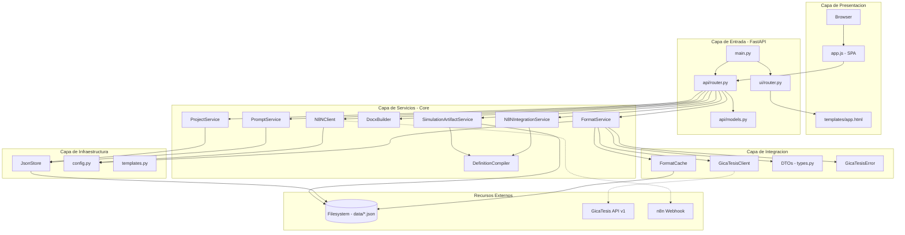
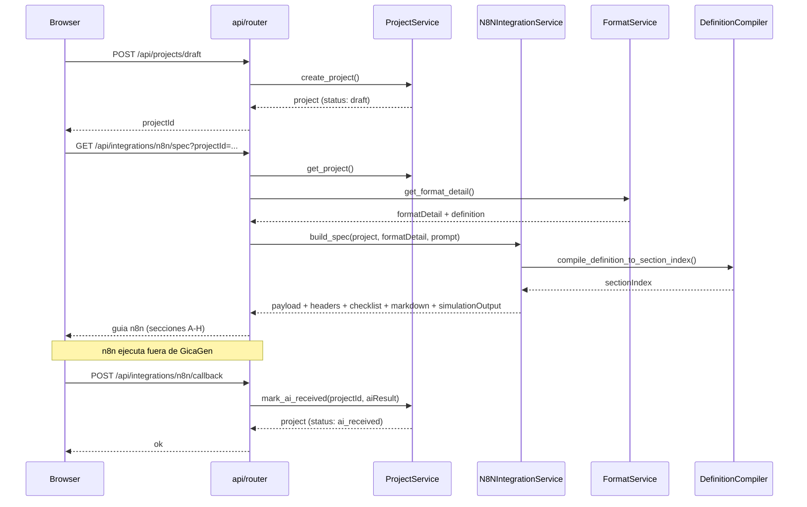
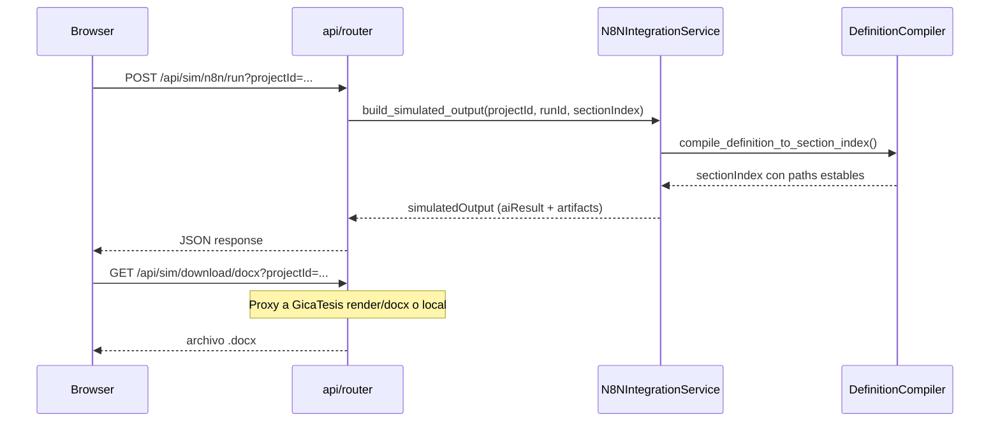
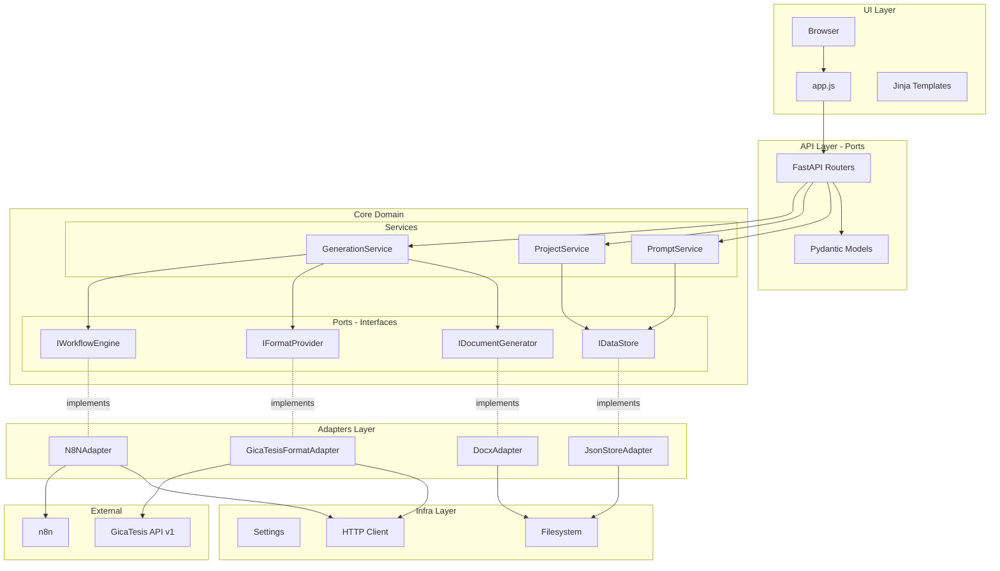

# Arquitectura - GicaGen

> Documentacion de la arquitectura actual del sistema.

---

## A) Arquitectura Actual

### Diagrama de Componentes



### Componentes Detectados

| Componente | Archivo | Responsabilidad |
|------------|---------|-----------------|
| **Entrypoint** | `app/main.py` | Configura FastAPI, monta routers y static files |
| **API Router** | `app/modules/api/router.py` | Endpoints REST: BFF formatos, prompts, proyectos, n8n, simulacion |
| **API Models** | `app/modules/api/models.py` | Modelos Pydantic: PromptIn, ProjectDraftIn, ProjectUpdateIn, ProjectGenerateIn, N8NCallbackIn |
| **UI Router** | `app/modules/ui/router.py` | Renderiza pagina principal via Jinja2 |
| **FormatService** | `app/core/services/format_service.py` | Orquesta obtencion de formatos via GicaTesis con cache ETag |
| **PromptService** | `app/core/services/prompt_service.py` | CRUD de prompts |
| **ProjectService** | `app/core/services/project_service.py` | CRUD de proyectos y estados |
| **DocxBuilder** | `app/core/services/docx_builder.py` | Genera DOCX placeholder (legacy) |
| **N8NClient** | `app/core/services/n8n_client.py` | Trigger webhook n8n |
| **N8NIntegrationService** | `app/core/services/n8n_integration_service.py` | Arma spec del paso 4 (payload/headers/checklist/markdown) |
| **DefinitionCompiler** | `app/core/services/definition_compiler.py` | Compila definiciones de formato a IR (Intermediate Representation) |
| **SimulationArtifactService** | `app/core/services/simulation_artifact_service.py` | Genera DOCX/PDF simulados desde IR de formato |
| **GicaTesisClient** | `app/integrations/gicatesis/client.py` | Cliente HTTP async para GicaTesis API v1 |
| **FormatCache** | `app/integrations/gicatesis/cache/format_cache.py` | Cache de formatos con ETag y timestamps |
| **DTOs** | `app/integrations/gicatesis/types.py` | FormatSummary, FormatDetail, FormatField, AssetRef, TemplateRef, CatalogVersionResponse |
| **GicaTesisError** | `app/integrations/gicatesis/errors.py` | Excepciones: UpstreamUnavailable, UpstreamTimeout, BadUpstreamResponse |
| **GicaTesisClient (legacy)** | `app/core/clients/gicatesis_client.py` | Cliente legacy (referencia antigua) |
| **JsonStore** | `app/core/storage/json_store.py` | Persistencia JSON con locks |
| **Config** | `app/core/config.py` | Settings desde env vars (dataclass frozen) |
| **Templates** | `app/core/templates.py` | Configuracion Jinja2Templates |

### Flujos Principales

#### 1. Wizard hasta guia n8n (Paso 4)



#### 2. Simulacion n8n



#### 3. CRUD de Prompts

```
Browser -> POST/PUT/DELETE /api/prompts -> PromptService -> JsonStore -> data/prompts.json
```

### Entrypoints

| Entrypoint | Descripcion |
|------------|-------------|
| `python -m uvicorn app.main:app --port 8001` | Servidor web principal |
| `GET /` | UI principal (SPA) |
| `GET /healthz` | Health check |
| `GET /api/_meta/build` | Metadata de la instancia activa |
| `GET /api/formats/version` | Version del catalogo |
| `GET /api/formats` | Lista formatos (con filtros university/category/documentType) |
| `GET /api/formats/{id}` | Detalle de formato |
| `GET /api/assets/{path}` | Proxy para assets de GicaTesis |
| `GET/POST/PUT/DELETE /api/prompts` | CRUD prompts |
| `GET /api/projects` | Lista proyectos |
| `POST /api/projects/draft` | Crea borrador desde wizard |
| `GET /api/projects/{id}` | Detalle de proyecto |
| `PUT /api/projects/{id}` | Actualiza proyecto |
| `GET /api/integrations/n8n/spec` | Contrato para paso 4 |
| `POST /api/integrations/n8n/callback` | Callback n8n -> GicaGen |
| `GET /api/integrations/n8n/health` | Health check n8n |
| `POST /api/sim/n8n/run` | Ejecuta simulacion |
| `GET /api/sim/download/docx` | Descarga DOCX simulado |
| `GET /api/sim/download/pdf` | Descarga PDF simulado |
| `POST /api/projects/generate` | Legacy: genera proyecto |
| `GET /api/download/{id}` | Legacy: descarga DOCX |

### Dependencias Cruzadas

| Problema | Evidencia | Severidad |
|----------|-----------|-----------|
| **Servicios como globals** | `api/router.py` instancia `FormatService()`, `PromptService()`, etc. como variables globales | Media |
| **Core depende de infraestructura** | `prompt_service.py` importa `JsonStore` directamente | Media |
| **Adapters en core** | `n8n_client.py` usa `httpx` directamente, `docx_builder.py` usa `python-docx` | Media |
| **Config hardcodeada** | `docx_builder.py` tiene secciones fijas | Baja |

---

## B) Arquitectura Objetivo (Propuesta)

### Diagrama con Boundaries



### Estructura de Carpetas Actual

```
app/
+---- main.py                      # Entrypoint FastAPI
+---- core/
|   +---- config.py                # Settings (dataclass frozen)
|   +---- templates.py             # Jinja2Templates config
|   +---- clients/
|   |   `---- gicatesis_client.py  # Cliente HTTP legacy
|   +---- services/                # 8 servicios principales
|   |   +---- format_service.py    # Orquesta formatos con cache
|   |   +---- prompt_service.py    # CRUD prompts
|   |   +---- project_service.py   # CRUD proyectos
|   |   +---- docx_builder.py      # Genera DOCX placeholder
|   |   +---- n8n_client.py        # Cliente webhook n8n
|   |   +---- n8n_integration_service.py  # Specs paso 4
|   |   +---- definition_compiler.py      # Compila definiciones a IR
|   |   `---- simulation_artifact_service.py  # Genera DOCX/PDF simulados
|   +---- storage/
|   |   `---- json_store.py        # Persistencia JSON con locks
|   `---- utils/
|       `---- id.py                # Generador de IDs con prefijo
+---- integrations/                # Integraciones externas
|   `---- gicatesis/
|       +---- client.py            # Cliente HTTP async para GicaTesis
|       +---- types.py             # DTOs Pydantic (FormatSummary, FormatDetail, etc.)
|       +---- errors.py            # Excepciones custom (UpstreamUnavailable, etc.)
|       `---- cache/
|           `---- format_cache.py  # Cache de formatos con ETag
+---- modules/
|   +---- api/
|   |   +---- router.py            # Todos los endpoints API
|   |   `---- models.py            # Modelos Pydantic de request
|   `---- ui/
|       `---- router.py            # Renderiza pagina principal
+---- static/js/
|   `---- app.js                   # Frontend SPA completo
`---- templates/
    +---- base.html                # Layout base HTML
    `---- pages/
        `---- app.html             # Pagina principal del wizard
```

---

## C) Reglas de Acoplamiento

### Principios

1. **Core no importa adapters/infra**
   - [X] `from app.adapters.storage import JsonStore`
   - [OK] `from app.core.ports import IDataStore` (interface)

2. **Adapters implementan ports**
   - Los adapters implementan las interfaces definidas en `core/ports/`
   - Ejemplo: `JsonStoreAdapter` implementa `IDataStore`

3. **Composition root hace el wiring**
   - `main.py` crea las instancias concretas y las inyecta
   - Usar `Depends()` de FastAPI para inyeccion

4. **Config declarativa manda**
   - Las URLs, claves y opciones vienen de `config.py`
   - No hardcodear en servicios

### Ejemplo de Codigo (Propuesto)

```python
# core/ports/data_store.py
from typing import Protocol, List, Dict, Any

class IDataStore(Protocol):
    def read_list(self) -> List[Dict[str, Any]]: ...
    def write_list(self, items: List[Dict[str, Any]]) -> None: ...

# core/services/prompt_service.py
class PromptService:
    def __init__(self, store: IDataStore):  # <- Inyectado
        self.store = store
    # ...

# adapters/storage/json_store_adapter.py
class JsonStoreAdapter:
    """Implementa IDataStore usando archivos JSON."""
    # ... (el codigo actual de json_store.py)

# main.py (composition root)
from fastapi import Depends

def get_prompt_store():
    return JsonStoreAdapter("data/prompts.json")

def get_prompt_service(store = Depends(get_prompt_store)):
    return PromptService(store)

@router.get("/prompts")
def list_prompts(svc: PromptService = Depends(get_prompt_service)):
    return svc.list_prompts()
```

---

## D) Plan de Desacoplo

### Problemas Identificados

| # | Problema | Evidencia | Impacto |
|---|----------|-----------|---------|
| 1 | Servicios como globals en router | `api/router.py` | Testing dificil, no inyectable |
| 2 | PromptService depende de JsonStore | `prompt_service.py` | Core acoplado a infra |
| 3 | ProjectService depende de JsonStore | `project_service.py` | Core acoplado a infra |
| 4 | FormatService usa GicaTesisClient separado | `format_service.py` + `integrations/gicatesis/` | **Implementado** |
| 5 | DocxBuilder usa python-docx directo | `docx_builder.py` | No reemplazable |
| 6 | N8NClient en core | `n8n_client.py` | Integracion en core |

### Soluciones Propuestas

| # | Solucion | Archivos a modificar | Riesgo |
|---|----------|---------------------|--------|
| 1 | Usar `Depends()` de FastAPI | `api/router.py`, `main.py` | Bajo |
| 2-3 | Crear `IDataStore` Protocol, inyectar | `prompt_service.py`, `project_service.py`, nuevo `ports/` | Medio |
| 4 | Ya implementado con patron BFF | `integrations/gicatesis/` | **Completado** |
| 5 | Crear `IDocumentGenerator`, mover a adapters | `docx_builder.py` -> `adapters/` | Medio |
| 6 | Crear `IWorkflowEngine`, mover a adapters | `n8n_client.py` -> `adapters/` | Medio |

### Orden Recomendado de Ejecucion

1. **Fase 1 (Bajo riesgo):** Cambiar servicios globals a `Depends()` en router
2. **Fase 2:** Crear carpeta `core/ports/` con interfaces
3. **Fase 3:** Mover `json_store.py` a `adapters/storage/`, hacer que implemente interface
4. **Fase 4:** Actualizar servicios para recibir interface inyectada
5. **Fase 5:** Mover `n8n_client.py`, `docx_builder.py` a `adapters/`

### Checklist de Validacion Post-Cambios

- [ ] `python -m uvicorn app.main:app --port 8001 --reload` inicia sin errores
- [ ] Navegar a http://127.0.0.1:8001/ carga correctamente
- [ ] Wizard completo funciona (pasos 1-5)
- [ ] CRUD de prompts funciona
- [ ] Simulacion n8n genera artifacts
- [ ] Descargar DOCX/PDF simulado funciona
- [ ] `GET /healthz` retorna `{"ok": true}`

---

## Diagrama de Arquitectura (Archivo)

Ver diagrama completo en: [diagramas/arquitectura.mmd](diagramas/arquitectura.mmd)
