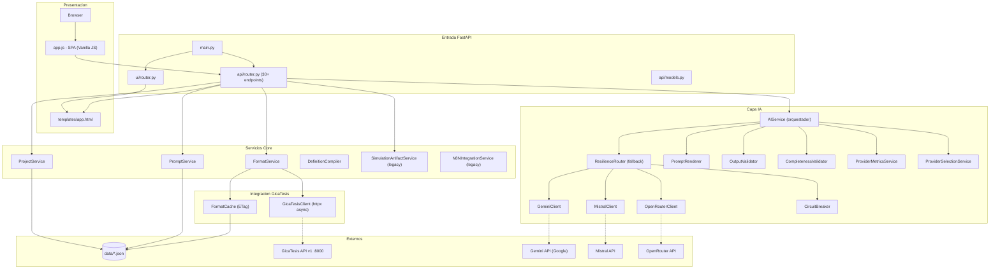
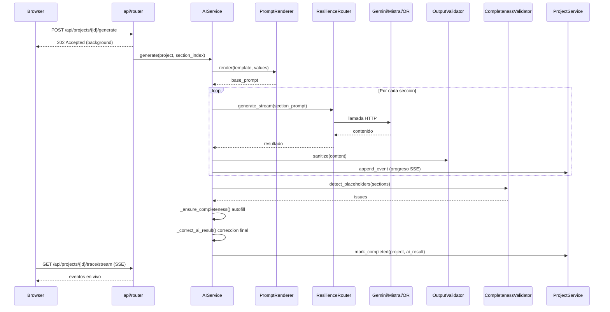

# Arquitectura - GicaGen

> Documentacion de la arquitectura actual del sistema.
> Actualizado: 2026-03-23.

---

## A) Arquitectura Actual

### Diagrama de Componentes


```mermaid
graph TB
    subgraph "Presentacion"
        BROWSER[Browser]
        JS["app.js - SPA (Vanilla JS)"]
        HTML["templates/app.html"]
    end

    subgraph "Entrada FastAPI"
        MAIN["main.py"]
        API_ROUTER["api/router.py (30+ endpoints)"]
        UI_ROUTER["ui/router.py"]
        MODELS["api/models.py"]
    end

    subgraph "Capa IA"
        AI_SVC["AIService (orquestador)"]
        RES_ROUTER["ResilienceRouter (fallback)"]
        GEMINI["GeminiClient"]
        MISTRAL["MistralClient"]
        OPENROUTER["OpenRouterClient"]
        CB["CircuitBreaker"]
        RENDERER["PromptRenderer"]
        OUT_VAL["OutputValidator"]
        COMP_VAL["CompletenessValidator"]
        PROV_MET["ProviderMetricsService"]
        PROV_SEL["ProviderSelectionService"]
    end

    subgraph "Servicios Core"
        FMT_SVC["FormatService"]
        PRM_SVC["PromptService"]
        PRJ_SVC["ProjectService"]
        DEF_COMP["DefinitionCompiler"]
        SIM_ART["SimulationArtifactService (legacy)"]
        N8N_INT["N8NIntegrationService (legacy)"]
    end

    subgraph "Integracion GicaTesis"
        GT_CLIENT["GicaTesisClient (httpx async)"]
        GT_CACHE["FormatCache (ETag)"]
    end

    subgraph "Externos"
        FS[("data/*.json")]
        GICATESIS["GicaTesis API v1 :8000"]
        GEMINI_API["Gemini API (Google)"]
        MISTRAL_API["Mistral API"]
        OR_API["OpenRouter API"]
    end

    BROWSER --> JS --> API_ROUTER
    MAIN --> API_ROUTER & UI_ROUTER --> HTML

    API_ROUTER --> AI_SVC & FMT_SVC & PRM_SVC & PRJ_SVC & SIM_ART

    AI_SVC --> RES_ROUTER
    AI_SVC --> RENDERER & OUT_VAL & COMP_VAL & PROV_MET & PROV_SEL
    RES_ROUTER --> GEMINI & MISTRAL & OPENROUTER & CB

    GEMINI -.-> GEMINI_API
    MISTRAL -.-> MISTRAL_API
    OPENROUTER -.-> OR_API

    FMT_SVC --> GT_CLIENT & GT_CACHE
    GT_CLIENT -.-> GICATESIS
    GT_CACHE --> FS
    PRM_SVC & PRJ_SVC --> FS
```

### Flujo de Generacion IA


```mermaid
sequenceDiagram
    participant B as Browser
    participant API as api/router
    participant AI as AIService
    participant PR as PromptRenderer
    participant RR as ResilienceRouter
    participant LLM as Gemini/Mistral/OR
    participant OV as OutputValidator
    participant CV as CompletenessValidator
    participant PS as ProjectService

    B->>API: POST /api/projects/{id}/generate
    API-->>B: 202 Accepted (background)

    API->>AI: generate(project, section_index)
    AI->>PR: render(template, values)
    PR-->>AI: base_prompt

    loop Por cada seccion
        AI->>RR: generate_stream(section_prompt)
        RR->>LLM: llamada HTTP
        LLM-->>RR: contenido
        RR-->>AI: resultado
        AI->>OV: sanitize(content)
        AI->>PS: append_event (progreso SSE)
    end

    AI->>CV: detect_placeholders(sections)
    CV-->>AI: issues
    AI->>AI: _ensure_completeness() autofill
    AI->>AI: _correct_ai_result() correccion final
    AI->>PS: mark_completed(project, ai_result)

    B->>API: GET /api/projects/{id}/trace/stream (SSE)
    API-->>B: eventos en vivo
```

### Componentes Actuales

| Componente | Archivo | Responsabilidad |
|------------|---------|-----------------|
| **Entrypoint** | `app/main.py` | Configura FastAPI, monta routers |
| **API Router** | `app/modules/api/router.py` | 30+ endpoints REST |
| **AIService** | `app/core/services/ai/ai_service.py` | Orquestador de generacion IA (70KB) |
| **ResilienceRouter** | `app/core/services/ai/resilience_router.py` | Fallback multi-proveedor con reintentos |
| **CircuitBreaker** | `app/core/services/ai/circuit_breaker.py` | Proteccion ante fallos consecutivos |
| **GeminiClient** | `app/core/services/ai/gemini_client.py` | Cliente Gemini API |
| **MistralClient** | `app/core/services/ai/mistral_client.py` | Cliente Mistral API |
| **OpenRouterClient** | `app/core/services/ai/openrouter_client.py` | Cliente OpenRouter |
| **PromptRenderer** | `app/core/services/ai/prompt_renderer.py` | Renderiza `{{variables}}` + SYSTEM_PROMPT |
| **OutputValidator** | `app/core/services/ai/output_validator.py` | Valida y sanea output IA |
| **CompletenessValidator** | `app/core/services/ai/completeness_validator.py` | Detecta placeholders y autofill |
| **ProviderMetricsService** | `app/core/services/ai/provider_metrics.py` | Metricas de uso y costo |
| **ProviderSelectionService** | `app/core/services/ai/provider_selection.py` | Seleccion de proveedor |
| **FormatService** | `app/core/services/format_service.py` | Formatos desde GicaTesis con ETag cache |
| **PromptService** | `app/core/services/prompt_service.py` | CRUD prompts JSON |
| **ProjectService** | `app/core/services/project_service.py` | CRUD proyectos, estados, trace, incidentes |
| **DefinitionCompiler** | `app/core/services/definition_compiler.py` | Formato → section_index IR |
| **ContentSanitizer** | `app/core/services/content_sanitizer.py` | Limpieza de texto generado |
| **TocDetector** | `app/core/services/toc_detector.py` | Detecta secciones de indice (excluidas) |
| **GicaTesisClient** | `app/integrations/gicatesis/client.py` | HTTP async GicaTesis API v1 |
| **FormatCache** | `app/integrations/gicatesis/cache/format_cache.py` | Cache ETag de formatos |
| **JsonStore** | `app/core/storage/json_store.py` | Persistencia JSON con locks |
| **SimulationArtifactService** | `app/core/services/simulation_artifact_service.py` | DOCX/PDF simulados (legacy/demo) |
| **N8NIntegrationService** | `app/core/services/n8n_integration_service.py` | Specs paso 4 (legacy) |

---

## B) Endpoints Principales

| Endpoint | Metodo | Descripcion |
|----------|--------|-------------|
| `/` | GET | UI wizard (SPA) |
| `/healthz` | GET | Health check |
| `/api/_meta/build` | GET | Build info |
| `/api/formats` | GET | Lista formatos |
| `/api/formats/{id}` | GET | Detalle de formato |
| `/api/assets/{path}` | GET | Proxy assets GicaTesis |
| `/api/prompts` | GET/POST/PUT/DELETE | CRUD prompts |
| `/api/projects` | GET | Lista proyectos |
| `/api/projects/draft` | POST | Crear borrador |
| `/api/projects/{id}` | GET/PUT | Ver/actualizar proyecto |
| `/api/projects/{id}/generate` | POST | **Generar con IA (202 async)** |
| `/api/projects/{id}/cancel` | POST | Cancelar generacion |
| `/api/projects/{id}/trace` | GET | Eventos de trace |
| `/api/projects/{id}/trace/stream` | GET | **SSE: trace en vivo** |
| `/api/render/docx` | POST | Proxy render DOCX (GicaTesis) |
| `/api/render/pdf` | POST | Proxy render PDF (GicaTesis) |
| `/api/sim/n8n/run` | POST | Simulacion legacy |

---

## C) Estructura de Carpetas Actual

```
app/
├── main.py
├── core/
│   ├── config.py
│   ├── templates.py
│   ├── services/
│   │   ├── ai/                        # 23 modulos
│   │   │   ├── ai_service.py
│   │   │   ├── gemini_client.py
│   │   │   ├── mistral_client.py
│   │   │   ├── openrouter_client.py
│   │   │   ├── resilience_router.py
│   │   │   ├── circuit_breaker.py
│   │   │   ├── completeness_validator.py
│   │   │   ├── output_validator.py
│   │   │   ├── prompt_renderer.py
│   │   │   ├── provider_metrics.py
│   │   │   ├── provider_selection.py
│   │   │   └── ... (12 mas)
│   │   ├── format_service.py
│   │   ├── prompt_service.py
│   │   ├── project_service.py
│   │   ├── definition_compiler.py
│   │   ├── content_sanitizer.py
│   │   ├── indices_normalizer.py
│   │   ├── toc_detector.py
│   │   ├── simulation_artifact_service.py
│   │   ├── n8n_client.py              # legacy
│   │   └── n8n_integration_service.py # legacy
│   ├── storage/json_store.py
│   └── utils/id.py
├── integrations/gicatesis/
│   ├── client.py
│   ├── types.py
│   ├── errors.py
│   └── cache/format_cache.py
├── modules/
│   ├── api/router.py
│   ├── api/models.py
│   └── ui/router.py
├── static/js/app.js
└── templates/pages/app.html
```

---

## D) Dependencias Cruzadas Pendientes

| Problema | Evidencia | Prioridad |
|----------|-----------|-----------|
| Servicios como globals | `api/router.py` instancia globalmente | P2 — migrar a `Depends()` |
| Core depende de infra directamente | `json_store.py` en servicios | P2 — extraer interfaces |
