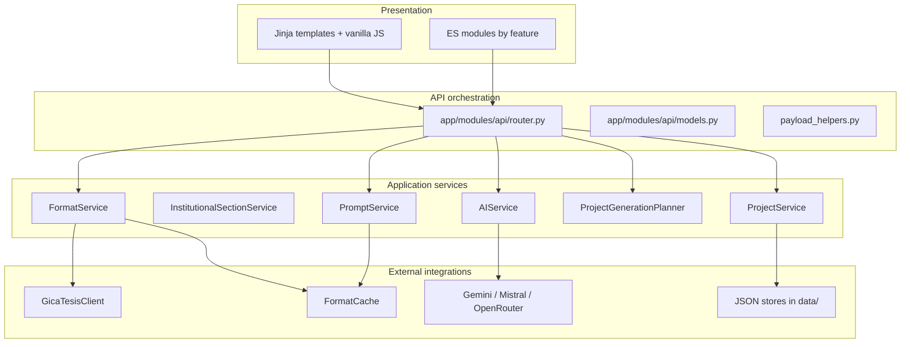
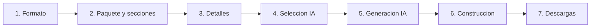

# Arquitectura de GicaGen

GicaGen is a backend-for-frontend for institutional thesis generation. The
system keeps the orchestration logic in GicaGen and delegates institutional
format truth plus final render to GicaTesis.

This document focuses on the architecture after the institutional prompt
package refactor.

## High-level view

The architecture is split into four practical layers:

- presentation
- API orchestration
- application services
- external integrations

```mermaid
graph TB
    subgraph "Presentation"
        UI["Jinja templates + vanilla JS"]
        MODS["ES modules by feature"]
    end

    subgraph "API orchestration"
        ROUTER["app/modules/api/router.py"]
        MODELS["app/modules/api/models.py"]
        HELPERS["payload_helpers.py"]
    end

    subgraph "Application services"
        FORMAT["FormatService"]
        SECTION["InstitutionalSectionService"]
        PROMPTS["PromptService"]
        PROJECTS["ProjectService"]
        PLAN["ProjectGenerationPlanner"]
        AI["AIService"]
    end

    subgraph "External integrations"
        GT["GicaTesisClient"]
        CACHE["FormatCache"]
        LLM["Gemini / Mistral / OpenRouter"]
        STORE["JSON stores in data/"]
    end

    UI --> ROUTER
    MODS --> ROUTER
    ROUTER --> FORMAT
    ROUTER --> PROMPTS
    ROUTER --> PROJECTS
    ROUTER --> PLAN
    ROUTER --> AI
    FORMAT --> GT
    FORMAT --> CACHE
    PROMPTS --> CACHE
    PROJECTS --> STORE
    AI --> LLM
```

## Institutional package flow

The central change is that the package structure no longer starts in the admin
UI. It starts in the institutional format definition.

The flow is:

1. `FormatService` fetches `FormatDetail` from GicaTesis.
2. `InstitutionalSectionService` extracts generative sections from
   `FormatDetail.definition`.
3. `PromptService` overlays prompt blocks and required variables on top of
   those sections.
4. `ProjectGenerationPlanner` filters the package by the project's selected
   sections.
5. `AIService` generates only the planned sections.
6. `payload_helpers.py` adapts the partial AI result for GicaTesis render.

This keeps one source of truth for institutional structure and prevents the
frontend from inventing chapter trees.

## Backend responsibilities

### `InstitutionalSectionService`

This service wraps the definition compiler output and applies the institutional
selection rules. It is the reusable boundary for both prompt administration and
the wizard.

Its responsibilities are:

- extract sections from `definition`
- derive `section_path`, `section_title`, and hierarchy
- exclude TOC and index branches through the compiled section index
- mark `resumen`, `dedicatoria`, and `agradecimiento` as optional

### `PromptService`

This service now manages prompt packages instead of flat prompt records. It
also absorbs legacy data into the normalized package structure.

Its responsibilities are:

- normalize prompt packages
- infer `format_id` for older records
- merge legacy UNAC prompt blocks into the real institutional sections
- persist normalized package records

### `ProjectService`

This service now persists wizard state that is necessary to replay the exact
generation scope later.

Its responsibilities are:

- store `prompt_snapshot`
- store `selected_sections`
- normalize old projects that do not have those fields yet
- keep generation and construction phase snapshots

### `ProjectGenerationPlanner`

This service isolates the merge between institutional structure, prompt package
metadata, and user selection.

Its responsibilities are:

- match package sections by `section_id` and `section_path`
- infer selection from previous `ai_result` when needed
- collect required variables for step 3
- provide the exact section plan for `AIService`

### `AIService`

This service keeps the provider routing and generation pipeline, but it no
longer assumes every compiled section must run.

Its responsibilities are:

- build one final prompt per selected section
- combine package template, compiler hints, and block instructions
- generate only `planned_sections`
- preserve trace and usage metrics per section

## Frontend responsibilities

The frontend now uses a small bootstrap entrypoint in
`app/static/js/app.js`. The compatibility shell still exists in
`app/static/js/features/app-shell.js`, but it now acts as composition and
compatibility facade instead of owning the feature logic directly.

Current module split:

- `shared/api-client.js`
- `shared/dom.js`
- `state/wizard-store.js`
- `features/projects/project-ui.js`
- `features/dashboard/dashboard-controller.js`
- `features/history/history-controller.js`
- `features/budget/budget-controller.js`
- `features/providers/provider-controller.js`
- `features/wizard/wizard-controller.js`
- `features/wizard/format-step.js`
- `features/wizard/package-selection-step.js`
- `features/wizard/details-step.js`
- `features/wizard/provider-step.js`
- `features/wizard/generation-step.js`
- `features/wizard/build-step.js`
- `features/wizard/download-step.js`
- `features/generation/trace-state.js`
- `features/generation/generation-controller.js`
- `features/generation/trace-view.js`
- `features/n8n/n8n-guide-controller.js`
- `features/prompt-packages/admin-list.js`
- `features/prompt-packages/section-tree.js`
- `features/prompt-packages/editor.js`
- `features/prompt-admin-legacy/prompt-admin-controller.js`

The main server-rendered template also changed shape. `app/templates/pages/app.html`
is now an assembler that includes partials for the sidebar, stepper, wizard
steps, admin view, and modal shells under `app/templates/pages/partials/`.

This split keeps legacy DOM hooks working while moving business rules out of
the old entrypoint and toward domain modules.

The shell still exists, but it now delegates these explicit domain
controllers:

- dashboard
- history
- budget
- providers
- generation
- n8n guide
- prompt admin legacy compatibility

## Wizard architecture

The wizard remains a seven-step flow.

```mermaid
flowchart LR
    A["1. Formato"] --> B["2. Paquete y secciones"]
    B --> C["3. Detalles"]
    C --> D["4. Seleccion IA"]
    D --> E["5. Generacion IA"]
    E --> F["6. Construccion"]
    F --> G["7. Descargas"]
```

The critical architectural rules are:

- step 2 always resolves the package from the selected format
- step 3 asks only for `title` plus variables required by selected sections
- step 5 shows trace only for selected sections
- optional sections remain visible but not selected by default

## Why GicaTesis did not change

This refactor deliberately stopped at the GicaGen boundary.

The existing GicaTesis contract already provided:

- `FormatDetail.definition` for section extraction
- stable HTTP DTOs for formats and render
- support for partial `aiResult.sections`

Because of that, the change stayed in GicaGen and did not require DTO or
render engine changes in GicaTesis.

## Architectural debt that still exists

The refactor was incremental, not a rewrite. These debt items still remain:

- `app/modules/api/router.py` is still too large and still contains workflow
  coordination that could move into dedicated application services.
- `app/static/js/features/app-shell.js` still owns navigation wiring and the
  public `window.TesisAI` facade, so it remains a compatibility layer even
  after the domain extractions.
- repository-wide static analysis is not yet clean outside the touched scope.

## Next steps

The next iteration should keep reducing the compatibility surface:

1. shrink the remaining public facade on `features/app-shell.js`
2. split `router.py` by domain area without changing HTTP contracts
3. retire legacy prompt admin paths once the normalized package UI is the only
   active path
