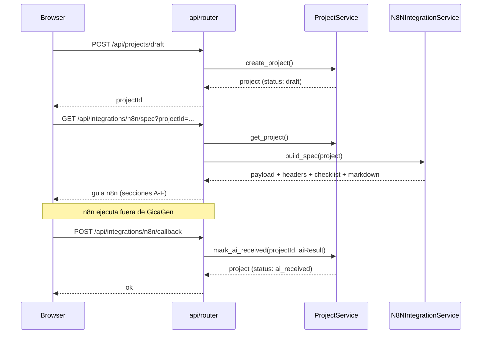

# Arquitectura - GicaGen

> Documentación de la arquitectura actual y objetivo del sistema.

---

## A) Arquitectura Actual

### Diagrama de Componentes


### Componentes Detectados

| Componente | Archivo | Responsabilidad |
|------------|---------|-----------------|
| **Entrypoint** | `app/main.py` | Configura FastAPI, monta routers y static files |
| **API Router** | `app/modules/api/router.py` | Endpoints REST para BFF, prompts, proyectos y contratos n8n |
| **UI Router** | `app/modules/ui/router.py` | Renderiza página principal via Jinja2 |
| **FormatService** | `app/core/services/format_service.py` | Orquesta obtención de formatos (via GicaTesis) |
| **PromptService** | `app/core/services/prompt_service.py` | CRUD de prompts |
| **ProjectService** | `app/core/services/project_service.py` | CRUD de proyectos y estados |
| **DocxBuilder** | `app/core/services/docx_builder.py` | Genera DOCX placeholder |
| **N8NClient** | `app/core/services/n8n_client.py` | Trigger webhook n8n |
| **N8NIntegrationService** | `app/core/services/n8n_integration_service.py` | Arma spec del paso 4 (payload/headers/checklist/markdown) |
| **JsonStore** | `app/core/storage/json_store.py` | Persistencia JSON con locks |
| **Config** | `app/core/config.py` | Settings desde env vars |

### Flujos Principales

#### 1. Wizard hasta guia n8n (Paso 4)



#### 2. CRUD de Prompts

```
Browser -> POST/PUT/DELETE /api/prompts -> PromptService -> JsonStore -> data/prompts.json
```

### Entrypoints

| Entrypoint | Descripción |
|------------|-------------|
| `python -m uvicorn app.main:app` | Servidor web principal |
| `GET /` | UI principal (SPA) |
| `GET /api/formats` | Lista formatos |
| `GET/POST/PUT/DELETE /api/prompts` | CRUD prompts |
| `GET /api/projects` | Lista proyectos |
| `POST /api/projects/draft` | Crea borrador desde wizard |
| `GET /api/integrations/n8n/spec` | Devuelve contrato para paso 4 |
| `POST /api/integrations/n8n/callback` | Guarda `aiResult` con secret |
| `POST /api/projects/generate` | Inicia generación |
| `GET /api/download/{id}` | Descarga DOCX |
| `POST /api/n8n/callback/{id}` | Callback legacy |
| `GET /healthz` | Health check |

### Dependencias Cruzadas Peligrosas

| Problema | Evidencia | Severidad |
|----------|-----------|-----------|
| **Servicios como globals** | `api/router.py:19-22` instancia `FormatService()`, `PromptService()`, etc. como variables globales | [MEDIA] Media |
| **Core depende de infraestructura** | `prompt_service.py:4` importa `JsonStore` directamente | [MEDIA] Media |
| **Adapters en core** | `n8n_client.py` usa `httpx` directamente, `docx_builder.py` usa `python-docx`. **Nota:** FormatService ahora usa cliente GicaTesis separado. | [MEDIA] Media |
| **Config hardcodeada** | `docx_builder.py:21` tiene secciones fijas | [BAJA] Baja |

---

## B) Arquitectura Objetivo (Propuesta)

### Diagrama con Boundaries


### Estructura de Carpetas Propuesta

```
app/
+---- main.py                      # Composition root
+---- core/
|   +---- domain/                  # Entidades de dominio (si las hay)
|   +---- services/                # Servicios de negocio
|   |   +---- prompt_service.py
|   |   +---- project_service.py
|   |   `---- generation_service.py
|   `---- ports/                   # Interfaces/Contratos
|       +---- data_store.py        # Protocol IDataStore
|       +---- document_generator.py
|       +---- format_provider.py
|       `---- workflow_engine.py
+---- adapters/                    # <- NUEVO
|   +---- storage/
|   |   `---- json_store_adapter.py
|   +---- documents/
|   |   `---- docx_adapter.py
|   +---- formats/
|   |   `---- external_format_adapter.py
|   `---- workflows/
|       `---- n8n_adapter.py
+---- infra/                       # <- NUEVO
|   +---- config.py
|   `---- http_client.py
+---- modules/                     # Se mantiene igual
|   +---- api/
|   `---- ui/
`---- ...
```

---

## C) Reglas de Acoplamiento

### Principios

1. **Core no importa adapters/infra**
   - [X] `from app.adapters.storage import JsonStore`
   - [OK] `from app.core.ports import IDataStore` (interface)

2. **Adapters implementan ports**
   - Los adapters implementan las interfaces definidas en `core/ports/`
   - Ejemplo: `JsonStoreAdapter` implementa `IDataStore`

3. **Composition root hace el wiring**
   - `main.py` crea las instancias concretas y las inyecta
   - Usar `Depends()` de FastAPI para inyección

4. **Config declarativa manda**
   - Las URLs, claves y opciones vienen de `config.py`
   - No hardcodear en servicios

### Ejemplo de Código (Propuesto)

```python
# core/ports/data_store.py
from typing import Protocol, List, Dict, Any

class IDataStore(Protocol):
    def read_list(self) -> List[Dict[str, Any]]: ...
    def write_list(self, items: List[Dict[str, Any]]) -> None: ...

# core/services/prompt_service.py
class PromptService:
    def __init__(self, store: IDataStore):  # <- Inyectado
        self.store = store
    # ...

# adapters/storage/json_store_adapter.py
class JsonStoreAdapter:
    """Implementa IDataStore usando archivos JSON."""
    # ... (el código actual de json_store.py)

# main.py (composition root)
from fastapi import Depends

def get_prompt_store():
    return JsonStoreAdapter("data/prompts.json")

def get_prompt_service(store = Depends(get_prompt_store)):
    return PromptService(store)

@router.get("/prompts")
def list_prompts(svc: PromptService = Depends(get_prompt_service)):
    return svc.list_prompts()
```

---

## D) Plan de Desacoplo

### Problemas Identificados

| # | Problema | Evidencia | Impacto |
|---|----------|-----------|---------|
| 1 | Servicios como globals en router | `api/router.py:19-22` | Testing difícil, no inyectable |
| 2 | PromptService depende de JsonStore | `prompt_service.py:4` | Core acoplado a infra |
| 3 | ProjectService depende de JsonStore | `project_service.py:7` | Core acoplado a infra |
| 4 | FormatService ahora usa GicaTesisClient separado | `format_service.py` + `integrations/gicatesis/` | [OK] Implementado |
| 5 | DocxBuilder usa python-docx directo | `docx_builder.py` | No reemplazable |
| 6 | N8NClient en core | `n8n_client.py` | Integración en core |

### Soluciones Propuestas

| # | Solución | Archivos a modificar | Riesgo |
|---|----------|---------------------|--------|
| 1 | Usar `Depends()` de FastAPI | `api/router.py`, `main.py` | [BAJA] Bajo |
| 2-3 | Crear `IDataStore` Protocol, inyectar | `prompt_service.py`, `project_service.py`, nuevo `ports/` | [MEDIA] Medio |
| 4 | Crear `IFormatProvider`, mover a adapters | `format_api.py` -> `adapters/` | [MEDIA] Medio |
| 5 | Crear `IDocumentGenerator`, mover a adapters | `docx_builder.py` -> `adapters/` | [MEDIA] Medio |
| 6 | Crear `IWorkflowEngine`, mover a adapters | `n8n_client.py` -> `adapters/` | [MEDIA] Medio |

### Orden Recomendado de Ejecución

1. **Fase 1 (Bajo riesgo):** Cambiar servicios globals a `Depends()` en router
2. **Fase 2:** Crear carpeta `core/ports/` con interfaces
3. **Fase 3:** Mover `json_store.py` a `adapters/storage/`, hacer que implemente interface
4. **Fase 4:** Actualizar servicios para recibir interface inyectada
5. **Fase 5:** Mover `format_api.py`, `n8n_client.py`, `docx_builder.py` a `adapters/`

### Checklist de Validación Post-Cambios

- [ ] `python -m uvicorn app.main:app --reload` inicia sin errores
- [ ] Navegar a http://127.0.0.1:8001/ carga correctamente
- [ ] Wizard completo funciona (pasos 1-4)
- [ ] CRUD de prompts funciona
- [ ] Descargar DOCX generado funciona
- [ ] `GET /healthz` retorna `{"ok": true}`

---

## Diagrama de Arquitectura (Archivo)

Ver diagrama completo en: [diagramas/arquitectura.mmd](diagramas/arquitectura.mmd)
