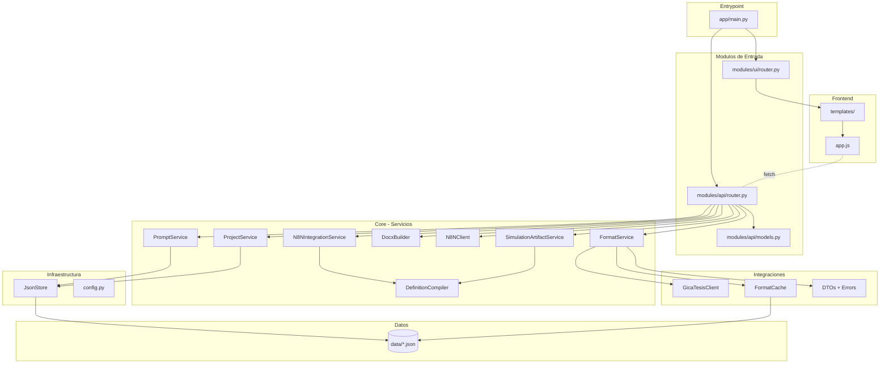

# Catalogo del Repositorio - GicaGen

> Mapa mental y resumen navegable del repositorio.

## Vista General



## Catalogos Detallados

| Catalogo | Descripcion | Link |
|----------|-------------|------|
| **Carpetas** | Inventario de 17 carpetas con proposito, criticidad y recomendaciones | [catalogo/carpetas.md](catalogo/carpetas.md) |
| **Archivos** | Inventario de 73 archivos con tipo, dependencias y estado | [catalogo/archivos.md](catalogo/archivos.md) |

## Resumen de Estructura

```
gicagen_tesis-main/
+-- README.md, AGENTS.md             # Documentacion raiz
+-- requirements.txt                 # Dependencias Python
+-- app/                             # Codigo fuente (Critico)
|   +-- main.py                      # Entrypoint FastAPI
|   +-- core/                        # Logica de negocio
|   |   +-- config.py                # Settings (dataclass frozen)
|   |   +-- templates.py             # Jinja2 config
|   |   +-- clients/                 # Cliente HTTP legacy
|   |   +-- services/                # 8 servicios principales
|   |   +-- storage/                 # JsonStore
|   |   `-- utils/                   # ID generator
|   +-- integrations/                # Integraciones externas
|   |   `-- gicatesis/               # Cliente + cache + DTOs + errores
|   |       `-- cache/               # Cache ETag de formatos
|   +-- modules/                     # API y UI
|   |   +-- api/                     # REST endpoints + modelos Pydantic
|   |   `-- ui/                      # Jinja router
|   +-- static/js/                   # Frontend SPA
|   `-- templates/                   # HTML Jinja2
+-- data/                            # JSON de datos (Importante)
+-- scripts/                         # Utilidades de encoding
`-- docs/                            # Esta documentacion (Opcional)
```

## Estadisticas del Repositorio

> **Fuente:** Conteo real del repositorio (excluyendo `.venv`, `__pycache__`, `.git`, `.cca`, `outputs`)

| Metrica | Valor |
|---------|-------|
| Archivos totales | 73 |
| Archivos de codigo Python | 33 |
| Lineas de codigo Python | 2875 |
| Lineas de codigo JavaScript | 898 (`app.js`) |
| Lineas de HTML | 464 (`base.html`: 31, `app.html`: 433) |
| Archivos de datos JSON | 4 |
| Scripts de utilidad | 3 |
| Dependencias Python | 7 paquetes |

## Dependencias Externas

**Python (requirements.txt):**

| Paquete | Version | Uso |
|---------|---------|-----|
| FastAPI | 0.115.6 | Framework web |
| uvicorn | 0.30.6 | Servidor ASGI |
| Jinja2 | 3.1.4 | Templates HTML |
| Pydantic | (latest) | Validacion de datos |
| python-multipart | 0.0.9 | Upload de archivos |
| httpx | 0.27.2 | Cliente HTTP async |
| python-docx | 1.1.2 | Generacion DOCX |

**Implicitas (usadas en codigo, no en requirements.txt):**

| Paquete | Uso |
|---------|-----|
| python-dotenv | Carga de `.env` en config.py |

**Frontend (CDN):**
- Tailwind CSS
- FontAwesome

## Set Minimo para Ejecutar

Ver detalles en [catalogo/archivos.md](catalogo/archivos.md#set-minimo-para-ejecutar-el-sistema).

**Resumen:** Se requieren ~38 archivos minimos para ejecutar el sistema (incluyendo modulo de integracion GicaTesis). Los archivos en `/docs`, `/scripts` y `readme.txt` son opcionales.

## Acoplamientos Identificados

| Problema | Archivos afectados | Severidad |
|----------|-------------------|-----------|
| Servicios instanciados como globals | `api/router.py` | Media |
| Servicios dependen de JsonStore directamente | `prompt_service.py`, `project_service.py` | Media |
| Adaptadores mezclados en core | `n8n_client.py`, `docx_builder.py` | Media |

Ver plan de desacoplo en [02-arquitectura.md](02-arquitectura.md).
