# Catálogo del Repositorio - GicaGen

> Mapa mental y resumen navegable del repositorio.

## Vista General

```mermaid
graph TB
    subgraph "Entrypoint"
        MAIN[app/main.py]
    end
    
    subgraph "Módulos de Entrada"
        API[modules/api/router.py]
        UI[modules/ui/router.py]
    end
    
    subgraph "Core - Servicios"
        FMT[FormatService]
        PRM[PromptService]
        PRJ[ProjectService]
        DOCX[DocxBuilder]
        N8N[N8NClient]
    end
    
    subgraph "Infraestructura"
        JSON[JsonStore]
        CFG[config.py]
    end
    
    subgraph "Datos"
        DATA[(data/*.json)]
    end
    
    subgraph "Frontend"
        JS[app.js]
        HTML[templates/]
    end
    
    MAIN --> API
    MAIN --> UI
    API --> FMT
    API --> PRM
    API --> PRJ
    API --> DOCX
    API --> N8N
    PRM --> JSON
    PRJ --> JSON
    JSON --> DATA
    FMT --> DATA
    UI --> HTML
    HTML --> JS
    JS -.->|fetch| API
```



## Catálogos Detallados

| Catálogo | Descripción | Link |
|----------|-------------|------|
| **Carpetas** | Inventario de 12 carpetas con propósito, criticidad y recomendaciones | [catalogo/carpetas.md](catalogo/carpetas.md) |
| **Archivos** | Inventario de 50 archivos con tipo, dependencias y estado | [catalogo/archivos.md](catalogo/archivos.md) |

## Resumen de Estructura

```
gicagen_tesis-main/
+-- 📄 README.md, AGENTS.md         # Documentación raíz
+-- 📄 requirements.txt             # Dependencias Python
+-- 📂 app/                         # Código fuente (🔴 Crítico)
|   +-- main.py                     # Entrypoint FastAPI
|   +-- 📂 core/                    # Lógica de negocio
|   |   +-- config.py               # Settings
|   |   +-- 📂 services/            # 5 servicios principales
|   |   +-- 📂 storage/             # JsonStore
|   |   `-- 📂 utils/               # ID generator
|   +-- 📂 modules/                 # API y UI
|   |   +-- 📂 api/                 # REST endpoints
|   |   `-- 📂 ui/                  # Jinja router
|   +-- 📂 static/js/               # Frontend SPA
|   `-- 📂 templates/               # HTML Jinja2
+-- 📂 data/                        # JSON de datos (🟡 Importante)
`-- 📂 docs/                        # Esta documentación (🟢 Opcional)
```

## Estadísticas del Repositorio

> **Fuente:** Conteo real del repositorio (excluyendo `.venv`, `__pycache__`, `.git`)

| Métrica | Valor | Verificación |
|---------|-------|--------------|
| Archivos totales | 50 | `find_by_name` con exclusiones |
| Archivos de código Python | 15 | `app/**/*.py` (sin __init__.py: 10) |
| Archivos de configuración | 2 | `requirements.txt`, `.env.example` |
| Archivos de datos JSON | 3 | `data/*.json` |
| Archivos frontend (JS/HTML) | 3 | `app.js`, `base.html`, `app.html` |
| Líneas de código Python | 378 | `Get-Content app/**/*.py | Measure-Object -Line` |
| Líneas de código JavaScript | 562 | `app/static/js/app.js` |
| Líneas de HTML | 399 | `base.html` (31) + `app.html` (368) |

## Dependencias Externas

**Python (requirements.txt):**

| Paquete | Versión | Uso |
|---------|---------|-----|
| FastAPI | 0.115.6 | Framework web |
| uvicorn | 0.30.6 | Servidor ASGI |
| Jinja2 | 3.1.4 | Templates HTML |
| Pydantic | 2.9.2 | Validación de datos |
| python-multipart | 0.0.9 | Upload de archivos |
| httpx | 0.27.2 | Cliente HTTP async |
| python-docx | 1.1.2 | Generación DOCX |

**Frontend (CDN):**
- Tailwind CSS
- FontAwesome

## Set Mínimo para Ejecutar

Ver detalles en [catalogo/archivos.md](catalogo/archivos.md#set-mínimo-para-ejecutar-el-sistema).

**Resumen:** Se requieren 25 archivos mínimos para ejecutar el sistema. Los archivos en `/docs` y `readme.txt` son opcionales.

## Acoplamientos Identificados

| Problema | Archivos afectados | Severidad |
|----------|-------------------|-----------|
| Servicios instanciados como globals | `api/router.py` | 🟡 Media |
| Servicios dependen de JsonStore directamente | `prompt_service.py`, `project_service.py` | 🟡 Media |
| Adaptadores mezclados en core | `format_api.py`, `n8n_client.py`, `docx_builder.py` | 🟡 Media |

Ver plan de desacoplo en [02-arquitectura.md](02-arquitectura.md).
