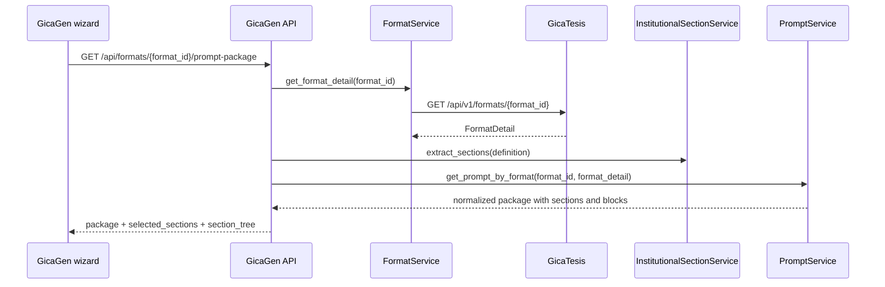

# Integracion con GicaTesis

GicaGen integrates with GicaTesis as a backend-for-frontend. GicaGen consumes
institutional formats and render endpoints over HTTP and does not import code
from the GicaTesis repository.

This document records the integration rules that remain true after the
institutional prompt package refactor completed on April 1, 2026.

## Integration boundaries

GicaGen consumes these GicaTesis concerns:

- institutional format catalog
- format detail metadata
- institutional assets
- DOCX render
- PDF render

GicaGen owns these concerns locally:

- wizard state
- prompt package administration
- project persistence
- AI provider selection
- AI generation trace
- payload validation before render

## Current contract usage

The refactor did not change GicaTesis contracts.

GicaGen still relies on:

- `FormatDetail.fields`
- `FormatDetail.definition`
- render endpoints that accept `aiResult.sections`

That was enough to implement:

- institutional section extraction
- optional section defaults
- selected section generation
- partial render payloads

No DTO, router, preprocessor, or render engine change was required in
GicaTesis.

## Format hydration flow

GicaGen now resolves the prompt package from the selected format instead of
from a manual admin tree.

## Section extraction rules

GicaGen derives the editable section tree from `FormatDetail.definition`.

The extraction rules are:

- reuse the compiled section index from the definition compiler
- exclude TOC and index branches
- keep chapter and subsection paths stable
- mark `resumen`, `dedicatoria`, and `agradecimiento` as optional

This means the package admin and the wizard read the same institutional tree.

## Render payload rules

GicaGen still validates the payload locally before calling GicaTesis render.

The important rule introduced by this refactor is:

- `aiResult.sections` now contains only the sections selected and generated by
  the project

GicaTesis keeps the institutional structure because render still uses the
original format definition plus the partial `aiResult`.

## Why partial `aiResult.sections` is valid

The current render integration is compatible with selected-section generation
because GicaTesis already resolves content by section identity.

GicaGen sends each generated section with:

- `sectionId`
- `path`
- generated `content`

Sections that the user did not select are omitted from `aiResult.sections`.
GicaTesis then renders the document with those branches empty or untouched,
depending on the format and the render path.

## Endpoints used by GicaGen

GicaGen uses these upstream routes:

- `GET /api/v1/formats`
- `GET /api/v1/formats/{id}`
- `GET /api/v1/formats/version`
- `GET /api/v1/assets/{path}`
- `POST /api/v1/render/docx`
- `POST /api/v1/render/pdf`

The browser-facing BFF routes in GicaGen remain:

- `GET /api/formats`
- `GET /api/formats/{id}`
- `GET /api/formats/{id}/prompt-package`
- `POST /api/render/docx`
- `POST /api/render/pdf`

## Operational note

If GicaTesis is offline, GicaGen still degrades gracefully:

- format list falls back to cache or sample data
- prompt package hydration uses cached format detail when available
- remote logos and assets can be unavailable
- render still requires GicaTesis unless the flow stays in demo mode

## Next steps

If a future format no longer exposes a usable chapter tree in
`FormatDetail.definition`, that would be the threshold to revisit the GicaTesis
contract. That threshold was not reached in this implementation.
