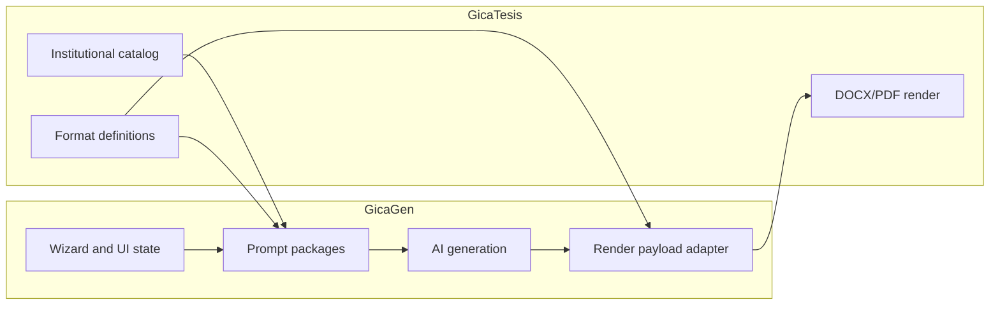

# Mapa GicaGen-GicaTesis

This document maps the responsibilities that stay in GicaGen and the
responsibilities that stay in GicaTesis after the institutional prompt package
refactor.

## System map

GicaGen and GicaTesis now interact with a cleaner boundary:

## Responsibility split

| Area | GicaGen | GicaTesis |
| --- | --- | --- |
| Institutional catalog | consume | own |
| Format definition | consume | own |
| Prompt package admin | own | no |
| Section extraction for AI | own, derived from definition | source data only |
| Section selection per project | own | no |
| Provider and model selection | own | no |
| AI generation | own | no |
| Render contract validation before proxy | own | no |
| DOCX render | proxy only | own |
| PDF render | proxy only | own |

## Data flow by step

The seven-step wizard now crosses the repo boundary like this:

1. **Formato**
   GicaGen loads the format catalog from GicaTesis.
2. **Paquete & Secciones**
   GicaGen derives sections from `FormatDetail.definition` and overlays prompt
   blocks.
3. **Detalles**
   GicaGen asks only for title plus required variables from selected sections.
4. **Seleccion IA**
   GicaGen resolves provider and model locally.
5. **Generacion IA**
   GicaGen generates only the selected sections.
6. **Construccion**
   GicaGen adapts the partial `aiResult` to the render payload.
7. **Descargas**
   GicaGen proxies the render artifacts produced by GicaTesis.

## Contract stability

The integration contract did not change in this refactor.

This is the justification:

- `FormatDetail.definition` already exposes the institutional hierarchy needed
  by GicaGen.
- GicaTesis render already accepts partial `aiResult.sections`.
- No cross-repo import was introduced.

## Files to check when debugging

When debugging the boundary, start with these files:

### In GicaGen

- `app/core/services/format_service.py`
- `app/core/services/institutional_section_service.py`
- `app/core/services/prompt_service.py`
- `app/core/services/project_generation_planner.py`
- `app/modules/api/payload_helpers.py`
- `app/integrations/gicatesis/client.py`

### In GicaTesis

- format DTO definitions
- format data published for UNAC and UNI
- render pipeline that consumes `aiResult.sections`

## Decision record

The refactor intentionally stayed in GicaGen because changing GicaTesis would
have created contract churn without technical need. The only data GicaGen
needed was already available through the existing format detail endpoint.
