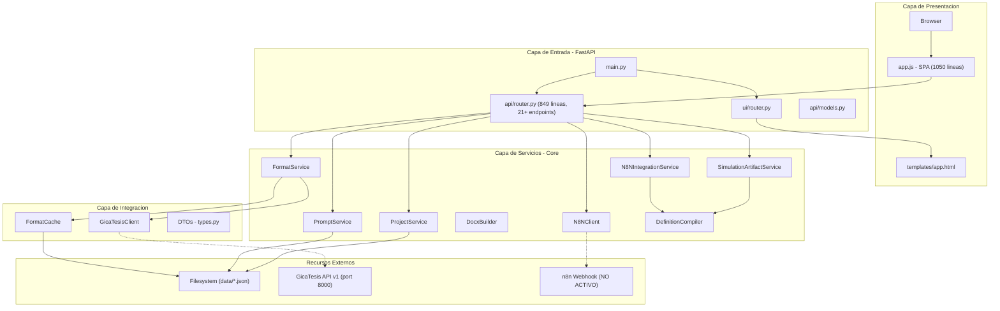

# GicaGen - Paquete de Contexto Completo

> Documento autocontenido para onboarding de agentes, consultores o equipos.
> Generado: 2026-02-17. Fuente de verdad: repo `gicagen_tesis-main`.

---

## 1) Resumen del Proyecto

**GicaGen** (TesisAI Gen) es un sistema generador de documentos academicos (tesis, articulos cientificos) que:

- Provee un **wizard de 5 pasos** para seleccion de formato, prompt de IA, formulario dinamico, guia de integracion y descarga.
- Actua como **BFF** (Backend for Frontend) consumiendo la API de **GicaTesis** (sistema hermano de gestion de formatos universitarios).
- Persiste datos locales en JSON (prompts, proyectos, cache de formatos).
- Genera documentos DOCX/PDF simulados usando un compilador de definiciones a IR (Intermediate Representation).

**Stack tecnologico**:

| Capa | Tecnologia |
|------|------------|
| Backend | Python 3.10-3.13, FastAPI 0.115.6, Uvicorn 0.30.6 |
| Frontend | Vanilla JS SPA (1050 lineas), Jinja2 templates, CSS |
| HTTP Client | httpx 0.27.2 (async) |
| Doc Generation | python-docx 1.1.2 + generador PDF minimal propio |
| Persistencia | Archivos JSON (data/) con locks |
| Validacion | Pydantic (modelos request/response/DTOs) |

---

## 2) Alcance Actual vs Alcance Deseado

### Alcance Actual

- Wizard funcional de 5 pasos con UI completa.
- Integracion BFF con GicaTesis (cache ETag, fallback demo, proxy de assets).
- CRUD de prompts y proyectos (persistencia JSON).
- Cliente n8n implementado (webhook trigger + ping + callback) pero **SIN flujos n8n reales funcionando**.
- Simulacion de salida de IA (contenido placeholder: `"Contenido IA simulado para: {path}"`).
- Generador de DOCX/PDF simulados con estructura basada en definiciones de formato.
- NO hay invocacion real a ningun modelo de IA (Gemini, GPT, etc.).

### Alcance Deseado (Objetivo de Migracion)

- **Eliminar dependencia de n8n** como orquestador de IA.
- **Integrar Gemini API directamente en codigo** para generar contenido real por seccion.
- Mantener la arquitectura BFF y el wizard existente.
- Reemplazar el contenido simulado por contenido generado por IA real.

```
ANTES:  Browser -> GicaGen -> n8n (webhook) -> [IA externa] -> callback -> GicaGen
AHORA:  Browser -> GicaGen -> Gemini API (directo en codigo) -> GicaGen
```

---

## 3) Arquitectura

### Diagrama de Componentes



### Dependencias Externas

| Dependencia | Tipo | Estado | Notas |
|-------------|------|--------|-------|
| GicaTesis API v1 | HTTP (port 8000) | Activa | Formatos, assets, render DOCX/PDF |
| n8n Webhook | HTTP (configurable) | Inactiva | Cliente implementado pero sin workflow real |
| Gemini API | N/A | **No implementada** | Objetivo de migracion |
| Filesystem | Local | Activa | `data/*.json`, `outputs/` |

---

## 4) Modulos Principales

| Modulo/Ruta | Responsabilidad | Entradas | Salidas | Tests | Riesgos |
|-------------|-----------------|----------|---------|-------|---------|
| `app/main.py` | Entrypoint FastAPI, monta routers | Config, routers | App FastAPI | Ninguno | Bajo |
| `app/core/config.py` | Settings desde env vars | `.env` | `Settings` dataclass | Ninguno | Bajo |
| `app/core/services/format_service.py` | Orquesta formatos con cache ETag | GicaTesis API | Lista/detalle de formatos | Ninguno | Medio: depende de upstream |
| `app/core/services/prompt_service.py` | CRUD de prompt templates | `data/prompts.json` | Prompts CRUD | Ninguno | Bajo |
| `app/core/services/project_service.py` | CRUD de proyectos + estados | `data/projects.json` | Proyectos con estados | Ninguno | Bajo |
| `app/core/services/n8n_client.py` | Cliente webhook n8n (ping/trigger) | Config N8N_WEBHOOK_URL | HTTP response | Ninguno | **Alto: sin uso real** |
| `app/core/services/n8n_integration_service.py` | Build spec del paso 4 (payload/checklist/markdown) | Proyecto, formato, prompt | Spec JSON + markdown | Ninguno | Medio |
| `app/core/services/definition_compiler.py` | Compila definiciones de formato a IR | JSON definition | DocumentIR / section index | Ninguno | Medio |
| `app/core/services/docx_builder.py` | Genera DOCX placeholder (legacy demo) | Variables, secciones | Archivo DOCX | Ninguno | Bajo |
| `app/core/services/simulation_artifact_service.py` | Genera DOCX/PDF simulados desde IR | Project + definition | Archivos DOCX/PDF | Ninguno | Medio |
| `app/integrations/gicatesis/client.py` | Cliente HTTP async GicaTesis | Config, ETag | FormatSummary/Detail | Ninguno | Medio |
| `app/integrations/gicatesis/cache/format_cache.py` | Cache JSON con ETag + timestamps | Formatos | `data/gicatesis_cache.json` | Ninguno | Bajo |
| `app/integrations/gicatesis/types.py` | DTOs Pydantic (FormatSummary, FormatDetail, etc.) | Contratos API | Modelos tipados | Ninguno | Bajo |
| `app/integrations/gicatesis/errors.py` | Excepciones custom | N/A | UpstreamUnavailable, etc. | Ninguno | Bajo |
| `app/modules/api/router.py` | 21+ endpoints REST (BFF) | HTTP requests | JSON/binarios | Ninguno | **Alto: monolito** |
| `app/modules/api/models.py` | Modelos Pydantic de request | Payloads | Validacion | Ninguno | Bajo |
| `app/modules/ui/router.py` | Renderiza pagina principal | Jinja2 | HTML | Ninguno | Bajo |
| `app/static/js/app.js` | Frontend SPA completo | API endpoints | UI interactiva | Ninguno | Medio |
| `app/core/storage/json_store.py` | Persistencia JSON con locks | Filesystem | Read/write lists | Ninguno | Bajo |

---

## 5) Integraciones Externas

### 5.1 GicaTesis (Activa)

**Tipo:** HTTP REST (async via httpx)
**Puerto:** 8000 (configurable via `GICATESIS_BASE_URL`)
**Patron:** BFF con cache ETag + fallback demo

**Endpoints consumidos:**

| Endpoint GicaTesis | Uso en GicaGen | Archivo |
|--------------------|----------------|---------|
| `GET /api/v1/formats/version` | Verificar si catalogo cambio | `gicatesis/client.py` |
| `GET /api/v1/formats` | Listar formatos con ETag | `gicatesis/client.py` |
| `GET /api/v1/formats/{id}` | Detalle de formato + definition | `gicatesis/client.py` |
| `GET /api/v1/assets/{path}` | Proxy de logos/imagenes | `api/router.py` |
| `POST /api/v1/render/docx` | Proxy render DOCX real | `api/router.py` |
| `POST /api/v1/render/pdf` | Proxy render PDF real | `api/router.py` |

### 5.2 n8n (Inactiva — Objetivo de Migracion)

**Tipo:** Webhook HTTP (POST)
**Estado:** Cliente implementado, SIN workflow n8n funcional
**Archivos:** `n8n_client.py`, `n8n_integration_service.py`

**Flujo diseñado (nunca completado):**
1. GicaGen envia payload al webhook n8n con formato + prompt + valores
2. n8n ejecuta IA externamente
3. n8n envia resultado via callback `POST /api/integrations/n8n/callback`
4. GicaGen almacena `aiResult` en el proyecto

### 5.3 Gemini API (No Implementada — Objetivo)

**Estado:** NO hay ninguna integracion con Gemini o cualquier otro proveedor de IA en el codigo.
**Dependencia faltante:** `google-generativeai` no esta en `requirements.txt`.
**Variables faltantes:** No existe `GEMINI_API_KEY` ni similar en `config.py`.

---

## 6) Configuracion

### Variables de Entorno

| Variable | Requerida | Default | Ejemplo | Descripcion | Fuente |
|----------|-----------|---------|---------|-------------|--------|
| `APP_NAME` | No | `TesisAI Gen` | `TesisAI Gen` | Nombre de la app | `config.py` |
| `APP_ENV` | No | `dev` | `dev`, `prod` | Ambiente | `config.py` |
| `GICATESIS_BASE_URL` | Si* | `http://localhost:8000/api/v1` | `http://localhost:8000/api/v1` | Base URL de GicaTesis | `config.py` |
| `GICATESIS_API_KEY` | No | `""` | `***REDACTED***` | API key para GicaTesis | `config.py` |
| `GICATESIS_TIMEOUT` | No | `8` | `8` | Timeout en segundos | `config.py` |
| `GICAGEN_PORT` | No | `8001` | `8001` | Puerto de GicaGen | `config.py` |
| `GICAGEN_BASE_URL` | No | `http://localhost:8001` | `http://localhost:8001` | URL publica de GicaGen | `config.py` |
| `GICAGEN_DEMO_MODE` | No | `false` | `true` | Fallback a datos demo | `config.py` |
| `FORMAT_API_BASE_URL` | No | `""` | (deprecated) | Legacy — usar GICATESIS_* | `config.py` |
| `FORMAT_API_KEY` | No | `""` | (deprecated) | Legacy — usar GICATESIS_* | `config.py` |
| `N8N_WEBHOOK_URL` | No | `""` | `http://localhost:5678/webhook/...` | URL webhook n8n (INACTIVA) | `config.py` |
| `N8N_SHARED_SECRET` | No | `""` | `***REDACTED***` | Secreto compartido n8n | `config.py` |

\* Si GicaTesis no esta disponible, funciona con cache o demo mode.

### Archivos de Configuracion

| Archivo | Proposito |
|---------|-----------|
| `.env` | Variables de entorno reales (NO commiteado) |
| `.env.example` | Template con documentacion de cada variable |
| `requirements.txt` | Dependencias Python (7 paquetes) |
| `data/prompts.json` | Plantillas de prompts de IA |
| `data/projects.json` | Proyectos generados |
| `data/formats_sample.json` | Formatos demo (fallback) |
| `data/gicatesis_cache.json` | Cache ETag de formatos GicaTesis |

---

## 7) Ejecucion Local (Paso a Paso)

### Prerrequisitos

- **Python**: 3.10 — 3.13 (recomendado 3.12)
- **GicaTesis** corriendo en port 8000 (opcional si `GICAGEN_DEMO_MODE=true`)

### Pasos

```powershell
# 1. Clonar/navegar al repo
cd C:\Users\jhoan\Documents\gicagen_tesis-main

# 2. Crear entorno virtual
python -m venv .venv

# 3. Activar (Windows)
.venv\Scripts\activate

# 4. Instalar dependencias
pip install -r requirements.txt

# 5. Copiar y editar config
copy .env.example .env
# Editar .env con valores reales

# 6. Ejecutar
python -m uvicorn app.main:app --port 8001 --reload
```

**Abrir:** http://127.0.0.1:8001/

### Verificacion Basica

| Check | Comando/URL | Resultado Esperado |
|-------|------------|-------------------|
| App inicia | Terminal sin errores | `Uvicorn running on http://127.0.0.1:8001` |
| Health check | `GET /healthz` | `{"ok": true, ...}` |
| UI carga | http://127.0.0.1:8001/ | Dashboard con wizard |
| Build info | `GET /api/_meta/build` | `{"service": "gicagen", ...}` |

---

## 8) Flujos Funcionales

### P0 — Criticos

| # | Flujo | Descripcion | Estado |
|---|-------|-------------|--------|
| 1 | **Wizard completo (5 pasos)** | Seleccion formato -> prompt -> form -> guia n8n -> descarga | Funcional (simulacion) |
| 2 | **Integracion BFF GicaTesis** | List/detail formatos con cache ETag + fallback | Funcional |
| 3 | **Simulacion n8n** | Generar aiResult simulado por secciones | Funcional |
| 4 | **Descarga DOCX/PDF** | Proxy a GicaTesis render o local | Funcional |

### P1 — Importantes

| # | Flujo | Descripcion | Estado |
|---|-------|-------------|--------|
| 5 | **CRUD Prompts** | Crear, editar, eliminar plantillas de prompts | Funcional |
| 6 | **CRUD Proyectos** | Crear borrador, listar, actualizar estado | Funcional |
| 7 | **Proxy Assets** | Logos/imagenes de GicaTesis via `/api/assets/` | Funcional |

### P2 — Secundarios

| # | Flujo | Descripcion | Estado |
|---|-------|-------------|--------|
| 8 | **Legacy generate** | `POST /api/projects/generate` (background task) | Funcional (legacy) |
| 9 | **Legacy n8n callback** | `POST /api/n8n/callback/{id}` | Funcional (legacy) |
| 10 | **Demo mode** | Fallback a `data/formats_sample.json` | Funcional |

### Observabilidad Actual

- **Logs:** `logging.basicConfig` con formato `asctime-name-level-message` (stdout).
- **Metricas:** Ninguna.
- **Trazas:** Ninguna (no hay OpenTelemetry ni similar).
- **Health check:** `GET /healthz` retorna info basica.

---

## 9) Estado Actual de n8n

### Evidencia en el Repo

| Item | Existe | Ubicacion | Detalle |
|------|--------|-----------|---------|
| Workflows n8n (.json) | **NO** | N/A | No hay export de workflows n8n en el repo |
| Carpeta `n8n/` o `workflows/` | **NO** | N/A | No existe |
| Cliente webhook | SI | `app/core/services/n8n_client.py` (120 lineas) | `ping()` + `trigger()` via httpx |
| Spec builder | SI | `app/core/services/n8n_integration_service.py` (303 lineas) | Build payload/headers/checklist para paso 4 |
| Callback endpoint | SI | `api/router.py` lineas 230-257 | `POST /api/integrations/n8n/callback` |
| Variables env | SI | `N8N_WEBHOOK_URL`, `N8N_SHARED_SECRET` | Ambas vacias por default |
| Simulacion | SI | `POST /api/sim/n8n/run` | Genera aiResult con contenido placeholder |
| UI Guia n8n | SI | `app.js` funcion `renderN8nGuide()` | Muestra payload copiable, checklist 8 pasos |

### Que se intento hacer con n8n

Segun el codigo (`n8n_integration_service.py` lineas 194-204, checklist de 8 pasos):

1. **Webhook Trigger**: n8n recibia POST con payload del proyecto
2. **Secret compartido**: Autenticacion bidireccional via headers
3. **GET format**: n8n consumia formato desde GicaTesis
4. **Prompt final**: n8n combinaba template + variables
5. **IA a JSON**: n8n ejecutaba IA y producia `aiResult.sections` por path/sectionId
6. **Validacion**: Validar estructura antes de callback
7. **Callback**: n8n enviaba POST a GicaGen con resultado
8. **Responder**: n8n respondia 200 al trigger original

### Por que no se completo

- No hay workflows n8n exportados en el repo
- No hay documentacion de configuracion de n8n
- El flujo real nunca se cerro (segun contexto del usuario)

---

## 10) Plan de Migracion (Resumen)

> Documento detallado en: [`MIGRATION_N8N_TO_CODE.md`](MIGRATION_N8N_TO_CODE.md)

**Objetivo:** Reemplazar el flujo `GicaGen -> n8n (webhook) -> IA -> callback` por `GicaGen -> Gemini API (directo)`.

**Capas propuestas (sin implementar):**

```
app/core/services/
  ai_service.py            # Orquestador de generacion de contenido IA
  gemini_client.py         # Cliente para Gemini API (google-generativeai SDK)
  prompt_renderer.py       # Renderiza template de prompt con variables
  output_validator.py      # Valida estructura de aiResult
```

**Puntos clave:**
- Agregar `google-generativeai` a `requirements.txt`
- Agregar `GEMINI_API_KEY`, `GEMINI_MODEL`, `GEMINI_TEMPERATURE` a `config.py`
- Crear servicio de IA que reemplace el flujo n8n
- Mantener la interfaz `aiResult.sections[{sectionId, path, content}]` existente
- Implementar retries con exponential backoff
- Validar output de Gemini antes de persistir

---

## 11) Testing/QA Actual

### Estado

> **NO hay tests automatizados en el proyecto.**

| Item | Existe | Detalle |
|------|--------|---------|
| Directorio `tests/` | NO | No existe |
| Archivos `test_*.py` | NO | No hay ninguno |
| pytest en requirements | NO | No esta listado |
| CI/CD pipeline | NO | No hay `.github/workflows/`, `Jenkinsfile`, etc. |
| Docker config | NO | No hay `Dockerfile` ni `docker-compose.yml` |

### Como validar manualmente

1. Iniciar app: `python -m uvicorn app.main:app --port 8001 --reload`
2. Verificar health: `curl http://localhost:8001/healthz`
3. Navegar UI: http://localhost:8001/
4. Completar wizard (5 pasos)
5. Verificar CRUD prompts en seccion Admin
6. Verificar simulacion n8n genera aiResult
7. Descargar DOCX/PDF simulado

---

## 12) Riesgos y Bloqueantes

| # | Riesgo | Severidad | Mitigacion |
|---|--------|-----------|------------|
| 1 | **Sin tests** — cualquier cambio puede romper funcionalidad | Alta | Crear tests antes de migrar |
| 2 | **Router monolitico** — `api/router.py` tiene 849 lineas y 21+ endpoints | Media | Dividir por dominio (formats, projects, n8n, render) |
| 3 | **Servicios como globals** — no inyectados, dificiles de mockear | Media | Migrar a `Depends()` de FastAPI |
| 4 | **Persistencia JSON** — no escalable, sin transacciones | Media | Aceptable para prototipo, migrar a DB si escala |
| 5 | **Sin Gemini SDK** — hay que agregar dependencia + config completa | Media | Bloquea migracion hasta implementar |
| 6 | **Sin rate limiting** — Gemini API tiene limites de requests | Media | Implementar backoff al integrar |
| 7 | **Sin observabilidad** — solo logs basicos, no hay metricas ni trazas | Baja | Agregar al integrar IA real |
| 8 | **Dependencia de GicaTesis** — si GicaTesis esta caido, wizard limitado | Baja | Cache + demo mode ya mitigan |

### Bloqueantes para Migracion

| Bloqueante | Detalle | Accion Requerida |
|------------|---------|-----------------|
| API Key Gemini | No existe en config ni env | Obtener key y agregar a `.env` |
| Modelo Gemini | No definido | Decidir: `gemini-2.0-flash`, `gemini-2.0-pro`, etc. |
| Parametros LLM | `temperature`, `top_p`, `max_output_tokens` | Definir por tipo de seccion |
| Contrato de output | Formato esperado de respuesta Gemini | Definir schema JSON estricto |
| Rate limits | Limites de la API segun plan | Verificar plan/tier de Gemini |

---

## 13) Known Gaps / TODO (Priorizado)

| # | Gap | Donde se evidencio | Prioridad | Preguntas Concretas |
|---|-----|---------------------|-----------|---------------------|
| 1 | **No hay integracion real con IA** | `requirements.txt`, `config.py`, todo el codebase | P0 | Cual modelo Gemini usar? Cual es el API key? |
| 2 | **No hay tests automatizados** | Ausencia total de `tests/`, pytest, etc. | P0 | Se requieren tests antes de migrar? |
| 3 | **No hay workflows n8n exportados** | Busqueda en todo el repo | P0 | Existieron workflows en algun momento? Donde estan? |
| 4 | **Router monolitico** | `api/router.py` — 849 lineas | P1 | Se dividira como parte de la migracion? |
| 5 | **Sin CI/CD** | Ausencia de Dockerfile, GitHub Actions, etc. | P1 | Se necesita pipeline antes de migrar? |
| 6 | **Sin validacion de output IA** | Simulacion genera texto fijo, no valida | P1 | Que schema debe cumplir el output de Gemini? |
| 7 | **Prompt templates basicos** | `data/prompts.json` — solo 2 prompts | P1 | Se necesitan mas templates? Quien los define? |
| 8 | **Legacy endpoints activos** | `/api/projects/generate`, `/api/n8n/callback/{id}` | P2 | Se pueden deprecar/eliminar? |
| 9 | **Sin metricas/trazas** | Solo `logging.basicConfig` | P2 | Se requiere observabilidad para produccion? |
| 10 | **Persistencia JSON no escalable** | `data/*.json` con locks | P2 | Se migrara a base de datos? Cuando? |

---

## Inventario del Repo

### Arbol (depth 4)

```
gicagen_tesis-main/
|-- .env                              # Variables reales (no commiteado)
|-- .env.example                      # Template con documentacion (965 bytes)
|-- AGENTS.md                         # Guia rapida para agentes (2323 bytes)
|-- README.md                         # Readme principal (1356 bytes)
|-- requirements.txt                  # 7 dependencias Python (130 bytes)
|-- readme.txt                        # Archivo legacy (940 bytes)
|-- startup_log.txt                   # Log de arranque (debug)
|-- startup_log_2.txt                 # Log de arranque (debug)
|-- docs.zip                          # Docs comprimido (32KB)
|
|-- app/                              # Codigo fuente principal (98 archivos)
|   |-- __init__.py
|   |-- main.py                       # Entrypoint FastAPI (46 lineas)
|   |-- core/
|   |   |-- __init__.py
|   |   |-- config.py                 # Settings dataclass (41 lineas)
|   |   |-- templates.py              # Jinja2Templates config
|   |   |-- clients/
|   |   |   |-- __init__.py
|   |   |   |-- gicatesis_client.py   # Legacy HTTP client
|   |   |-- services/
|   |   |   |-- __init__.py
|   |   |   |-- definition_compiler.py       # Formato -> IR (371 lineas)
|   |   |   |-- docx_builder.py              # DOCX placeholder (26 lineas)
|   |   |   |-- format_service.py            # Orquesta formatos (277 lineas)
|   |   |   |-- n8n_client.py                # Cliente webhook (120 lineas)
|   |   |   |-- n8n_integration_service.py   # Spec builder (303 lineas)
|   |   |   |-- project_service.py           # CRUD proyectos (162 lineas)
|   |   |   |-- prompt_service.py            # CRUD prompts (59 lineas)
|   |   |   |-- simulation_artifact_service.py  # DOCX/PDF simulados (346 lineas)
|   |   |-- storage/
|   |   |   |-- __init__.py
|   |   |   |-- json_store.py         # Persistencia JSON con locks
|   |   |-- utils/
|   |       |-- __init__.py
|   |       |-- id.py                 # Generador de IDs con prefijo
|   |-- integrations/
|   |   |-- __init__.py
|   |   |-- gicatesis/
|   |       |-- __init__.py
|   |       |-- client.py             # Cliente HTTP async (143 lineas)
|   |       |-- errors.py             # Excepciones custom (28 lineas)
|   |       |-- types.py              # DTOs Pydantic (64 lineas)
|   |       |-- cache/
|   |           |-- __init__.py
|   |           |-- format_cache.py   # Cache ETag (153 lineas)
|   |-- modules/
|   |   |-- __init__.py
|   |   |-- api/
|   |   |   |-- __init__.py
|   |   |   |-- models.py             # Modelos request (90 lineas)
|   |   |   |-- router.py             # 21+ endpoints (849 lineas)
|   |   |-- ui/
|   |       |-- __init__.py
|   |       |-- router.py             # Pagina principal (11 lineas)
|   |-- static/
|   |   |-- js/
|   |       |-- app.js                # Frontend SPA (1050 lineas)
|   |-- templates/
|       |-- pages/
|           |-- app.html              # Template HTML principal
|
|-- data/                             # Datos persistidos (JSON)
|   |-- formats_sample.json           # Formatos demo (fallback)
|   |-- gicatesis_cache.json          # Cache ETag de formatos
|   |-- projects.json                 # Proyectos generados
|   |-- prompts.json                  # 2 templates de prompts
|
|-- docs/                             # Documentacion (20 archivos)
|   |-- 00-indice.md                  # Indice navegable
|   |-- 01-vision-y-alcance.md
|   |-- 02-arquitectura.md            # Diagramas mermaid + componentes
|   |-- 03-catalogo-repo.md
|   |-- 04-integracion-gicatesis.md   # Contratos API BFF
|   |-- 05-plan-de-cambios.md
|   |-- 06-desarrollo-local.md
|   |-- 07-pruebas.md
|   |-- 08-despliegue.md
|   |-- 09-troubleshooting.md
|   |-- 10-resumen-ejecutivo.md
|   |-- 11-checklist-validacion.md
|   |-- README.md
|   |-- STYLE_GUIDE.md
|   |-- GICAGEN_CONTEXT.md            # ESTE DOCUMENTO
|   |-- MIGRATION_N8N_TO_CODE.md      # Plan de migracion
|   |-- adrs/
|   |   |-- ADR-0001-contexto.md
|   |   |-- ADR-0002-boundaries-desacoplo.md
|   |-- catalogo/
|   |   |-- archivos.md
|   |   |-- carpetas.md
|   |-- diagramas/
|   |   |-- arquitectura.mmd
|   |-- runbooks/
|       |-- levantar-local.md
|
|-- outputs/                          # Archivos generados
|   |-- simulation/                   # DOCX/PDF simulados
|
|-- scripts/                          # Utilidades
    |-- check_encoding.py
    |-- check_mojibake.py
    |-- fix_encoding.py
```

### Archivos Clave por Area

| Area | Archivos |
|------|----------|
| **Core App** | `main.py`, `config.py`, `templates.py` |
| **Servicios** | `format_service.py`, `prompt_service.py`, `project_service.py`, `n8n_client.py`, `n8n_integration_service.py`, `definition_compiler.py`, `simulation_artifact_service.py`, `docx_builder.py` |
| **Integracion GicaTesis** | `integrations/gicatesis/client.py`, `types.py`, `errors.py`, `cache/format_cache.py` |
| **API** | `modules/api/router.py`, `modules/api/models.py` |
| **UI** | `modules/ui/router.py`, `static/js/app.js`, `templates/pages/app.html` |
| **Config** | `.env.example`, `config.py`, `requirements.txt` |
| **Datos** | `data/prompts.json`, `data/projects.json`, `data/formats_sample.json`, `data/gicatesis_cache.json` |
| **Docs** | `docs/00-indice.md` hasta `docs/11-checklist-validacion.md` + ADRs + runbooks |
| **n8n** | `n8n_client.py`, `n8n_integration_service.py` (NO hay workflows exportados) |
| **Tests** | **NINGUNO** |
