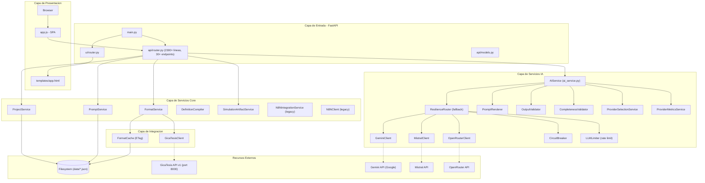

# GicaGen - Paquete de Contexto Completo

> Documento autocontenido para onboarding de agentes, consultores o equipos.
> Actualizado: 2026-03-23. Fuente de verdad: repo `gicagen_tesis-main`.

---

## 1) Resumen del Proyecto

**GicaGen** (TesisAI Gen) es un sistema generador de documentos academicos (tesis, proyectos, informes) que:

- Provee un **wizard de 5 pasos**: seleccion de formato → prompt de IA → formulario → generacion en vivo → descarga.
- Actua como **BFF** consumiendo la API de **GicaTesis** (sistema de formatos universitarios).
- Genera contenido real con **IA directa** (Gemini, Mistral, OpenRouter) — ya NO depende de n8n.
- Persiste datos locales en JSON (prompts, proyectos, cache de formatos).
- Genera documentos DOCX/PDF usando GicaTesis como motor de render.

**Stack tecnologico**:

| Capa | Tecnologia |
|------|------------|
| Backend | Python 3.10-3.14, FastAPI, Uvicorn |
| Frontend | Vanilla JS SPA, Jinja2 templates, CSS |
| IA | Gemini API, Mistral API, OpenRouter (multi-proveedor con fallback) |
| HTTP Client | httpx (async) |
| Doc Generation | GicaTesis render/docx + render/pdf (proxy) |
| Persistencia | Archivos JSON (data/) con locks |
| Validacion | Pydantic (modelos request/response/DTOs) |
| Tests | pytest (29 archivos, 200+ tests) |
| CI/CD | GitHub Actions (lint + typecheck + pytest) |

---

## 2) Estado Actual

### Lo que esta implementado y funcionando

- **Generacion IA real directa**: `AIService` llama a Gemini/Mistral/OpenRouter por seccion.
- **Multi-proveedor con fallback**: si Gemini excede cuota (429), falla automaticamente a Mistral, luego OpenRouter.
- **Circuit breaker**: detiene reintentos a proveedores con fallas consecutivas.
- **Validador de completitud**: detecta y reemplaza placeholders automaticamente en el output de IA.
- **Corrector de IA**: pase de correccion post-generacion para limpiar y formatear contenido.
- **10 prompts reales** (UNAC + UNI) con instrucciones especificas por tipo de documento.
- **Wizard completo paso 4 en vivo**: SSE con progreso por seccion, trace expandible, fallback visual.
- **Cancelacion de generacion** en cualquier punto.
- **CI/CD con GitHub Actions**: lint (ruff), typecheck (mypy), pytest automatizados en cada PR.
- **29 archivos de test** cubriendo todos los modulos criticos.

### Lo que ya NO es relevante (obsoleto)

- **n8n como orquestador de IA**: reemplazado por `AIService`. El cliente n8n sigue disponible como ruta legacy pero no se usa en el flujo principal.
- **Simulacion de contenido IA**: el sistema genera contenido real, no placeholders.

---

## 3) Arquitectura

### Diagrama de Componentes Actual


```mermaid
graph TB
    subgraph "Capa de Presentacion"
        BROWSER[Browser]
        JS["app.js - SPA"]
        HTML["templates/app.html"]
    end

    subgraph "Capa de Entrada - FastAPI"
        MAIN["main.py"]
        API_ROUTER["api/router.py (2300+ lineas, 30+ endpoints)"]
        UI_ROUTER["ui/router.py"]
        MODELS["api/models.py"]
    end

    subgraph "Capa de Servicios IA"
        AI_SVC["AIService (ai_service.py)"]
        GEMINI["GeminiClient"]
        MISTRAL["MistralClient"]
        OPENROUTER["OpenRouterClient"]
        RES_ROUTER["ResilienceRouter (fallback)"]
        CB["CircuitBreaker"]
        LIMITER["LLMLimiter (rate limit)"]
        RENDERER["PromptRenderer"]
        VALIDATOR["OutputValidator"]
        COMP_VAL["CompletenessValidator"]
        PROV_SEL["ProviderSelectionService"]
        PROV_MET["ProviderMetricsService"]
    end

    subgraph "Capa de Servicios Core"
        FMT_SVC["FormatService"]
        PRM_SVC["PromptService"]
        PRJ_SVC["ProjectService"]
        DEF_COMP["DefinitionCompiler"]
        SIM_ART["SimulationArtifactService"]
        N8N_INT["N8NIntegrationService (legacy)"]
        N8N_SVC["N8NClient (legacy)"]
    end

    subgraph "Capa de Integracion"
        GT_CLIENT["GicaTesisClient"]
        GT_CACHE["FormatCache (ETag)"]
    end

    subgraph "Recursos Externos"
        FS[("Filesystem (data/*.json)")]
        GICATESIS["GicaTesis API v1 (port 8000)"]
        GEMINI_API["Gemini API (Google)"]
        MISTRAL_API["Mistral API"]
        OR_API["OpenRouter API"]
    end

    BROWSER --> JS --> API_ROUTER
    MAIN --> API_ROUTER
    MAIN --> UI_ROUTER --> HTML

    API_ROUTER --> FMT_SVC & PRM_SVC & PRJ_SVC & SIM_ART & AI_SVC

    AI_SVC --> RES_ROUTER --> GEMINI & MISTRAL & OPENROUTER
    AI_SVC --> RENDERER & VALIDATOR & COMP_VAL & PROV_SEL & PROV_MET
    RES_ROUTER --> CB & LIMITER

    GEMINI -.-> GEMINI_API
    MISTRAL -.-> MISTRAL_API
    OPENROUTER -.-> OR_API

    FMT_SVC --> GT_CLIENT & GT_CACHE
    GT_CLIENT -.-> GICATESIS
    GT_CACHE --> FS
    PRM_SVC --> FS
    PRJ_SVC --> FS
```

### Flujo Principal: Generacion IA Directa

```
Browser
  -> POST /api/projects/{id}/generate        (acepta con 202 inmediatamente)
  -> AIService.generate()                    (background task)
      -> DefinitionCompiler.compile()        (construye section_index)
      -> PromptRenderer.render()             (renderiza template con variables)
      -> ResilienceRouter.generate_stream()  (intenta proveedores con fallback)
          -> GeminiClient / MistralClient / OpenRouterClient
      -> OutputValidator.sanitize()          (limpia output)
      -> CompletenessValidator.detect()      (detecta placeholders)
      -> AIService._ensure_completeness()    (autofill si aplica)
      -> AIService._correct_ai_result()      (pase de correccion post-gen)
      -> ProjectService.mark_completed()     (persiste resultado)
  -> SSE /api/projects/{id}/trace/stream     (progreso en vivo al browser)
```

---

## 4) Modulos del Proyecto

### Capa IA (`app/core/services/ai/`)

| Modulo | Responsabilidad |
|--------|-----------------|
| `ai_service.py` | Orquestador principal: genera contenido por seccion, gestiona fallback, emite trace |
| `gemini_client.py` | Cliente Gemini API (google-generativeai SDK) |
| `mistral_client.py` | Cliente Mistral API |
| `openrouter_client.py` | Cliente OpenRouter (multi-modelo) |
| `resilience_router.py` | Router de fallback entre proveedores con reintentos |
| `circuit_breaker.py` | Detiene reintentos a proveedores con fallas consecutivas |
| `limiter.py` | Rate limiter por proveedor |
| `retry_policy.py` | Politica de reintentos con backoff |
| `prompt_renderer.py` | Renderiza templates `{{variable}}` + ensambla SYSTEM_PROMPT |
| `output_validator.py` | Valida y sanea el output de IA |
| `completeness_validator.py` | Detecta placeholders y autofill para secciones conocidas |
| `provider_selection.py` | Seleccion de proveedor por preferencia del usuario |
| `provider_metrics.py` | Metricas de uso, costo y disponibilidad por proveedor |
| `phase_policy.py` | Politicas de generacion por fase (draft/correction) |
| `error_classifier.py` | Clasifica errores de proveedores (quota, timeout, etc.) |
| `content_parser.py` | Parseo de contenido estructurado del output IA |
| `figure_recommendations.py` | Sugerencias de figuras por seccion |
| `reference_proposals.py` | Propuestas de referencias bibliograficas |
| `token_usage.py` | Seguimiento de tokens usados |
| `section_content_policy.py` | Politica de contenido por tipo de seccion |
| `rate_limiter.py` | Limiter de requests por ventana de tiempo |
| `errors.py` | Excepciones de IA (GenerationCancelledError, QuotaExceededError) |

### Capa Core (`app/core/services/`)

| Modulo | Responsabilidad |
|--------|-----------------|
| `format_service.py` | Orquesta formatos desde GicaTesis con cache ETag |
| `prompt_service.py` | CRUD de prompts desde `data/prompts.json` |
| `project_service.py` | CRUD de proyectos, estados, trace, incidentes, resume |
| `definition_compiler.py` | Compila definiciones de formato a section_index (IR) |
| `simulation_artifact_service.py` | Genera DOCX/PDF simulados (legacy/demo) |
| `content_sanitizer.py` | Sanea texto de contenido generado |
| `indices_normalizer.py` | Normaliza indices y tablas de contenido |
| `toc_detector.py` | Detecta secciones de indice (excluidas de IA) |
| `n8n_client.py` | Cliente webhook n8n (legacy, no activo en flujo principal) |
| `n8n_integration_service.py` | Specs para paso 4 legacy (legacy) |
| `docx_builder.py` | Generador DOCX placeholder (legacy) |

### Integracion GicaTesis (`app/integrations/gicatesis/`)

| Modulo | Responsabilidad |
|--------|-----------------|
| `client.py` | Cliente HTTP async para GicaTesis API v1 |
| `types.py` | DTOs Pydantic (FormatSummary, FormatDetail, etc.) |
| `errors.py` | Excepciones: UpstreamUnavailable, UpstreamTimeout |
| `cache/format_cache.py` | Cache de formatos con ETag y timestamps |

### API (`app/modules/api/`)

| Modulo | Responsabilidad |
|--------|-----------------|
| `router.py` | 30+ endpoints REST — BFF completo |
| `models.py` | Modelos Pydantic de request |

---

## 5) Proveedores de IA

| Proveedor | Variable de config | Modelo default | Estado |
|-----------|-------------------|----------------|--------|
| **Gemini** | `GEMINI_API_KEY` | `gemini-2.0-flash` | Proveedor primario |
| **Mistral** | `MISTRAL_API_KEY` | `mistral-medium-2505` | Fallback primario |
| **OpenRouter** | `OPENROUTER_API_KEY` | configurable | Fallback secundario |

**Logica de fallback:**
1. Si `AI_PRIMARY_PROVIDER=gemini` y Gemini retorna 429 → cambia a Mistral
2. Si Mistral tambien falla → cambia a OpenRouter
3. Circuit breaker: si un proveedor falla N veces seguidas → marcado como `unavailable` por ventana de tiempo
4. Estado de proveedor: `available` | `degraded` | `unavailable`

---

## 6) Prompts (10 plantillas reales)

Ubicacion: `data/prompts.json`

| ID | Nombre | Universidad | Enfoque |
|----|--------|-------------|---------|
| `prompt_45c88af464` | Tesis de Posgrado (Maestría/Doctorado) | UNI | Cuantitativo |
| `prompt_29aa7778cc` | Tesis de Maestría | UNAC | Cuantitativo |
| `prompt_7cf94e7523` | Tesis de Maestría | UNAC | Cualitativo |
| `prompt_6bc6fb0e9f` | Plan de Trabajo de Tesis | UNI | Tecnico |
| `prompt_9f0764d149` | Proyecto de Tesis | UNAC | Cuantitativo |
| `prompt_c90ea886b7` | Proyecto de Tesis | UNAC | Cualitativo |
| `prompt_17595d0ce3` | Informe de Tesis | UNI | Cuantitativo |
| `prompt_fc13e3c0d8` | Informe de Tesis | UNAC | Cualitativo |
| `prompt_1936b2172c` | Informe de Tesis | UNAC | Cuantitativo |
| `prompt_tesis_estandar` | Tesis Ingenieria Estandar | General | Base |

Cada prompt define: `system_instruction`, `template` con `{{variables}}`, `sections` con instrucciones por capitulo, y lista de `variables` requeridas.

---

## 7) Configuracion

### Variables de Entorno

| Variable | Default | Descripcion |
|----------|---------|-------------|
| `GEMINI_API_KEY` | `""` | Clave Gemini (Google AI Studio) |
| `GEMINI_MODEL` | `gemini-2.0-flash` | Modelo Gemini |
| `MISTRAL_API_KEY` | `""` | Clave Mistral |
| `MISTRAL_MODEL` | `mistral-medium-2505` | Modelo Mistral |
| `OPENROUTER_API_KEY` | `""` | Clave OpenRouter |
| `AI_PRIMARY_PROVIDER` | `gemini` | Proveedor primario |
| `AI_FALLBACK_ON_QUOTA` | `true` | Activar fallback automatico |
| `GICATESIS_BASE_URL` | `http://localhost:8000/api/v1` | URL upstream GicaTesis |
| `GICAGEN_PORT` | `8001` | Puerto de GicaGen |
| `GICAGEN_DEMO_MODE` | `false` | Catalogo demo sin upstream |
| `N8N_WEBHOOK_URL` | `""` | URL n8n (legacy, no activo) |

### Archivos de datos

| Archivo | Proposito |
|---------|-----------|
| `data/prompts.json` | 10 plantillas de prompts reales |
| `data/projects.json` | Proyectos generados |
| `data/gicatesis_cache.json` | Cache ETag de formatos GicaTesis |
| `data/formats_sample.json` | Formatos demo (fallback sin GicaTesis) |
| `data/provider_selection.json` | Preferencia de proveedor del usuario |

---

## 8) Testing

### Estado actual

**29 archivos de test** con 200+ casos automatizados.

| Archivo | Que cubre |
|---------|-----------|
| `test_ai_service.py` | Pipeline completo de generacion IA |
| `test_api_integration.py` | Endpoints del router (integration tests) |
| `test_prompt_flow.py` | Flujo completo prompts → render → LLM (47 tests) |
| `test_completeness_validator.py` | Deteccion y reparacion de placeholders |
| `test_output_validator.py` | Validacion y saneamiento de output IA |
| `test_gemini_client.py` | Cliente Gemini |
| `test_mistral_client.py` | Cliente Mistral |
| `test_openrouter_client.py` | Cliente OpenRouter |
| `test_resilience_router.py` | Fallback y circuit breaker |
| `test_circuit_breaker.py` | Circuit breaker |
| `test_definition_compiler.py` | Compilador de definiciones |
| `test_indices_contract.py` | Exclusion de secciones de indice |
| `test_pricing_service.py` | Calculo de costos por proveedor |
| `test_project_service_events.py` | Eventos y trace de proyectos |
| `test_prompt_renderer.py` | Renderizado de templates |
| `test_gicatesis_offline.py` | Comportamiento sin GicaTesis |
| `test_pipeline_toc_exclusion.py` | Exclusion de TOC en pipeline IA |
| ... y 12 mas | Otros modulos |

### Ejecutar tests

```powershell
.venv\Scripts\activate
python -m pytest tests -v
python -m pytest tests/test_prompt_flow.py -v  # Solo prompts
```

### CI/CD (GitHub Actions)

3 checks automaticos en cada PR:
- **lint**: `ruff check` (imports, formato)
- **typecheck**: `mypy`
- **pytest**: suite completa

---

## 9) Ejecucion Local

```powershell
# 1. Entrar al directorio
cd C:\Users\jhoan\Documents\gicagen_tesis-main

# 2. Crear y activar entorno
python -m venv .venv
.venv\Scripts\activate

# 3. Instalar dependencias
pip install -r requirements.txt
pip install -r requirements-dev.txt  # Para tests y lint

# 4. Configurar variables
copy .env.example .env
# Editar .env con GEMINI_API_KEY, GICATESIS_BASE_URL, etc.

# 5. Levantar GicaTesis primero (port 8000)
# 6. Levantar GicaGen
python -m uvicorn app.main:app --port 8001 --reload
```

**Abrir:** http://127.0.0.1:8001/

### Verificacion basica

| Check | URL/Comando | Esperado |
|-------|------------|----------|
| App inicia | Terminal | `Uvicorn running on http://127.0.0.1:8001` |
| Health | `GET /healthz` | `{"ok": true}` |
| UI | http://127.0.0.1:8001/ | Wizard 5 pasos |
| Test | `pytest tests -q` | `passed` |

---

## 10) Inventario del Repo (Estado Actual)

```
gicagen_tesis-main/
├── .env                              # Variables reales (NO commiteado)
├── .env.example                      # Template documentado
├── .gitignore                        # Incluye logs, .venv, .env, IDE files
├── README.md                         # Quick start + trace + API info
├── requirements.txt                  # Dependencias produccion
├── requirements-dev.txt              # pytest, ruff, mypy
├── pyproject.toml                    # Config ruff/mypy
├── mypy.ini                          # Config mypy adicional
├── playwright.config.ts              # Config E2E (scaffold)
├── package.json                      # E2E scripts npm
│
├── app/
│   ├── main.py                       # Entrypoint FastAPI
│   ├── core/
│   │   ├── config.py                 # Settings (dataclass + env vars)
│   │   ├── templates.py              # Jinja2 config
│   │   ├── services/
│   │   │   ├── ai/                   # 23 modulos de IA
│   │   │   │   ├── ai_service.py            # Orquestador (70KB)
│   │   │   │   ├── gemini_client.py
│   │   │   │   ├── mistral_client.py
│   │   │   │   ├── openrouter_client.py
│   │   │   │   ├── resilience_router.py     # Fallback entre proveedores
│   │   │   │   ├── circuit_breaker.py
│   │   │   │   ├── completeness_validator.py
│   │   │   │   ├── output_validator.py
│   │   │   │   ├── prompt_renderer.py
│   │   │   │   ├── provider_metrics.py
│   │   │   │   ├── provider_selection.py
│   │   │   │   └── ... (12 modulos mas)
│   │   │   ├── format_service.py
│   │   │   ├── prompt_service.py
│   │   │   ├── project_service.py    # CRUD proyectos (45KB)
│   │   │   ├── definition_compiler.py
│   │   │   ├── content_sanitizer.py
│   │   │   ├── indices_normalizer.py
│   │   │   ├── toc_detector.py
│   │   │   ├── simulation_artifact_service.py
│   │   │   ├── n8n_client.py         # Legacy
│   │   │   └── n8n_integration_service.py  # Legacy
│   │   ├── storage/json_store.py
│   │   └── utils/id.py
│   ├── integrations/gicatesis/
│   │   ├── client.py
│   │   ├── types.py
│   │   ├── errors.py
│   │   └── cache/format_cache.py
│   ├── modules/
│   │   ├── api/router.py             # 30+ endpoints (2300 lineas)
│   │   ├── api/models.py
│   │   └── ui/router.py
│   ├── static/js/app.js              # Frontend SPA
│   └── templates/pages/app.html
│
├── data/                             # Persistencia JSON
│   ├── prompts.json                  # 10 prompts reales
│   ├── projects.json                 # Proyectos generados
│   ├── gicatesis_cache.json          # Cache ETag formatos
│   └── formats_sample.json           # Demo fallback
│
├── tests/                            # 29 archivos de test
│   ├── conftest.py
│   ├── test_ai_service.py
│   ├── test_api_integration.py
│   ├── test_prompt_flow.py
│   ├── test_completeness_validator.py
│   └── ... (25 archivos mas)
│
├── docs/                             # Documentacion
│   ├── 00-indice.md
│   ├── 01-vision-y-alcance.md
│   ├── 02-arquitectura.md
│   ├── 03-catalogo-repo.md
│   └── ... (12 archivos mas)
│
├── scripts/                          # Utilidades
│   ├── quality_gate.py               # Lint + typecheck runner
│   ├── check_encoding.py
│   └── check_mojibake.py
│
└── .github/workflows/                # CI/CD GitHub Actions
    └── ci.yml                        # lint + typecheck + pytest
```

---

## 11) Known Gaps / TODO Actual

| Prioridad | Gap | Notas |
|-----------|-----|-------|
| P1 | Migrar SDK `google-generativeai` a `google.genai` | Nuevo SDK mas estable |
| P1 | Ampliar cobertura mypy a mas modulos | Algunos modulos sin type hints completos |
| P1 | Expandir E2E con backend real | Scaffold existe, sin fixtures de backend |
| P2 | Inyeccion de dependencias via `Depends()` | Servicios siguen siendo globals en router |
| P2 | Agregar metricas y trazas (OpenTelemetry) | Solo tiene logs basicos |
| P2 | Persistencia JSON no escalable | Aceptable para prototipo, migrar a DB si escala |
| P2 | Agregar stage E2E al CI | CI actual solo tiene lint/typecheck/pytest |
