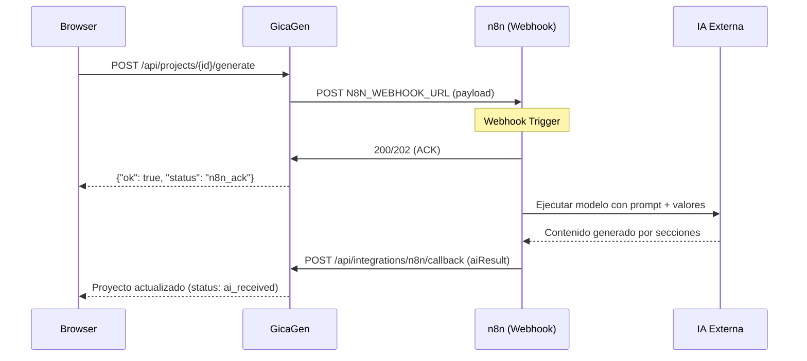
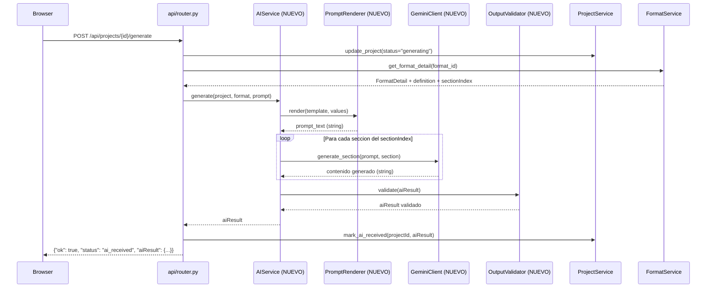

# Migracion n8n a Codigo (Gemini API) — Plan Detallado

> Estado: **IMPLEMENTADO** (2026-02-17)
> Original: PLAN — 2026-02-17. Fuente: analisis del repo `gicagen_tesis-main`.
>
> **Implementacion completada:** Se crearon 5 modulos en `app/core/services/ai/`,
> se modifico `router.py` (3 paths: Gemini → n8n deprecated → demo),
> se actualizo UI (`app.js`), y se agregaron 17 tests (todos pasando).

---

## 1) Que Hacia n8n (Evidencia del Repo)

### Flujo Diseñado (Nunca Completado en Produccion)



### Evidencia en Codigo

| Componente | Archivo | Lineas | Funcion |
|------------|---------|--------|---------|
| Cliente webhook | `n8n_client.py` | 120 | `ping()`, `trigger()` via httpx |
| Spec builder | `n8n_integration_service.py` | 303 | `build_spec()` — payload, headers, checklist markdown |
| Callback receptor | `api/router.py` | 230-257 | `POST /api/integrations/n8n/callback` |
| Trigger endpoint | `api/router.py` | 622-698 | `POST /api/projects/{id}/generate` |
| Legacy trigger | `api/router.py` | 584-619 | `POST /api/projects/generate` |
| UI guia | `app.js` | 444-515 | `renderN8nGuide()` |

### Checklist de 8 Pasos que n8n Debia Hacer

Fuente: `n8n_integration_service.py` lineas 194-204

| Paso | Titulo | Detalle |
|------|--------|---------|
| 1 | Webhook Trigger | Crear trigger POST en n8n para recibir request.payload |
| 2 | Secret compartido | Configurar X-GICAGEN-SECRET en entrada y X-N8N-SECRET en callback |
| 3 | GET format | Consumir formato desde GicaTesis via URL en payload |
| 4 | Prompt final | Combinar prompt.text con values para construir el prompt de ejecucion |
| 5 | IA a JSON | Ejecutar IA y producir JSON estable en aiResult.sections por path/sectionId |
| 6 | Validacion | Validar estructura antes de callback (projectId, status, aiResult) |
| 7 | Callback | Enviar POST al callbackUrl con header X-N8N-SECRET |
| 8 | Responder | Responder 200 al trigger inicial y guardar trazabilidad de runId |

### Contrato de Output (aiResult)

Fuente: `n8n_integration_service.py` linea 168-175, `api/models.py` linea 84-89

```json
{
  "projectId": "proj_abc123",
  "runId": "run-20260217120000",
  "status": "success",
  "aiResult": {
    "sections": [
      {
        "sectionId": "sec-0001",
        "path": "Preliminares/Resumen",
        "content": "Contenido generado por IA para esta seccion..."
      },
      {
        "sectionId": "sec-0002",
        "path": "Cuerpo/Capitulo 1/Introduccion",
        "content": "Contenido generado por IA..."
      }
    ]
  }
}
```

---

## 2) Tabla de Mapeo n8n a Codigo

| # | Paso n8n | Nodo/Accion | Input | Output | Equivalente en Codigo (Propuesto) | Gaps |
|---|----------|-------------|-------|--------|-----------------------------------|------|
| 1 | Webhook Trigger | Recibir POST | Payload JSON | ACK 200 | Endpoint existente `POST /api/projects/{id}/generate` ya maneja trigger | Ninguno |
| 2 | Secret compartido | Header auth | `X-GICAGEN-SECRET` | Validado/rechazado | Eliminar — no necesario sin n8n externo | Ninguno |
| 3 | GET format | HTTP GET GicaTesis | format_id | FormatDetail + definition | `FormatService.get_format_detail()` — **ya existe** | Ninguno |
| 4 | Prompt final | Template + variables | prompt.text + values | Prompt renderizado | **NUEVO:** `PromptRenderer.render(template, values)` | No existe |
| 5 | IA a JSON | Llamar modelo IA | Prompt renderizado | `aiResult.sections[]` | **NUEVO:** `GeminiClient.generate(prompt, section_index)` | No existe SDK |
| 6 | Validacion | Validar schema | aiResult crudo | aiResult validado | **NUEVO:** `OutputValidator.validate(aiResult)` | No existe |
| 7 | Callback | POST a GicaGen | aiResult | Proyecto actualizado | `ProjectService.mark_ai_received()` — **ya existe** (llamar directo) | Ninguno |
| 8 | Trazabilidad | Guardar runId | runId | Estado persistido | `ProjectService.update_project()` — **ya existe** | Ninguno |

**Resumen: 3 componentes nuevos necesarios, 5 ya existen.**

---

## 3) Diseño Propuesto (Alto Nivel) — SIN IMPLEMENTAR

### Diagrama de Flujo Nuevo



### Modulos Sugeridos

```
app/core/services/
  ai/
    __init__.py
    ai_service.py            # Orquestador principal
    gemini_client.py         # Wrapper del SDK google-generativeai
    prompt_renderer.py       # Renderiza templates {{variable}}
    output_validator.py      # Valida schema de aiResult
    config.py                # Configuracion especifica de IA (model, params)
```

### Responsabilidades por Modulo

| Modulo | Responsabilidad | Entrada | Salida |
|--------|-----------------|---------|--------|
| `ai_service.py` | Orquesta el flujo completo: render prompt → generar por seccion → validar | Project, Format, Prompt | `aiResult` validado |
| `gemini_client.py` | Wrapper thin del SDK de Gemini; maneja auth, retries, rate limiting | prompt_text, model_config | response.text |
| `prompt_renderer.py` | Reemplaza `{{variables}}` en template con valores del proyecto | template, values | prompt_text |
| `output_validator.py` | Valida que `aiResult.sections` tenga `sectionId`, `path`, `content` | aiResult crudo | aiResult validado o error |

### Configuracion Necesaria

Agregar a `config.py`:

```python
# AI / Gemini Integration
GEMINI_API_KEY: str = _get("GEMINI_API_KEY", "")
GEMINI_MODEL: str = _get("GEMINI_MODEL", "gemini-2.0-flash")
GEMINI_TEMPERATURE: float = float(_get("GEMINI_TEMPERATURE", "0.7"))
GEMINI_MAX_OUTPUT_TOKENS: int = int(_get("GEMINI_MAX_OUTPUT_TOKENS", "8192"))
GEMINI_TOP_P: float = float(_get("GEMINI_TOP_P", "0.95"))
GEMINI_RETRY_MAX: int = int(_get("GEMINI_RETRY_MAX", "3"))
GEMINI_RETRY_BACKOFF: float = float(_get("GEMINI_RETRY_BACKOFF", "2.0"))
```

Agregar a `requirements.txt`:

```
google-generativeai>=0.8.0
```

Agregar a `.env.example`:

```
# === AI / Gemini Integration ===
GEMINI_API_KEY=""
GEMINI_MODEL="gemini-2.0-flash"
GEMINI_TEMPERATURE="0.7"
GEMINI_MAX_OUTPUT_TOKENS="8192"
GEMINI_TOP_P="0.95"
GEMINI_RETRY_MAX="3"
GEMINI_RETRY_BACKOFF="2.0"
```

---

## 4) Estrategia de Retries/Timeouts

| Parametro | Valor Propuesto | Motivo |
|-----------|-----------------|--------|
| Max retries | 3 | Balanceo entre resiliencia y latencia |
| Backoff base | 2.0s | Exponential: 2s, 4s, 8s |
| Timeout por request | 60s | Gemini puede tardar en contenido largo |
| Timeout total (todas las secciones) | 300s (5min) | Limite razonable para un documento completo |
| Rate limit | Respetar `429 Too Many Requests` | Usar header `Retry-After` si disponible |

### Pseudocodigo de Retries

```python
async def call_gemini_with_retry(prompt: str, config: GeminiConfig) -> str:
    for attempt in range(config.retry_max):
        try:
            response = await gemini_model.generate_content_async(prompt)
            return response.text
        except RateLimitError:
            wait = config.retry_backoff ** attempt
            await asyncio.sleep(wait)
        except APIError as e:
            if attempt == config.retry_max - 1:
                raise
            await asyncio.sleep(config.retry_backoff ** attempt)
    raise MaxRetriesExceeded()
```

---

## 5) Estrategia de Validacion de Output

### Schema Esperado

```json
{
  "sections": [
    {
      "sectionId": "string (requerido, ej: sec-0001)",
      "path": "string (requerido, ej: Cuerpo/Capitulo 1/Introduccion)",
      "content": "string (requerido, contenido generado, min 50 chars)"
    }
  ]
}
```

### Reglas de Validacion

| Regla | Tipo | Accion si falla |
|-------|------|-----------------|
| `sections` es lista no vacia | Estructura | Rechazar, re-generar |
| Cada seccion tiene `sectionId` | Campo | Rechazar seccion, asignar ID |
| Cada seccion tiene `path` | Campo | Rechazar seccion |
| Cada seccion tiene `content` no vacio | Campo | Marcar como fallida |
| `content` tiene minimo 50 caracteres | Calidad | Warning, aceptar con flag |
| Los `sectionId` son unicos | Integridad | Renumerar |
| Los `path` coinciden con `sectionIndex` | Consistencia | Warning, aceptar |

### Estrategia de Parsing

Gemini puede devolver texto libre o JSON. Opciones:
1. **Prompt con instruccion JSON** — pedir output en JSON estricto
2. **JSON mode** de Gemini (`response_mime_type="application/json"`) — forzar JSON
3. **Post-parsing** — extraer JSON de la respuesta con regex/fallback

**Recomendacion:** Usar JSON mode de Gemini + validacion con Pydantic model.

---

## 6) Impacto en Codigo Existente

### Archivos a Modificar (NO crear ni modificar ahora)

| Archivo | Cambio | Razon |
|---------|--------|-------|
| `config.py` | Agregar settings de Gemini | Config de API key, modelo, parametros |
| `requirements.txt` | Agregar `google-generativeai` | SDK de Gemini |
| `.env.example` | Agregar variables Gemini | Documentar config |
| `api/router.py` | Modificar `trigger_generation()` + `_generation_job()` | Llamar `AIService` en lugar de `N8NClient` |
| `n8n_integration_service.py` | Mantener (aun util para spec/guia) | La guia del paso 4 se adaptara |
| `app.js` | Adaptar `renderN8nGuide()` y flujo de generacion | UI refleja nuevo flujo |

### Archivos Nuevos (NO crear ahora)

| Archivo | Proposito |
|---------|-----------|
| `app/core/services/ai/ai_service.py` | Orquestador de generacion IA |
| `app/core/services/ai/gemini_client.py` | Wrapper SDK Gemini |
| `app/core/services/ai/prompt_renderer.py` | Renderizado de templates |
| `app/core/services/ai/output_validator.py` | Validacion de schema |
| `app/core/services/ai/__init__.py` | Exports del paquete |

### Archivos que Se Pueden Deprecar (Evaluar)

| Archivo | Motivo | Accion |
|---------|--------|--------|
| `n8n_client.py` | No se usara webhook n8n | Marcar `DEPRECATED`, no eliminar |
| `docx_builder.py` | Legacy demo mode | Mantener como fallback |

---

## 7) Orden de Implementacion Sugerido

### Fase 1: Infraestructura (Pre-requisitos)

1. Agregar `google-generativeai` a `requirements.txt`
2. Agregar settings Gemini a `config.py`
3. Agregar variables a `.env.example`
4. Crear estructura `app/core/services/ai/`

### Fase 2: Componentes Core

5. Implementar `prompt_renderer.py` (mas simple, sin dependencia externa)
6. Implementar `gemini_client.py` (wrapper SDK + retries)
7. Implementar `output_validator.py` (validacion Pydantic)
8. Implementar `ai_service.py` (orquestador)

### Fase 3: Integracion

9. Modificar `api/router.py` — `trigger_generation()` usa `AIService`
10. Adaptar UI (`app.js`) para reflejar el flujo nuevo
11. Adaptar `n8n_integration_service.py` para generar spec del flujo nuevo

### Fase 4: Testing y Validacion

12. Crear tests unitarios para cada componente nuevo
13. Test de integracion end-to-end (wizard completo)
14. Validar con formatos reales de GicaTesis

---

## 8) Bloqueantes

| # | Bloqueante | Severidad | Accion Requerida |
|---|------------|-----------|-----------------|
| 1 | **API Key de Gemini** | P0 | Obtener key de Google AI Studio o Vertex AI |
| 2 | **Decidir modelo** | P0 | `gemini-2.0-flash` (rapido) vs `gemini-2.0-pro` (mejor calidad) |
| 3 | **Sin tests existentes** | P0 | Crear tests minimamente antes de refactorizar router |
| 4 | **Rate limits del plan** | P1 | Verificar limites del plan gratuito/pago de Gemini |
| 5 | **Calidad de prompts** | P1 | Los 2 templates actuales son basicos; necesitan refinamiento |
| 6 | **Formato de output Gemini** | P1 | Definir si usar JSON mode o parsing libre |
| 7 | **Timeout para docs largos** | P2 | Un doc con 20+ secciones puede tardar 2-5 min |
| 8 | **Costo por request** | P2 | Estimar costo por generacion completa |

---

## 9) Known Gaps / TODO

| # | Gap | Prioridad | Pregunta Concreta |
|---|-----|-----------|-------------------|
| 1 | No se definio el modelo Gemini a usar | P0 | Usar `gemini-2.0-flash` o `gemini-2.0-pro`? |
| 2 | No hay API key disponible | P0 | De donde obtener la key? Google AI Studio o Vertex? |
| 3 | Los prompts actuales son genericos | P1 | Se necesitan prompts especificos por tipo de seccion (intro, metodologia, etc.)? |
| 4 | No se definio estrategia de streaming | P1 | Mostrar output parcial al usuario o esperar completamente? |
| 5 | No hay mecanismo de cancelacion | P1 | Si el usuario cancela, como abortar la generacion en curso? |
| 6 | No se definio manejo de contenido multilingue | P2 | Los documentos son solo en español? |
| 7 | No hay caching de respuestas de IA | P2 | Cachear respuestas para mismas entradas? |
| 8 | No se definio limite de tokens por seccion | P1 | Cada seccion tiene un max de tokens diferente? |
